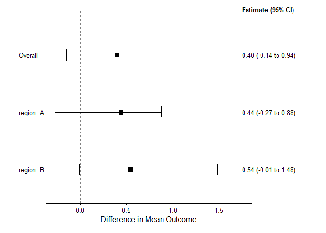

# bonsaiforest2 🌳

The goal of `bonsaiforest2` is to **simplify fitting and interpreting
Bayesian models for subgroup analysis** in clinical trials. It leverages
the power of the `brms` package to:

- Distinguish between **prognostic** (baseline predictors) and
  **predictive** (treatment effect modifiers) factors.
- Apply differential **shrinkage priors** (like Horseshoe or R2D2) to
  explore subgroup effects robustly.
- Calculate interpretable **marginal treatment effects** using a
  counterfactual approach.
- Generate publication-ready **forest plots**.

## Installation

You can install the development version of `bonsaiforest2` from its
GitLab repository:

``` r
# install.packages("remotes") 
remotes::install_gitlab("statistical-engineering/bonsaiforest2", host = "code.roche.com") 
```

## Example

This is a basic example showing the main workflow: fitting a simple
continuous outcome model with shrinkage on a subgroup interaction.

``` r
library(bonsaiforest2)
library(brms) # Needed for backend

# 1. Minimal data setup
set.seed(123)
n <- 50 # Small n for README example
sim_data_readme <- data.frame(
  outcome = rnorm(n),
  trt = factor(sample(0:1, n, replace = TRUE)),
  age = rnorm(n, 50, 10),
  region = factor(sample(c("A", "B"), n, replace = TRUE))
)

# 2. Fit a simple model (use very few iterations for speed!)
# Shrink the treatment:region interaction
fit <- run_brms_analysis(
  data = sim_data_readme,
  response_formula_str = "outcome ~ trt",
  response_type = "continuous",
  unshrunk_prognostic_formula_str = "~ age",     # Adjust for age
  shrunk_predictive_formula_str = "~ trt:region", # Explore region interaction
  chains = 1, iter = 50, warmup = 25, refresh = 0, # Keep it FAST
  backend = "cmdstanr" # Optional: Specify backend if needed
)

# 3. Summarize marginal effects (will auto-detect 'region')
effect_summary <- summary_subgroup_effects(
  brms_fit = fit,
  original_data = sim_data_readme,
  trt_var = "trt",
  response_type = "continuous"
)

# 4. Plot the results
plot(effect_summary) # Display plot
```



**Summarized Effects:**

    #> # A tibble: 3 × 4
    #>   Subgroup  Median CI_Lower CI_Upper
    #>   <chr>      <dbl>    <dbl>    <dbl>
    #> 1 Overall    0.399  -0.145     0.939
    #> 2 region: A  0.440  -0.271     0.875
    #> 3 region: B  0.544  -0.0111    1.48
