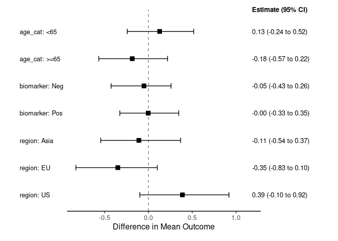

# bonsaiforest2 <a href="https://github.com/openpharma/bonsaiforest2"></a>

## Overview

The `bonsaiforest2` package is used for Bayesian shrinkage estimation of
subgroup treatment effects in randomized clinical trials. It supports
both One-Variable-at-a-Time (OVAT) and Global modeling approaches for
estimating treatment-by-subgroup interactions, with built-in support for
continuous, binary, time-to-event (Cox), and count outcomes. The package
implements state-of-the-art shrinkage priors including Regularized
Horseshoe and R2D2, combined with standardization (G-computation) to
provide interpretable marginal treatment effects. By leveraging `brms`
and `Stan`, `bonsaiforest2` provides a practical tool for obtaining more
stable and reliable subgroup effect estimates in exploratory analyses.

## Installation

**UPDATE TO USUAL INSTALLATION** You can install the development version
of `bonsaiforest2` from its GitLab repository:

``` r
# install.packages("remotes") 
remotes::install_github("openpharma/bonsaiforest2")
```

## Example

This example demonstrates the usage of `bonsaiforest2` for subgroup
treatment effect estimation across multiple overlapping subgroups (Age,
Region, and Biomarker) using a Global Modeling approach with a
Regularized Horseshoe prior.

``` r
library(bonsaiforest2)

# 1. Simulate trial data
set.seed(42)
n <- 200
trial_data <- data.frame(
  outcome  = rnorm(n),
  trt      = factor(sample(c("Control", "Active"), n, replace = TRUE)),
  age_cat  = factor(sample(c("<65", ">=65"), n, replace = TRUE)),
  region   = factor(sample(c("US", "EU", "Asia"), n, replace = TRUE)),
  biomarker = factor(sample(c("Pos", "Neg"), n, replace = TRUE))
)

# 2. Fit a Global Model with default priors
fit <- run_brms_analysis(
  data = trial_data,
  response_type = "continuous",
  response_formula = outcome ~ trt,
  unshrunk_terms_formula = ~ age_cat + region + biomarker, 
  shrunk_predictive_formula = ~ 0 + trt:age_cat + trt:region + trt:biomarker, 
  sigma_ref = 3,
  chains = 2, iter = 1000, warmup = 500 #
)
#> Step 1: Preparing formula and data...
#> Converting treatment variable 'trt' to numeric binary (0/1). 'Active' = 0, 'Control' = 1
#> Note: Treatment 'trt' automatically added to unshrunk terms.
#> Note: Applied one-hot encoding to shrunken factor 'age_cat' (will be used with ~ 0 + ...)
#> Note: Applied one-hot encoding to shrunken factor 'region' (will be used with ~ 0 + ...)
#> Note: Applied one-hot encoding to shrunken factor 'biomarker' (will be used with ~ 0 + ...)
#> Note: Applied dummy encoding (contr.treatment) to unshrunken factor 'age_cat'
#> Note: Applied dummy encoding (contr.treatment) to unshrunken factor 'region'
#> Note: Applied dummy encoding (contr.treatment) to unshrunken factor 'biomarker'
#> DEBUG: Creating sub-formulas...
#>   - all_unshrunk_terms: age_cat, region, biomarker, trt
#>   - shrunk_prog_terms:
#>   - shrunk_pred_formula: trt:age_cat + trt:region + trt:biomarker
#> DEBUG: Final formula object:
#> outcome ~ unshrunktermeffect + shpredeffect 
#> unshrunktermeffect ~ age_cat + region + biomarker + trt
#> shpredeffect ~ 0 + trt:age_cat + trt:region + trt:biomarker
#> 
#> Step 2: Fitting the brms model...
#> Using trt_var from prepared_model: trt
#> Using sigma_ref = 3
#> Computed outcome mean: -0.027
#> Using default priors for unspecified effects:
#>   - intercept: normal(-0.027484445779618, 15)
#>   - unshrunk terms: normal(0, 15)
#>   - shrunk predictive: horseshoe(1)
#> Adding sigma prior: normal(0, 3)
#> Fitting brms model...
#> Compiling Stan program...
#> Trying to compile a simple C file
#> Running /usr/lib/R/bin/R CMD SHLIB foo.c
#> using C compiler: ‘gcc (Ubuntu 11.4.0-1ubuntu1~22.04) 11.4.0’
#> gcc -I"/usr/share/R/include" -DNDEBUG   -I"/usr/local/lib/R/site-library/Rcpp/include/"  -I"/usr/local/lib/R/site-library/RcppEigen/include/"  -I"/usr/local/lib/R/site-library/RcppEigen/include/unsupported"  -I"/usr/local/lib/R/site-library/BH/include" -I"/home/pedreram/R/x86_64-pc-linux-gnu-library/4.4/StanHeaders/include/src/"  -I"/home/pedreram/R/x86_64-pc-linux-gnu-library/4.4/StanHeaders/include/"  -I"/usr/local/lib/R/site-library/RcppParallel/include/"  -I"/home/pedreram/R/x86_64-pc-linux-gnu-library/4.4/rstan/include" -DEIGEN_NO_DEBUG  -DBOOST_DISABLE_ASSERTS  -DBOOST_PENDING_INTEGER_LOG2_HPP  -DSTAN_THREADS  -DUSE_STANC3 -DSTRICT_R_HEADERS  -DBOOST_PHOENIX_NO_VARIADIC_EXPRESSION  -D_HAS_AUTO_PTR_ETC=0  -include '/home/pedreram/R/x86_64-pc-linux-gnu-library/4.4/StanHeaders/include/stan/math/prim/fun/Eigen.hpp'  -D_REENTRANT -DRCPP_PARALLEL_USE_TBB=1       -fpic  -g -O2 -ffile-prefix-map=/build/r-base-JpkSDg/r-base-4.4.3=. -fstack-protector-strong -Wformat -Werror=format-security -Wdate-time -D_FORTIFY_SOURCE=2  -c foo.c -o foo.o
#> In file included from /usr/local/lib/R/site-library/RcppEigen/include/Eigen/Core:19,
#>                  from /usr/local/lib/R/site-library/RcppEigen/include/Eigen/Dense:1,
#>                  from /home/pedreram/R/x86_64-pc-linux-gnu-library/4.4/StanHeaders/include/stan/math/prim/fun/Eigen.hpp:22,
#>                  from <command-line>:
#> /usr/local/lib/R/site-library/RcppEigen/include/Eigen/src/Core/util/Macros.h:679:10: fatal error: cmath: No such file or directory
#>   679 | #include <cmath>
#>       |          ^~~~~~~
#> compilation terminated.
#> make: *** [/usr/lib/R/etc/Makeconf:195: foo.o] Error 1
#> Start sampling
#> 
#> SAMPLING FOR MODEL 'anon_model' NOW (CHAIN 1).
#> Chain 1: 
#> Chain 1: Gradient evaluation took 6.7e-05 seconds
#> Chain 1: 1000 transitions using 10 leapfrog steps per transition would take 0.67 seconds.
#> Chain 1: Adjust your expectations accordingly!
#> Chain 1: 
#> Chain 1: 
#> Chain 1: Iteration:   1 / 1000 [  0%]  (Warmup)
#> Chain 1: Iteration: 100 / 1000 [ 10%]  (Warmup)
#> Chain 1: Iteration: 200 / 1000 [ 20%]  (Warmup)
#> Chain 1: Iteration: 300 / 1000 [ 30%]  (Warmup)
#> Chain 1: Iteration: 400 / 1000 [ 40%]  (Warmup)
#> Chain 1: Iteration: 500 / 1000 [ 50%]  (Warmup)
#> Chain 1: Iteration: 501 / 1000 [ 50%]  (Sampling)
#> Chain 1: Iteration: 600 / 1000 [ 60%]  (Sampling)
#> Chain 1: Iteration: 700 / 1000 [ 70%]  (Sampling)
#> Chain 1: Iteration: 800 / 1000 [ 80%]  (Sampling)
#> Chain 1: Iteration: 900 / 1000 [ 90%]  (Sampling)
#> Chain 1: Iteration: 1000 / 1000 [100%]  (Sampling)
#> Chain 1: 
#> Chain 1:  Elapsed Time: 1.047 seconds (Warm-up)
#> Chain 1:                0.981 seconds (Sampling)
#> Chain 1:                2.028 seconds (Total)
#> Chain 1: 
#> 
#> SAMPLING FOR MODEL 'anon_model' NOW (CHAIN 2).
#> Chain 2: 
#> Chain 2: Gradient evaluation took 3.6e-05 seconds
#> Chain 2: 1000 transitions using 10 leapfrog steps per transition would take 0.36 seconds.
#> Chain 2: Adjust your expectations accordingly!
#> Chain 2: 
#> Chain 2: 
#> Chain 2: Iteration:   1 / 1000 [  0%]  (Warmup)
#> Chain 2: Iteration: 100 / 1000 [ 10%]  (Warmup)
#> Chain 2: Iteration: 200 / 1000 [ 20%]  (Warmup)
#> Chain 2: Iteration: 300 / 1000 [ 30%]  (Warmup)
#> Chain 2: Iteration: 400 / 1000 [ 40%]  (Warmup)
#> Chain 2: Iteration: 500 / 1000 [ 50%]  (Warmup)
#> Chain 2: Iteration: 501 / 1000 [ 50%]  (Sampling)
#> Chain 2: Iteration: 600 / 1000 [ 60%]  (Sampling)
#> Chain 2: Iteration: 700 / 1000 [ 70%]  (Sampling)
#> Chain 2: Iteration: 800 / 1000 [ 80%]  (Sampling)
#> Chain 2: Iteration: 900 / 1000 [ 90%]  (Sampling)
#> Chain 2: Iteration: 1000 / 1000 [100%]  (Sampling)
#> Chain 2: 
#> Chain 2:  Elapsed Time: 1.061 seconds (Warm-up)
#> Chain 2:                0.752 seconds (Sampling)
#> Chain 2:                1.813 seconds (Total)
#> Chain 2:
#> Warning: There were 2 divergent transitions after warmup. See
#> https://mc-stan.org/misc/warnings.html#divergent-transitions-after-warmup
#> to find out why this is a problem and how to eliminate them.
#> Warning: Examine the pairs() plot to diagnose sampling problems
#> Warning: Bulk Effective Samples Size (ESS) is too low, indicating posterior means and medians may be unreliable.
#> Running the chains for more iterations may help. See
#> https://mc-stan.org/misc/warnings.html#bulk-ess
#> Warning: Tail Effective Samples Size (ESS) is too low, indicating posterior variances and tail quantiles may be unreliable.
#> Running the chains for more iterations may help. See
#> https://mc-stan.org/misc/warnings.html#tail-ess
#> 
#> Analysis complete.

# 3. Derive Marginal Treatment Effects
subgroup_effects <- summary_subgroup_effects(
  brms_fit = fit
)
#> Using trt_var from model attributes: trt
#> Using response_type from model attributes: continuous
#> --- Calculating specific subgroup effects... ---
#> Using data from model attributes
#> Step 1: Identifying subgroups and creating counterfactuals...
#> `subgroup_vars` set to 'auto'. Detecting from model...
#> All coefficient names:
#> unshrunktermeffect_Intercept
#> unshrunktermeffect_age_cat>EQ65
#> unshrunktermeffect_regionEU
#> unshrunktermeffect_regionUS
#> unshrunktermeffect_biomarkerPos
#> unshrunktermeffect_trt
#> shpredeffect_trt:age_cat<65
#> shpredeffect_trt:age_cat>EQ65
#> shpredeffect_trt:regionEU
#> shpredeffect_trt:regionUS
#> shpredeffect_trt:biomarkerPos
#> Looking for treatment interactions with pattern: 'trt:'
#> Found 5 treatment interaction coefficients
#> Treatment interaction coefficients found:
#> shpredeffect_trt:age_cat<65
#> shpredeffect_trt:age_cat>EQ65
#> shpredeffect_trt:regionEU
#> shpredeffect_trt:regionUS
#> shpredeffect_trt:biomarkerPos
#> Detected subgroup variable 'age_cat' from coefficient 'shpredeffect_trt:age_cat<65'
#> Detected subgroup variable 'age_cat' from coefficient 'shpredeffect_trt:age_cat>EQ65'
#> Detected subgroup variable 'region' from coefficient 'shpredeffect_trt:regionEU'
#> Detected subgroup variable 'region' from coefficient 'shpredeffect_trt:regionUS'
#> Detected subgroup variable 'biomarker' from coefficient 'shpredeffect_trt:biomarkerPos'
#> ...detected subgroup variable(s): age_cat, region, biomarker
#> Step 2: Generating posterior predictions...
#> ... detected Fixed Effects (Colon model). Predicting with re_formula = NA.
#> ... (predicting expected outcomes)...
#> Step 3: Calculating marginal effects...
#> ... processing age_cat
#> ... processing region
#> ... processing biomarker
#> Done.

# 4. Visualize Results
plot(subgroup_effects)
#> Preparing data for plotting...
#> Generating plot...
#> Done.
```


