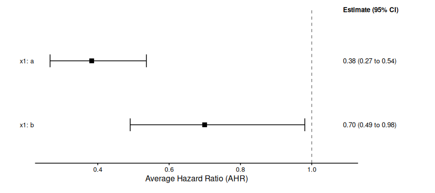
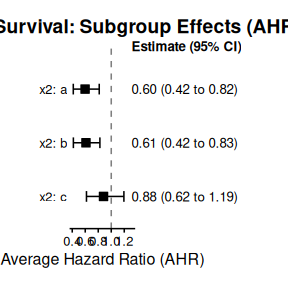

# Advanced Functionalities

This vignette demonstrates advanced functionalities for Bayesian
shrinkage estimation, including specifying an **offset for count data**,
customizing **prior distributions**, and using **stratification** to
handle heterogeneity in nuisance parameters.

## 1 Handling Exposure in Count Outcomes with Offsets

For count data (like disease exacerbations or event rates), the observed
count often depends on the **exposure time** or **follow-up time**.
Using an **offset** variable is the standard statistical method to
properly account for this time variation by modeling the event **rate**
(count per unit time) instead of the raw count.

In `bonsaiforest2`, you can include the offset directly in the
`response_formula_str` using the standard `brms` syntax:
`outcome + offset(log_time) ~ predictors`.

### 1.1 Example 1: Count Outcome with Offset (Disease Exacerbations)

This scenario models exacerbation counts using a Negative Binomial
distribution and explicitly accounts for the patient’s exposure time.

*Scenario*: Modeling exacerbation counts. Adjust for `baseline_severity`
(unshrunk) and many exploratory `biomarkers` (shrunk). No interaction
terms (overall treatment effect only).

``` r
# Data Simulation 
set.seed(789)
library(bonsaiforest2)
n_patients <- 150
biomarker_data <- as.data.frame(matrix(rnorm(n_patients * 10), ncol = 10))
names(biomarker_data) <- paste0("biomarker_", 1:10)
count_data <- data.frame(
  exacerbation_count = rnbinom(n_patients, size = 1.5, mu = 3),
  medication = sample(0:1, n_patients, replace = TRUE),
  baseline_severity = rnorm(n_patients, 10, 2),
  log_exposure_time = log(runif(n_patients, 0.5, 1.5)) # Example offset
)
count_data <- cbind(count_data, biomarker_data)
count_data$medication <- factor(count_data$medication, levels = c(0, 1))

# Create formula string for all biomarkers (Prognostic effects only here)
shrunk_prog_str <- paste("~", paste(names(biomarker_data), collapse = " + "))
```

``` r
# Model Fitting with Offset
# For count models, sigma_ref is typically set to 1 (used as reference scale for priors)

count_model_fit <- run_brms_analysis(
  data = count_data,
  # Include offset(log_exposure_time) directly in the response formula
  response_formula = exacerbation_count + offset(log_exposure_time) ~ medication,
  response_type = "count",
  unshrunk_terms_formula = ~ 1 + baseline_severity,
  shrunk_prognostic_formula = as.formula(shrunk_prog_str),
  sigma_ref = 1,  # Standard value for count models
  chains = 1, iter = 200, warmup = 100, cores = 1, refresh = 0, backend = "cmdstanr"
)
#> Step 1: Preparing formula and data...
#> Converting treatment variable 'medication' to numeric binary (0/1). '0' = 0, '1' = 1
#> Note: Treatment 'medication' automatically added to unshrunk terms.
#> DEBUG: Creating sub-formulas...
#>   - all_unshrunk_terms: 1, baseline_severity, medication
#>   - shrunk_prog_terms: biomarker_1, biomarker_2, biomarker_3, biomarker_4, biomarker_5, biomarker_6, biomarker_7, biomarker_8, biomarker_9, biomarker_10
#>   - shrunk_pred_formula:
#> Warning: Formula 'shprogeffect' contains an intercept. For proper
#> regularization/interpretation, consider removing it by adding '~ 0 + ...' or '~
#> -1 + ...' to your input formula.
#> DEBUG: Final formula object:
#> exacerbation_count ~ unshrunktermeffect + shprogeffect + log_exposure_time 
#> unshrunktermeffect ~ 1 + baseline_severity + medication
#> shprogeffect ~ biomarker_1 + biomarker_2 + biomarker_3 + biomarker_4 + biomarker_5 + biomarker_6 + biomarker_7 + biomarker_8 + biomarker_9 + biomarker_10
#> 
#> Step 2: Fitting the brms model...
#> Using trt_var from prepared_model: medication
#> Using sigma_ref = 1
#> Using default priors for unspecified effects:
#>   - intercept: normal(0, 5)
#>   - unshrunk terms: normal(0, 5)
#>   - shrunk prognostic: horseshoe(1)
#> Fitting brms model...
#> Start sampling
#> Running MCMC with 1 chain...
#> 
#> Chain 1 WARNING: There aren't enough warmup iterations to fit the 
#> Chain 1          three stages of adaptation as currently configured. 
#> Chain 1          Reducing each adaptation stage to 15%/75%/10% of 
#> Chain 1          the given number of warmup iterations: 
#> Chain 1            init_buffer = 15 
#> Chain 1            adapt_window = 75 
#> Chain 1            term_buffer = 10 
#> Chain 1 finished in 2.7 seconds.
#> Loading required namespace: rstan
#> 
#> Analysis complete.
```

## 2 Customizing Prior Distributions

The choice of prior is central to Bayesian shrinkage. `bonsaiforest2`
provides sensible defaults, but it allows for full customization using
the `prognostic_effect_priors` and `predictive_effect_priors` arguments.

### 2.1 Prior Specification Mechanics

**NEW API:** Priors are now specified using separate parameters for each
component, with a **required** `sigma_ref` parameter that serves as the
reference scale.

| Prior Component       | Parameter Name            | Default Prior                         | Notes                                                                                         |
|:----------------------|:--------------------------|:--------------------------------------|:----------------------------------------------------------------------------------------------|
| **Reference Scale**   | `sigma_ref`               | **REQUIRED**                          | Must be user-specified: `sd(outcome)` for continuous/count, typically `1` for binary/survival |
| **Intercept**         | `intercept_prior`         | `normal(mean(outcome), 5*sigma_ref)`  | Automatically centered at observed mean                                                       |
| **Unshrunk Terms**    | `unshrunk_prior`          | `normal(0, 5*sigma_ref)`              | Weakly informative                                                                            |
| **Shrunk Prognostic** | `shrunk_prognostic_prior` | `horseshoe(scale_global = sigma_ref)` | Strong shrinkage                                                                              |
| **Shrunk Predictive** | `shrunk_predictive_prior` | `horseshoe(scale_global = sigma_ref)` | Strong shrinkage                                                                              |

**Key Feature:** You can use `sigma_ref` in prior expressions (e.g.,
`"normal(0, 2.5 * sigma_ref)"`) and the actual value will be
automatically substituted.

#### 2.1.1 Prior Recommendations for Non-Shrunk Terms

For non-shrunk (fixed) effects, choosing a **weakly informative prior**
is critical to stabilize the model without unduly influencing the
results. A robust strategy is to scale the priors based on the
**standard deviation (SD)** of the outcome variable.

\\\sigma\_{outcome} = \text{SD}(\text{Outcome})\\

| Parameter               | Recommended Prior Scale                           | Justification                                                                                               |
|:------------------------|:--------------------------------------------------|:------------------------------------------------------------------------------------------------------------|
| **Intercept**           | \\\text{Normal}(0, 10 \times \sigma\_{outcome})\\ | Wide enough to cover the range of outcomes if all predictors are zero.                                      |
| **Unshrunk Prognostic** | \\\text{Normal}(0, \sigma\_{outcome})\\           | Assumes a typical coefficient’s impact is roughly comparable to the magnitude of the outcome’s variability. |

### 2.2 Practical Examples of Prior Setting

To provide a functional example, we will generate a **synthetic
dataset** that mirrors the structure of the **Tirzepatide (SURPASS-2)
trial** case study described in Wang et al. (2024). This study used a
**continuous endpoint** (change in HbA1c), which fits perfectly with
your code snippet calculating the standard deviation (`sd`).

#### 2.2.1 Dataset Generation and Model Preparation (Synthetic SURPASS-2)

This dataset mimics a clinical trial comparing a Treatment (Tirzepatide)
vs. Control (Semaglutide), looking at subgroups defined by **Sex**,
**Race**, and **Age Group**.

``` r
# Prerequisites: Ensure packages used by your function are loaded
library(survival) # For Surv()
library(brms)     # For brmsformula objects
#> Loading required package: Rcpp
#> Loading 'brms' package (version 2.23.0). Useful instructions
#> can be found by typing help('brms'). A more detailed introduction
#> to the package is available through vignette('brms_overview').
#> 
#> Attaching package: 'brms'
#> The following object is masked from 'package:survival':
#> 
#>     kidney
#> The following object is masked from 'package:stats':
#> 
#>     ar
library(bonsaiforest2)

# 1. Create Sample Data (matching your @examples section)
set.seed(123)
n <- 100
sim_data <- data.frame(
  time = round(runif(n, 1, 100)),
  status = sample(0:1, n, replace = TRUE),
  trt = sample(0:1, n, replace = TRUE),
  age = rnorm(n, 50, 10),
  region = sample(c("A", "B"), n, replace = TRUE),
  subgroup = sample(c("S1", "S2", "S3"), n, replace = TRUE)
)

# Ensure variables are factors where appropriate
sim_data$trt <- factor(sim_data$trt, levels = c(0, 1))
sim_data$region <- as.factor(sim_data$region)
sim_data$subgroup <- as.factor(sim_data$subgroup)

# 2. Run prepare_formula_model
# This transforms the data (creating dummy variables for interactions)
# and builds the non-linear brms formula.
prepared_model <- prepare_formula_model(
  data = sim_data,
  
  # Main response variable and treatment identifier
  response_formula = Surv(time, status) ~ trt,
  
  # Predictive (Interaction) effects to be shrunk
  # Note: The function will automatically generate dummy columns for 'subgroup'
  shrunk_predictive_formula = ~ 0 + trt:subgroup,
  
  # Prognostic (Main) effects: Unshrunk (Fixed)
  unshrunk_terms_formula = ~ age,
  
  # Prognostic (Main) effects: Shrunk (Regularized)
  shrunk_prognostic_formula = ~ 0 + region,
  
  # Model type
  response_type = "survival",
  
  # Stratify the baseline hazard by region
  stratification_formula = ~ region
)
#> Converting treatment variable 'trt' to numeric binary (0/1). '0' = 0, '1' = 1
#> Response type is 'survival'. Modeling the baseline hazard explicitly using bhaz().
#> Applying stratification: estimating separate baseline hazards by 'region'.
#> Note: Treatment 'trt' automatically added to unshrunk terms.
#> Note: Applied one-hot encoding to shrunken factor 'subgroup' (will be used with ~ 0 + ...)
#> Note: Marginality principle not followed - interaction term 'subgroup' is used without its main effect. Consider adding 'subgroup' to prognostic terms for proper model hierarchy.
#> Note: Applied one-hot encoding to shrunken factor 'region' (will be used with ~ 0 + ...)
#> DEBUG: Creating sub-formulas...
#>   - all_unshrunk_terms: age, trt
#>   - shrunk_prog_terms: region
#>   - shrunk_pred_formula: trt:subgroup
#> DEBUG: Final formula object:
#> time | cens(1 - status) + bhaz(Boundary.knots = c(0.02, 99.98), knots = c(24, 46, 69), intercept = FALSE, gr = region) ~ unshrunktermeffect + shprogeffect + shpredeffect 
#> unshrunktermeffect ~ 0 + age + trt
#> shprogeffect ~ 0 + region
#> shpredeffect ~ 0 + trt:subgroup

# 3. Inspect the Results

# A. The generated brms formula object
# You should see parts for 'unprogeffect', 'shprogeffect', etc.
print(prepared_model$formula)
#> time | cens(1 - status) + bhaz(Boundary.knots = c(0.02, 99.98), knots = c(24, 46, 69), intercept = FALSE, gr = region) ~ unshrunktermeffect + shprogeffect + shpredeffect 
#> unshrunktermeffect ~ 0 + age + trt
#> shprogeffect ~ 0 + region
#> shpredeffect ~ 0 + trt:subgroup

# B. The processed data
# You should see new columns like 'subgroup_S1_x_trt', 'subgroup_S2_x_trt', etc.
head(prepared_model$data)
#>   time status trt      age region subgroup
#> 1   29      0   1 57.87739      B       S2
#> 2   79      1   1 57.69042      B       S1
#> 3   41      1   1 53.32203      B       S3
#> 4   88      0   0 39.91623      B       S3
#> 5   94      1   1 48.80547      A       S3
#> 6    6      1   1 47.19605      A       S2
```

#### 2.2.2 Model Preparation

#### 2.2.3 Example 2: Using Default Priors (Recommended)

The simplest approach: just provide `sigma_ref` and let the package use
smart defaults that adapt to your outcome type.

``` r
# For survival models, sigma_ref is typically 1
# For continuous outcomes, use sd(outcome)
sigma_ref <- 1  # Standard for survival models

fit_ex3 <- fit_brms_model(
  prepared_model = prepared_model,
  sigma_ref = sigma_ref,
  # All priors use defaults - no need to specify!
  chains = 1, iter = 200, warmup = 100, cores = 1, refresh = 0, backend = "cmdstanr"
)
#> Using trt_var from prepared_model: trt
#> Using sigma_ref = 1
#> Using default priors for unspecified effects:
#>   - unshrunk terms: normal(0, 5)
#>   - shrunk prognostic: horseshoe(1)
#>   - shrunk predictive: horseshoe(1)
#> Fitting brms model...
#> Start sampling
#> Running MCMC with 1 chain...
#> 
#> Chain 1 WARNING: There aren't enough warmup iterations to fit the 
#> Chain 1          three stages of adaptation as currently configured. 
#> Chain 1          Reducing each adaptation stage to 15%/75%/10% of 
#> Chain 1          the given number of warmup iterations: 
#> Chain 1            init_buffer = 15 
#> Chain 1            adapt_window = 75 
#> Chain 1            term_buffer = 10 
#> Chain 1 finished in 4.4 seconds.
#> Warning: 100 of 100 (100.0%) transitions hit the maximum treedepth limit of 10.
#> See https://mc-stan.org/misc/warnings for details.

# View the priors that were automatically set
cat("\n=== Priors Used ===\n")
#> 
#> === Priors Used ===
print(prior_summary(fit_ex3))
#>         prior class           coef group resp dpar              nlpar lb ub tag
#>  horseshoe(1)     b                                      shpredeffect          
#>  horseshoe(1)     b trt:subgroupS1                       shpredeffect          
#>  horseshoe(1)     b trt:subgroupS2                       shpredeffect          
#>  horseshoe(1)     b trt:subgroupS3                       shpredeffect          
#>  horseshoe(1)     b                                      shprogeffect          
#>  horseshoe(1)     b        regionA                       shprogeffect          
#>  horseshoe(1)     b        regionB                       shprogeffect          
#>  normal(0, 5)     b                                unshrunktermeffect          
#>  normal(0, 5)     b            age                 unshrunktermeffect          
#>  normal(0, 5)     b            trt                 unshrunktermeffect          
#>  dirichlet(1) sbhaz                                                            
#>  dirichlet(1) sbhaz                    A                                       
#>  dirichlet(1) sbhaz                    B                                       
#>        source
#>          user
#>  (vectorized)
#>  (vectorized)
#>  (vectorized)
#>          user
#>  (vectorized)
#>  (vectorized)
#>          user
#>  (vectorized)
#>  (vectorized)
#>       default
#>  (vectorized)
#>  (vectorized)
```

#### 2.2.4 Example 3: Using the R2D2 Shrinkage Prior

The R2D2 prior is useful when you want to control the *global* shrinkage
via the coefficient of determination (\\R^2\\) rather than a scale
parameter. This is often more interpretable for stakeholders.

``` r
# Use a custom R2D2 prior for the shrunk predictive effects (interactions)
# mean_R2 = 0.5 implies we expect the subgroups to explain 50% of the variance
# This is more interpretable than abstract scale parameters

fit_ex4 <- fit_brms_model(
  prepared_model = prepared_model,
  sigma_ref = 1,
  shrunk_predictive_prior = "R2D2(mean_R2 = 0.5, prec_R2 = 1)",
  # Can also customize other priors
  intercept_prior = "normal(0, 5 * sigma_ref)",
  unshrunk_prior = "normal(0, 2.5 * sigma_ref)",
  chains = 1, iter = 200, warmup = 100, cores = 1, refresh = 0, backend = "cmdstanr"
)
#> Using trt_var from prepared_model: trt
#> Using sigma_ref = 1
#> Using default priors for unspecified effects:
#>   - shrunk prognostic: horseshoe(1)
#> Fitting brms model...
#> Start sampling
#> Running MCMC with 1 chain...
#> 
#> Chain 1 WARNING: There aren't enough warmup iterations to fit the 
#> Chain 1          three stages of adaptation as currently configured. 
#> Chain 1          Reducing each adaptation stage to 15%/75%/10% of 
#> Chain 1          the given number of warmup iterations: 
#> Chain 1            init_buffer = 15 
#> Chain 1            adapt_window = 75 
#> Chain 1            term_buffer = 10 
#> Chain 1 finished in 4.3 seconds.
#> Warning: 100 of 100 (100.0%) transitions hit the maximum treedepth limit of 10.
#> See https://mc-stan.org/misc/warnings for details.
```

#### 2.2.5 Example 4: Custom Hierarchical Prior (Advanced)

This example demonstrates injecting raw Stan code using `stanvars`. This
is necessary if you want to implement a hierarchical structure that
`brms` does not support natively, such as estimating a shared variance
parameter across coefficients.

``` r
library(brms)

# 1. Define new hyperparameters in Stan
# Declare parameters that will be estimated
stanvars_full_hierarchical <- brms::stanvar(
  scode = "  real mu_pred;\n  real<lower=0> sigma_pred;\n",
  block = "parameters"
) +
  # Add priors for these parameters
  brms::stanvar(
    scode = "  // Priors on the hierarchical parameters\n  target += normal_lpdf(mu_pred | 0, 4); \n  target += normal_lpdf(sigma_pred | 0, 1) - normal_lccdf(0 | 0, 1); \n",
    block = "model"
  )

# 2. Create prior that references the Stan variables
prior_full_hierarchical <- brms::set_prior("normal(mu_pred, sigma_pred)")

# 3. Pass both to fit_brms_model
fit_ex5 <- fit_brms_model(
  prepared_model = prepared_model,
  sigma_ref = 1,
  shrunk_predictive_prior = prior_full_hierarchical,
  stanvars = stanvars_full_hierarchical,
  # Other priors can still use sigma_ref
  intercept_prior = "normal(0, 5 * sigma_ref)",
  unshrunk_prior = "normal(0, 2.5 * sigma_ref)",
  chains = 1, iter = 200, warmup = 100, cores = 1, refresh = 0, backend = "cmdstanr"
)
#> Using trt_var from prepared_model: trt
#> Using sigma_ref = 1
#> Re-targeting 'brmsprior' object for nlpar: shpredeffect class: b
#> Using default priors for unspecified effects:
#>   - shrunk prognostic: horseshoe(1)
#> Fitting brms model...
#> Start sampling
#> Running MCMC with 1 chain...
#> 
#> Chain 1 WARNING: There aren't enough warmup iterations to fit the 
#> Chain 1          three stages of adaptation as currently configured. 
#> Chain 1          Reducing each adaptation stage to 15%/75%/10% of 
#> Chain 1          the given number of warmup iterations: 
#> Chain 1            init_buffer = 15 
#> Chain 1            adapt_window = 75 
#> Chain 1            term_buffer = 10 
#> Chain 1 finished in 2.9 seconds.
#> Warning: 100 of 100 (100.0%) transitions hit the maximum treedepth limit of 10.
#> See https://mc-stan.org/misc/warnings for details.

# View the estimated hyperparameters
cat("\n=== Estimated Hierarchical Parameters ===\n")
#> 
#> === Estimated Hierarchical Parameters ===
mu_pred_samples <- as.data.frame(fit_ex5)$mu_pred
sigma_pred_samples <- as.data.frame(fit_ex5)$sigma_pred

if (!is.null(mu_pred_samples)) {
  cat("mu_pred: ", round(mean(mu_pred_samples), 3), 
      " (SD: ", round(sd(mu_pred_samples), 3), ")\n")
}
#> mu_pred:  -1.039  (SD:  0.001 )
if (!is.null(sigma_pred_samples)) {
  cat("sigma_pred: ", round(mean(sigma_pred_samples), 3), 
      " (SD: ", round(sd(sigma_pred_samples), 3), ")\n")
}
#> sigma_pred:  0.749  (SD:  0 )
```

## 3 Advanced Model Parameterization

This section demonstrates advanced features for controlling how your
model represents subgroups and priors.

### 3.1 Example 5: One-Hot Encoding for Interaction Terms

**NEW FEATURE:** When you use `~ 0 + trt:factor_var`, ALL levels of the
factor will appear in the interaction (not k-1 levels). This gives you
full control over the model parameterization.

``` r
# Create sample data with multiple subgroups
set.seed(456)
n_patients <- 180
sample_data_onehot <- data.frame(
  id = 1:n_patients,
  trt = factor(sample(0:1, n_patients, replace = TRUE)),
  outcome = rnorm(n_patients, 50, 10),
  age = rnorm(n_patients, 65, 10),
  biomarker = factor(sample(c("Low", "Medium", "High"), n_patients, replace = TRUE))
)

# Compare: Standard vs One-Hot Encoding
cat("\\n=== Standard Encoding (k-1 levels) ===\\n")
#> \n=== Standard Encoding (k-1 levels) ===\n
cat("~ trt:biomarker gives k-1 = 2 interaction terms (reference category excluded)\\n\\n")
#> ~ trt:biomarker gives k-1 = 2 interaction terms (reference category excluded)\n\n

cat("=== One-Hot Encoding (ALL levels) ===\\n")
#> === One-Hot Encoding (ALL levels) ===\n
cat("~ 0 + trt:biomarker gives k = 3 interaction terms (all categories included)\\n\\n")
#> ~ 0 + trt:biomarker gives k = 3 interaction terms (all categories included)\n\n

# Prepare with one-hot encoding
prepared_onehot <- prepare_formula_model(
  data = sample_data_onehot,
  response_formula = outcome ~ trt,
  unshrunk_terms_formula = ~ age,
  shrunk_predictive_formula = ~ 0 + trt:biomarker,  # Note the "0 +" prefix!
  response_type = "continuous"
)
#> Converting treatment variable 'trt' to numeric binary (0/1). '0' = 0, '1' = 1
#> Note: Treatment 'trt' automatically added to unshrunk terms.
#> Note: Applied one-hot encoding to shrunken factor 'biomarker' (will be used with ~ 0 + ...)
#> Note: Marginality principle not followed - interaction term 'biomarker' is used without its main effect. Consider adding 'biomarker' to prognostic terms for proper model hierarchy.
#> DEBUG: Creating sub-formulas...
#>   - all_unshrunk_terms: age, trt
#>   - shrunk_prog_terms:
#>   - shrunk_pred_formula: trt:biomarker
#> DEBUG: Final formula object:
#> outcome ~ unshrunktermeffect + shpredeffect 
#> unshrunktermeffect ~ age + trt
#> shpredeffect ~ 0 + trt:biomarker

# Fit the model
sigma_ref <- sd(sample_data_onehot$outcome)
fit_onehot <- fit_brms_model(
  prepared_model = prepared_onehot,
  sigma_ref = sigma_ref,
  chains = 1, iter = 200, warmup = 100, cores = 1, refresh = 0, backend = "cmdstanr"
)
#> Using trt_var from prepared_model: trt
#> Using sigma_ref = 9.47
#> Computed outcome mean: 50.06
#> Using default priors for unspecified effects:
#>   - intercept: normal(50.0602209848849, 47.3503965224165)
#>   - unshrunk terms: normal(0, 47.3503965224165)
#>   - shrunk predictive: horseshoe(1)
#> Adding sigma prior: normal(0, 9.4700793044833)
#> Fitting brms model...
#> Start sampling
#> Running MCMC with 1 chain...
#> 
#> Chain 1 WARNING: There aren't enough warmup iterations to fit the 
#> Chain 1          three stages of adaptation as currently configured. 
#> Chain 1          Reducing each adaptation stage to 15%/75%/10% of 
#> Chain 1          the given number of warmup iterations: 
#> Chain 1            init_buffer = 15 
#> Chain 1            adapt_window = 75 
#> Chain 1            term_buffer = 10 
#> Chain 1 finished in 1.2 seconds.
#> Warning: 5 of 100 (5.0%) transitions hit the maximum treedepth limit of 10.
#> See https://mc-stan.org/misc/warnings for details.

# Check coefficients - you should see ALL three biomarker levels
cat("\\n=== All Biomarker Levels in Interaction ===\\n")
#> \n=== All Biomarker Levels in Interaction ===\n
coefs_onehot <- fixef(fit_onehot)
print(coefs_onehot[grepl("biomarker", rownames(coefs_onehot)), ])
#>                                    Estimate Est.Error      Q2.5    Q97.5
#> shpredeffect_trt:biomarkerHigh    1.2094524  1.567111 -1.322856 4.581310
#> shpredeffect_trt:biomarkerLow    -0.9166909  1.518297 -4.120591 2.079405
#> shpredeffect_trt:biomarkerMedium  0.3101408  1.522730 -2.373000 3.844711

cat("\\n=== Advantage ===\\n")
#> \n=== Advantage ===\n
cat("All biomarker levels treated symmetrically - no arbitrary reference category\\n")
#> All biomarker levels treated symmetrically - no arbitrary reference category\n
```

### 3.2 Example 6: Coefficient-Specific Priors

**ADVANCED FEATURE:** You can set different priors for specific
coefficients by passing a `brmsprior` object (created with
[`c()`](https://rdrr.io/r/base/c.html)).

*Scenario*: Set a general prior for all unshrunk terms, but use a
tighter prior specifically for treatment-biomarker interactions.

``` r
# Prepare model with biomarker:trt interaction in unshrunk terms
prepared_specific <- prepare_formula_model(
  data = sample_data_onehot,
  response_formula = outcome ~ trt,
  unshrunk_terms_formula = ~ age + trt:biomarker,  # Interaction in unshrunk
  response_type = "continuous"
)
#> Converting treatment variable 'trt' to numeric binary (0/1). '0' = 0, '1' = 1
#> Note: Treatment 'trt' automatically added to unshrunk terms.
#> Note: Applied dummy encoding (contr.treatment) to unshrunken factor 'biomarker'
#> Note: Marginality principle not followed - interaction term 'biomarker' is used without its main effect. Consider adding 'biomarker' to prognostic terms for proper model hierarchy.
#> DEBUG: Creating sub-formulas...
#>   - all_unshrunk_terms: age, trt:biomarker, trt
#>   - shrunk_prog_terms:
#>   - shrunk_pred_formula:
#> DEBUG: Final formula object:
#> outcome ~ unshrunktermeffect 
#> unshrunktermeffect ~ age + trt:biomarker + trt

sigma_ref <- sd(sample_data_onehot$outcome)

cat("\\n=== Prior Strategy ===\\n")
#> \n=== Prior Strategy ===\n
cat("General unshrunk prior: normal(0,", round(5 * sigma_ref, 2), ")\\n")
#> General unshrunk prior: normal(0, 47.35 )\n
cat("Specific for trt:biomarker: normal(0,", round(1 * sigma_ref, 2), ")\\n\\n")
#> Specific for trt:biomarker: normal(0, 9.47 )\n\n

# Create combined prior object
# IMPORTANT: Use EXACT coefficient names - check with get_prior() if unsure
unshrunk_priors_combined <- c(
  brms::set_prior("normal(0, 5 * sigma_ref)", class = "b"),  # General
  brms::set_prior("normal(0, 1 * sigma_ref)", class = "b", coef = "trt:biomarkerLow"),
  brms::set_prior("normal(0, 1 * sigma_ref)", class = "b", coef = "trt:biomarkerMedium")
)

# Fit the model
fit_specific <- fit_brms_model(
  prepared_model = prepared_specific,
  sigma_ref = sigma_ref,
  unshrunk_prior = unshrunk_priors_combined,  # Pass the combined object
  chains = 1, iter = 200, warmup = 100, cores = 1, refresh = 0, backend = "cmdstanr"
)
#> Using trt_var from prepared_model: trt
#> Using sigma_ref = 9.47
#> Computed outcome mean: 50.06
#> Re-targeting 'brmsprior' object for nlpar: unshrunktermeffect class: b
#> Using default priors for unspecified effects:
#>   - intercept: normal(50.0602209848849, 47.3503965224165)
#> Adding sigma prior: normal(0, 9.4700793044833)
#> Fitting brms model...
#> Start sampling
#> Running MCMC with 1 chain...
#> 
#> Chain 1 WARNING: There aren't enough warmup iterations to fit the 
#> Chain 1          three stages of adaptation as currently configured. 
#> Chain 1          Reducing each adaptation stage to 15%/75%/10% of 
#> Chain 1          the given number of warmup iterations: 
#> Chain 1            init_buffer = 15 
#> Chain 1            adapt_window = 75 
#> Chain 1            term_buffer = 10 
#> Chain 1 finished in 0.5 seconds.
#> Warning: 14 of 100 (14.0%) transitions hit the maximum treedepth limit of 10.
#> See https://mc-stan.org/misc/warnings for details.

cat("\n=== Coefficient Estimates ===\n")
#> 
#> === Coefficient Estimates ===
coefs_specific <- fixef(fit_specific)
cat("\nAge (general prior):\n")
#> 
#> Age (general prior):
print(coefs_specific["unshrunktermeffect_age", ])
#>     Estimate    Est.Error         Q2.5        Q97.5 
#> -0.131924626  0.079361667 -0.270910902  0.004676001
cat("\nTreatment:biomarker (tighter prior):\n")
#> 
#> Treatment:biomarker (tighter prior):
print(coefs_specific[grepl("trt.*:biomarker", rownames(coefs_specific)), ])
#>                                         Estimate Est.Error      Q2.5     Q97.5
#> unshrunktermeffect_trt:biomarkerLow    -3.813007  2.468372 -8.468921 0.9088512
#> unshrunktermeffect_trt:biomarkerMedium -1.097621  2.839478 -7.046517 4.1781891
```

### 3.3 Example 7: Hierarchical Priors with Shared Variance (stanvars)

**VERY ADVANCED FEATURE:** Create correlated priors by sharing a common
variance parameter estimated from the data.

*Use case*: When you believe treatment effects across subgroups should
be exchangeable, you can pool information by giving them a shared
variance.

``` r
# Prepare model
prepared_corr <- prepare_formula_model(
  data = sample_data_onehot,
  response_formula = outcome ~ trt,
  unshrunk_terms_formula = ~ age + trt:biomarker,
  response_type = "continuous"
)
#> Converting treatment variable 'trt' to numeric binary (0/1). '0' = 0, '1' = 1
#> Note: Treatment 'trt' automatically added to unshrunk terms.
#> Note: Applied dummy encoding (contr.treatment) to unshrunken factor 'biomarker'
#> Note: Marginality principle not followed - interaction term 'biomarker' is used without its main effect. Consider adding 'biomarker' to prognostic terms for proper model hierarchy.
#> DEBUG: Creating sub-formulas...
#>   - all_unshrunk_terms: age, trt:biomarker, trt
#>   - shrunk_prog_terms:
#>   - shrunk_pred_formula:
#> DEBUG: Final formula object:
#> outcome ~ unshrunktermeffect 
#> unshrunktermeffect ~ age + trt:biomarker + trt

sigma_ref <- sd(sample_data_onehot$outcome)

cat("\n=== Hierarchical Prior Structure ===\n")
#> 
#> === Hierarchical Prior Structure ===
cat("Instead of independent priors, we'll use a shared variance:\n")
#> Instead of independent priors, we'll use a shared variance:
cat("  tau ~ half-normal(0, 1)  [shared variance parameter]\n")
#>   tau ~ half-normal(0, 1)  [shared variance parameter]
cat("  beta_Low ~ N(0, tau)\n")
#>   beta_Low ~ N(0, tau)
cat("  beta_Medium ~ N(0, tau)\n")
#>   beta_Medium ~ N(0, tau)
cat("This creates exchangeability and adaptive shrinkage.\n\n")
#> This creates exchangeability and adaptive shrinkage.

# Step 1: Declare tau as a parameter to be estimated
tau_parameter <- brms::stanvar(
  scode = "  real<lower=0> biomarker_tau;  // Shared variance\n",
  block = "parameters"
)

# Step 2: Add prior for tau
tau_prior <- brms::stanvar(
  scode = "  biomarker_tau ~ normal(0, 1);  // Hyperprior\n",
  block = "model"
)

# Combine stanvars
hierarchical_stanvars <- tau_parameter + tau_prior

# Step 3: Create priors referencing the estimated tau
unshrunk_priors_hier <- c(
  brms::set_prior("normal(0, 5 * sigma_ref)", class = "b"),  # General
  brms::set_prior("normal(0, biomarker_tau)", class = "b", coef = "trt:biomarkerLow"),
  brms::set_prior("normal(0, biomarker_tau)", class = "b", coef = "trt:biomarkerMedium")
)

# Step 4: Fit the hierarchical model
fit_hier <- fit_brms_model(
  prepared_model = prepared_corr,
  sigma_ref = sigma_ref,
  unshrunk_prior = unshrunk_priors_hier,
  stanvars = hierarchical_stanvars,
  chains = 1, iter = 400, warmup = 200, cores = 1, refresh = 0, backend = "cmdstanr"
)
#> Using trt_var from prepared_model: trt
#> Using sigma_ref = 9.47
#> Computed outcome mean: 50.06
#> Re-targeting 'brmsprior' object for nlpar: unshrunktermeffect class: b
#> Using default priors for unspecified effects:
#>   - intercept: normal(50.0602209848849, 47.3503965224165)
#> Adding sigma prior: normal(0, 9.4700793044833)
#> Fitting brms model...
#> Start sampling
#> Running MCMC with 1 chain...
#> 
#> Chain 1 finished in 0.2 seconds.

# Extract the estimated tau
cat("\n=== Estimated Shared Variance ===\n")
#> 
#> === Estimated Shared Variance ===
tau_samples <- as.data.frame(fit_hier)$biomarker_tau
if (!is.null(tau_samples) && length(tau_samples) > 0) {
  cat("Posterior mean:", round(mean(tau_samples), 3), "\n")
  cat("95% CI: [", round(quantile(tau_samples, 0.025), 3), ",", 
      round(quantile(tau_samples, 0.975), 3), "]\n\n")
  cat("Interpretation:\n")
  cat("- Small tau: Effects tightly clustered (strong shrinkage)\n")
  cat("- Large tau: Effects show substantial variability (weak shrinkage)\n")
  cat("- Data-driven: tau adapts automatically\n")
}
#> Posterior mean: 0.759 
#> 95% CI: [ 0.089 , 2.136 ]
#> 
#> Interpretation:
#> - Small tau: Effects tightly clustered (strong shrinkage)
#> - Large tau: Effects show substantial variability (weak shrinkage)
#> - Data-driven: tau adapts automatically
```

\#Stratification for Nuisance Parameters

In many trials, parameters like the observation error variance
(\\\sigma^2\\ for continuous outcomes) or the baseline hazard function
(\\h_0(t)\\ for survival outcomes) are known to vary by site, country,
or other factors. Stratification models this known heterogeneity by
fitting these nuisance parameters separately for each level of a
grouping variable.

Use the `stratification_formula_str` argument to define the grouping
factor(s).

### 3.4 Example 8: Stratified Continuous Model

*Scenario*: We model SBP change where the observation **variance**
\\\sigma^2\\ differs by \\\text{clinic\\site}\\. This is modeled by
stratifying the \\\sigma\\ parameter in the Normal distribution by the
site variable.

``` r
set.seed(42)
n_patients <- 180
sigma_by_site <- c(SiteA = 6, SiteB = 12, SiteC = 18)
sample_data_strat_cont <- data.frame(
    id = 1:n_patients,
    clinic_site = factor(sample(c("SiteA", "SiteB", "SiteC"), n_patients, replace = TRUE))
)
sample_data_strat_cont$trt <- factor(sample(0:1, n_patients, replace = TRUE, prob = c(0.5, 0.5)))
sample_data_strat_cont$baseline_sbp <- rnorm(n_patients, mean = 145, sd = 8)
sample_data_strat_cont$age_group <- factor(sample(c("Under60", "Over60"), n_patients, replace = TRUE))
noise <- rnorm(n_patients, mean = 0, sd = sigma_by_site[sample_data_strat_cont$clinic_site])
sample_data_strat_cont$sbp_change <- -5 - (as.integer(sample_data_strat_cont$trt)-1) * 8 -
                                     0.2 * (sample_data_strat_cont$baseline_sbp - 145) +
                                     (as.integer(sample_data_strat_cont$trt)-1) * ifelse(sample_data_strat_cont$age_group == "Over60", -5, 0) +
                                     noise
```

``` r
# Model Fitting with Stratified Sigma
# Calculate sigma_ref from the outcome SD
sigma_ref <- sd(sample_data_strat_cont$sbp_change)

fit_continuous_stratified <- run_brms_analysis(
  data = sample_data_strat_cont,
  response_formula = sbp_change ~ trt,
  response_type = "continuous",
  unshrunk_terms_formula = ~ baseline_sbp,
  shrunk_predictive_formula = ~ 0 + trt:age_group,
  stratification_formula = ~ clinic_site,
  sigma_ref = sigma_ref,
  chains = 1, iter = 200, warmup = 100, cores = 1, refresh = 0, backend = "cmdstanr"
)
#> Step 1: Preparing formula and data...
#> Converting treatment variable 'trt' to numeric binary (0/1). '0' = 0, '1' = 1
#> Applying stratification: estimating sigma by 'clinic_site'.
#> Note: Treatment 'trt' automatically added to unshrunk terms.
#> Note: Applied one-hot encoding to shrunken factor 'age_group' (will be used with ~ 0 + ...)
#> Note: Marginality principle not followed - interaction term 'age_group' is used without its main effect. Consider adding 'age_group' to prognostic terms for proper model hierarchy.
#> DEBUG: Creating sub-formulas...
#>   - all_unshrunk_terms: baseline_sbp, trt
#>   - shrunk_prog_terms:
#>   - shrunk_pred_formula: trt:age_group
#> DEBUG: Final formula object:
#> sbp_change ~ unshrunktermeffect + shpredeffect 
#> sigma ~ clinic_site
#> unshrunktermeffect ~ baseline_sbp + trt
#> shpredeffect ~ 0 + trt:age_group
#> 
#> Step 2: Fitting the brms model...
#> Using trt_var from prepared_model: trt
#> Using sigma_ref = 13.287
#> Computed outcome mean: -11.302
#> Using default priors for unspecified effects:
#>   - intercept: normal(-11.3016300423315, 66.4347558459801)
#>   - unshrunk terms: normal(0, 66.4347558459801)
#>   - shrunk predictive: horseshoe(1)
#> Fitting brms model...
#> Start sampling
#> Running MCMC with 1 chain...
#> 
#> Chain 1 WARNING: There aren't enough warmup iterations to fit the 
#> Chain 1          three stages of adaptation as currently configured. 
#> Chain 1          Reducing each adaptation stage to 15%/75%/10% of 
#> Chain 1          the given number of warmup iterations: 
#> Chain 1            init_buffer = 15 
#> Chain 1            adapt_window = 75 
#> Chain 1            term_buffer = 10 
#> Chain 1 finished in 2.8 seconds.
#> Warning: 60 of 100 (60.0%) transitions hit the maximum treedepth limit of 10.
#> See https://mc-stan.org/misc/warnings for details.
#> 
#> Analysis complete.
```

``` r
strat_continuous_summary <- summary_subgroup_effects(
  brms_fit = fit_continuous_stratified
  # All parameters automatically extracted!
)
#> Using trt_var from model attributes: trt
#> Using response_type from model attributes: continuous
#> --- Calculating specific subgroup effects... ---
#> Using data from model attributes
#> Step 1: Identifying subgroups and creating counterfactuals...
#> `subgroup_vars` set to 'auto'. Detecting from model...
#> Model data has 180 rows and 6 columns
#> Column names: id, clinic_site, trt, baseline_sbp, age_group, sbp_change
#> Treatment variable: 'trt'
#> All coefficient names:
#> sigma_Intercept
#> unshrunktermeffect_Intercept
#> unshrunktermeffect_baseline_sbp
#> unshrunktermeffect_trt
#> sigma_clinic_siteSiteB
#> sigma_clinic_siteSiteC
#> shpredeffect_trt:age_groupOver60
#> shpredeffect_trt:age_groupUnder60
#> Looking for treatment interactions with pattern: 'trt:'
#> Found 2 treatment interaction coefficients
#> Treatment interaction coefficients found:
#> shpredeffect_trt:age_groupOver60
#> shpredeffect_trt:age_groupUnder60
#> Detected subgroup variable 'age_group' from coefficient 'shpredeffect_trt:age_groupOver60'
#> Detected subgroup variable 'age_group' from coefficient 'shpredeffect_trt:age_groupUnder60'
#> Checking for random effects parameters...
#> Retrieved 15 total parameters from model
#> Using regex pattern: '^r_(.+)__[^\[]+\[[^,]+,trt\]'
#> Found 0 matching random effect parameters
#> No random effect parameters matching the pattern were found
#> ...detected subgroup variable(s): age_group
#> Step 2: Generating posterior predictions...
#> ... detected Fixed Effects (Colon model). Predicting with re_formula = NA.
#> ... (predicting expected outcomes)...
#> Step 3: Calculating marginal effects...
#> ... processing age_group
#> Done.

print(strat_continuous_summary$estimates)
#> # A tibble: 2 × 4
#>   Subgroup           Median CI_Lower CI_Upper
#>   <chr>               <dbl>    <dbl>    <dbl>
#> 1 age_group: Over60  -11.6     -14.5    -7.33
#> 2 age_group: Under60  -8.50    -12.2    -5.67
plot(strat_continuous_summary, title = "Stratified Continuous: Subgroup Effects")
#> Preparing data for plotting...
#> Generating plot...
#> Done.
```



### 3.5 Example 9: Stratified Survival Model

*Scenario*: We model a time-to-event outcome where the **baseline
hazard** \\h_0(t)\\ differs by \\\text{country}\\. This is particularly
important for multi-regional trials where regional differences in
standard of care affect baseline risk.

``` r
set.seed(123)
n_patients <- 200
lambda_by_country <- c(US = 0.01, EU = 0.03)
surv_data_strat <- data.frame(
    id = 1:n_patients,
    country = factor(sample(c("US", "EU"), n_patients, replace = TRUE)),
    trt = factor(sample(0:1, n_patients, replace = TRUE)),
    age = rnorm(n_patients, 65, 10),
    biomarker = factor(sample(c("Low", "High"), n_patients, replace = TRUE))
)
lp <- (as.integer(surv_data_strat$trt)-1) * -0.6 + (surv_data_strat$age - 65) * 0.03 +
      (as.integer(surv_data_strat$trt)-1) * (as.integer(surv_data_strat$biomarker) - 1) * -0.5
u <- runif(n_patients)
lambda_vec <- lambda_by_country[surv_data_strat$country]
gamma <- 1.5 # Weibull shape parameter
true_event_time <- (-log(u) / (lambda_vec * exp(lp)))^(1/gamma)
censoring_time <- 60 # Administrative censoring time
surv_data_strat$event_status <- ifelse(true_event_time <= censoring_time, 1, 0)
surv_data_strat$event_time <- pmin(true_event_time, censoring_time)
```

``` r
# Model Fitting with Stratified Baseline Hazard
fit_surv_stratified <- run_brms_analysis(
  data = surv_data_strat,
  response_formula = Surv(event_time, event_status) ~ trt,
  response_type = "survival",
  unshrunk_terms_formula = ~ age,
  shrunk_predictive_formula = ~ 0 + trt:biomarker,
  stratification_formula = ~ country,
  sigma_ref = 1,  # For survival models, typically use 1
  chains = 1, iter = 200, warmup = 100, cores = 1, refresh = 0, backend = "cmdstanr"
)
#> Step 1: Preparing formula and data...
#> Converting treatment variable 'trt' to numeric binary (0/1). '0' = 0, '1' = 1
#> Response type is 'survival'. Modeling the baseline hazard explicitly using bhaz().
#> Applying stratification: estimating separate baseline hazards by 'country'.
#> Note: Treatment 'trt' automatically added to unshrunk terms.
#> Note: Applied one-hot encoding to shrunken factor 'biomarker' (will be used with ~ 0 + ...)
#> Note: Marginality principle not followed - interaction term 'biomarker' is used without its main effect. Consider adding 'biomarker' to prognostic terms for proper model hierarchy.
#> DEBUG: Creating sub-formulas...
#>   - all_unshrunk_terms: age, trt
#>   - shrunk_prog_terms:
#>   - shrunk_pred_formula: trt:biomarker
#> DEBUG: Final formula object:
#> event_time | cens(1 - event_status) + bhaz(Boundary.knots = c(0, 60.5958978874147), knots = c(7.96377038417436, 13.5426536107278, 24.4077980704831), intercept = FALSE, gr = country) ~ unshrunktermeffect + shpredeffect 
#> unshrunktermeffect ~ 0 + age + trt
#> shpredeffect ~ 0 + trt:biomarker
#> 
#> Step 2: Fitting the brms model...
#> Using trt_var from prepared_model: trt
#> Using sigma_ref = 1
#> Using default priors for unspecified effects:
#>   - unshrunk terms: normal(0, 5)
#>   - shrunk predictive: horseshoe(1)
#> Fitting brms model...
#> Start sampling
#> Running MCMC with 1 chain...
#> 
#> Chain 1 WARNING: There aren't enough warmup iterations to fit the 
#> Chain 1          three stages of adaptation as currently configured. 
#> Chain 1          Reducing each adaptation stage to 15%/75%/10% of 
#> Chain 1          the given number of warmup iterations: 
#> Chain 1            init_buffer = 15 
#> Chain 1            adapt_window = 75 
#> Chain 1            term_buffer = 10 
#> Chain 1 finished in 7.8 seconds.
#> Warning: 100 of 100 (100.0%) transitions hit the maximum treedepth limit of 10.
#> See https://mc-stan.org/misc/warnings for details.
#> 
#> Analysis complete.
```

``` r
strat_surv_summary <- summary_subgroup_effects(
  brms_fit = fit_surv_stratified
  # All parameters automatically extracted!
)
#> Using trt_var from model attributes: trt
#> Using response_type from model attributes: survival
#> --- Calculating specific subgroup effects... ---
#> Using data from model attributes
#> Step 1: Identifying subgroups and creating counterfactuals...
#> `subgroup_vars` set to 'auto'. Detecting from model...
#> Model data has 200 rows and 7 columns
#> Column names: id, country, trt, age, biomarker, event_status, event_time
#> Treatment variable: 'trt'
#> All coefficient names:
#> unshrunktermeffect_age
#> unshrunktermeffect_trt
#> shpredeffect_trt:biomarkerHigh
#> shpredeffect_trt:biomarkerLow
#> Looking for treatment interactions with pattern: 'trt:'
#> Found 2 treatment interaction coefficients
#> Treatment interaction coefficients found:
#> shpredeffect_trt:biomarkerHigh
#> shpredeffect_trt:biomarkerLow
#> Detected subgroup variable 'biomarker' from coefficient 'shpredeffect_trt:biomarkerHigh'
#> Detected subgroup variable 'biomarker' from coefficient 'shpredeffect_trt:biomarkerLow'
#> Checking for random effects parameters...
#> Retrieved 22 total parameters from model
#> Using regex pattern: '^r_(.+)__[^\[]+\[[^,]+,trt\]'
#> Found 0 matching random effect parameters
#> No random effect parameters matching the pattern were found
#> ...detected subgroup variable(s): biomarker
#> Step 2: Generating posterior predictions...
#> ... detected Fixed Effects (Colon model). Predicting with re_formula = NA.
#> ... (reconstructing baseline hazard and getting linear predictors)...
#> Warning: Dropping 'draws_df' class as required metadata was removed.
#> Warning: Dropping 'draws_df' class as required metadata was removed.
#> Step 3: Calculating marginal effects...
#> ... processing biomarker
#> Done.

print(strat_surv_summary$estimates)
#> # A tibble: 2 × 4
#>   Subgroup        Median CI_Lower CI_Upper
#>   <chr>            <dbl>    <dbl>    <dbl>
#> 1 biomarker: High  0.625    0.471    0.835
#> 2 biomarker: Low   0.360    0.268    0.529
plot(strat_surv_summary, title = "Stratified Survival: Subgroup Effects (AHR)")
#> Preparing data for plotting...
#> Generating plot...
#> Done.
```



## 4 Summary

This vignette demonstrated advanced functionalities in `bonsaiforest2`:

1.  **Offset variables** for count outcomes with varying exposure times
2.  **Custom prior specification** with the new `sigma_ref` API
3.  **One-hot encoding** for full factor representation in interactions
4.  **Coefficient-specific priors** for fine-grained control
5.  **Hierarchical priors** with shared variance using `stanvars`
6.  **Stratification** for nuisance parameters that vary by groups

These features provide researchers with powerful tools for complex trial
analyses while maintaining the principled Bayesian shrinkage framework.
