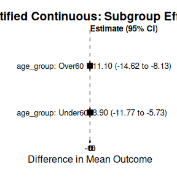

# Advanced Functionalities

This vignette demonstrates advanced functionalities for Bayesian
shrinkage estimation, including specifying an **offset for count data**,
customizing **prior distributions**, and using **stratification** to
handle heterogeneity in nuisance parameters.

## 1 Handling Exposure in Count Outcomes with Offsets

For count data (like disease exacerbations or event rates), the observed
count often depends on the **exposure time** or **follow-up time**.
Using an **offset** variable is the standard statistical method to
properly account for this time variation by modeling the event **rate**
(count per unit time) instead of the raw count.

In `bonsaiforest2`, you can include the offset directly in the
`response_formula` using the standard `brms` syntax:
`outcome + offset(log_time) ~ trt`.

### 1.1 Example 1: Count Outcome with Offset (Disease Exacerbations)

This scenario models exacerbation counts using a Negative Binomial
distribution and explicitly accounts for the patient’s exposure time.

*Scenario*: Modeling exacerbation counts. Adjust for `baseline_severity`
(unshrunk) and many exploratory `biomarkers` (shrunk). No interaction
terms (overall treatment effect only).

``` r
# Data Simulation 
set.seed(789)
library(bonsaiforest2)
n_patients <- 150
biomarker_data <- as.data.frame(matrix(rnorm(n_patients * 10), ncol = 10))
names(biomarker_data) <- paste0("biomarker_", 1:10)
count_data <- data.frame(
  exacerbation_count = rnbinom(n_patients, size = 1.5, mu = 3),
  medication = sample(0:1, n_patients, replace = TRUE),
  baseline_severity = rnorm(n_patients, 10, 2),
  log_exposure_time = log(runif(n_patients, 0.5, 1.5))
)
count_data <- cbind(count_data, biomarker_data)
count_data$medication <- factor(count_data$medication, levels = c(0, 1))

# Create formula string for all biomarkers (Prognostic effects only here)
shrunk_prog_str <- paste("~", paste(names(biomarker_data), collapse = " + "))
```

``` r
# Model Fitting with Offset
# For count models, sigma_ref is typically set to 1 (used as reference scale for priors)
count_model_fit <- run_brms_analysis(
  data = count_data,
  # Include offset(log_exposure_time) directly in the response formula
  response_formula = exacerbation_count + offset(log_exposure_time) ~ medication,
  response_type = "count",
  unshrunk_terms_formula = ~ 1 + baseline_severity,
  shrunk_prognostic_formula = as.formula(shrunk_prog_str),
  sigma_ref = 1, 
  chains = 1, iter = 200, warmup = 100, cores = 1, refresh = 0, backend = "cmdstanr"
)
#> Step 1: Preparing formula and data...
#> Converting treatment variable 'medication' to numeric binary (0/1). '0' = 0, '1' = 1
#> Note: Treatment 'medication' automatically added to unshrunk terms.
#> Warning: Formula 'shprogeffect' contains an intercept. For proper
#> regularization/interpretation, consider removing it by adding '~ 0 + ...' or '~
#> -1 + ...' to your input formula.
#> 
#> Step 2: Fitting the brms model...
#> Using trt_var from prepared_model: medication
#> Using sigma_ref = 1
#> Using default priors for unspecified effects:
#>   - intercept: normal(0, 2)
#>   - unshrunk terms: normal(0, 2)
#>   - shrunk prognostic: horseshoe(1)
#> Fitting brms model...
#> Start sampling
#> Running MCMC with 1 chain...
#> 
#> Chain 1 WARNING: There aren't enough warmup iterations to fit the 
#> Chain 1          three stages of adaptation as currently configured. 
#> Chain 1          Reducing each adaptation stage to 15%/75%/10% of 
#> Chain 1          the given number of warmup iterations: 
#> Chain 1            init_buffer = 15 
#> Chain 1            adapt_window = 75 
#> Chain 1            term_buffer = 10 
#> Chain 1 finished in 2.7 seconds.
#> Loading required namespace: rstan
#> 
#> Analysis complete.
```

## 2 Customizing Prior Distributions

The choice of prior is central to Bayesian shrinkage. `bonsaiforest2`
provides sensible defaults, but it allows for full customization using
dedicated prior arguments: `intercept_prior`, `unshrunk_prior`,
`shrunk_prognostic_prior`, and `shrunk_predictive_prior`.

### 2.1 Prior Specification Mechanics

Priors are specified using separate parameters for each component, with
a **required** `sigma_ref` parameter that serves as the reference scale
for all prior distributions.

| Prior Component       | Parameter Name            | Default Prior                         | Notes                                                                                         |
|:----------------------|:--------------------------|:--------------------------------------|:----------------------------------------------------------------------------------------------|
| **Reference Scale**   | `sigma_ref`               | **REQUIRED**                          | Must be user-specified: `sd(outcome)` for continuous/count, typically `1` for binary/survival |
| **Intercept**         | `intercept_prior`         | `normal(mean(outcome), 5*sigma_ref)`  | Automatically centered at observed mean                                                       |
| **Unshrunk Terms**    | `unshrunk_prior`          | `normal(0, 5*sigma_ref)`              | Weakly informative                                                                            |
| **Shrunk Prognostic** | `shrunk_prognostic_prior` | `horseshoe(scale_global = sigma_ref)` | Strong shrinkage                                                                              |
| **Shrunk Predictive** | `shrunk_predictive_prior` | `horseshoe(scale_global = sigma_ref)` | Strong shrinkage                                                                              |

**Key Feature:** You can use `sigma_ref` in prior expressions (e.g.,
`"normal(0, 2.5 * sigma_ref)"`) and the actual value will be
automatically substituted. This allows you to specify priors that
automatically scale with your data while maintaining interpretability.

### 2.2 Practical Examples of Prior Setting

The following examples demonstrate how to customize priors using the new
API. We use a synthetic survival dataset to show different prior
specification strategies, from simple defaults to advanced hierarchical
structures.

#### 2.2.1 Dataset Generation and Model Preparation

This dataset mimics a clinical trial with treatment effects that vary by
subgroups.

``` r
# Load library
library(bonsaiforest2)

# 1. Create Sample Data
set.seed(123)
n <- 100
sim_data <- data.frame(
  time = round(runif(n, 1, 100)),
  status = sample(0:1, n, replace = TRUE),
  trt = sample(0:1, n, replace = TRUE),
  age = rnorm(n, 50, 10),
  region = sample(c("A", "B"), n, replace = TRUE),
  subgroup = sample(c("S1", "S2", "S3"), n, replace = TRUE)
)

# Ensure variables are factors where appropriate
sim_data$trt <- factor(sim_data$trt, levels = c(0, 1))
sim_data$region <- as.factor(sim_data$region)
sim_data$subgroup <- as.factor(sim_data$subgroup)

# 2. Prepare the model formula
prepared_model <- prepare_formula_model(
  data = sim_data,
  response_formula = Surv(time, status) ~ trt,
  shrunk_predictive_formula = ~ 0 + trt:region,
  unshrunk_terms_formula = ~ age,
  response_type = "survival"
)
#> Converting treatment variable 'trt' to numeric binary (0/1). '0' = 0, '1' = 1
#> Response type is 'survival'. Modeling the baseline hazard explicitly using bhaz().
#> Note: Treatment 'trt' automatically added to unshrunk terms.
#> Note: Applied one-hot encoding to shrunken factor 'region' (will be used with ~ 0 + ...)
#> Note: Marginality principle not followed - interaction term 'region' is used without its main effect. Consider adding 'region' to prognostic terms for proper model hierarchy.
```

#### 2.2.2 Example 2: Using Default Priors (Recommended)

The simplest approach: just provide `sigma_ref` and let the package use
smart defaults that adapt to your outcome type.

``` r
# For survival models, sigma_ref is typically 1
# For continuous outcomes, use sd(outcome)
sigma_ref <- 1  # Standard for survival models

fit_ex3 <- fit_brms_model(
  prepared_model = prepared_model,
  sigma_ref = sigma_ref,
  # All priors use defaults - no need to specify!
  chains = 1, iter = 200, warmup = 100, cores = 1, refresh = 0, backend = "cmdstanr"
)
#> Using trt_var from prepared_model: trt
#> Using sigma_ref = 1
#> Using default priors for unspecified effects:
#>   - unshrunk terms: normal(0, 1.5)
#>   - shrunk predictive: horseshoe(1)
#> Fitting brms model...
#> Start sampling
#> Running MCMC with 1 chain...
#> 
#> Chain 1 WARNING: There aren't enough warmup iterations to fit the 
#> Chain 1          three stages of adaptation as currently configured. 
#> Chain 1          Reducing each adaptation stage to 15%/75%/10% of 
#> Chain 1          the given number of warmup iterations: 
#> Chain 1            init_buffer = 15 
#> Chain 1            adapt_window = 75 
#> Chain 1            term_buffer = 10 
#> Chain 1 finished in 2.1 seconds.
#> Warning: 92 of 100 (92.0%) transitions hit the maximum treedepth limit of 10.
#> See https://mc-stan.org/misc/warnings for details.

# View the priors that were automatically set
cat("\n=== Priors Used ===\n")
#> 
#> === Priors Used ===
print(fit_ex3[["prior"]])
#>           prior class        coef group resp dpar              nlpar lb ub tag
#>    horseshoe(1)     b                                   shpredeffect          
#>    horseshoe(1)     b trt:regionA                       shpredeffect          
#>    horseshoe(1)     b trt:regionB                       shpredeffect          
#>  normal(0, 1.5)     b                             unshrunktermeffect          
#>  normal(0, 1.5)     b         age                 unshrunktermeffect          
#>  normal(0, 1.5)     b         trt                 unshrunktermeffect          
#>    dirichlet(1) sbhaz                                                         
#>        source
#>          user
#>  (vectorized)
#>  (vectorized)
#>          user
#>  (vectorized)
#>  (vectorized)
#>       default
```

#### 2.2.3 Example 3: Using the R2D2 Shrinkage Prior

The R2D2 prior is useful when you want to control the *global* shrinkage
via the coefficient of determination (\\R^2\\) rather than a scale
parameter. This is often more interpretable for stakeholders.

``` r
# Use a custom R2D2 prior for the shrunk predictive effects (interactions)

fit_ex4 <- fit_brms_model(
  prepared_model = prepared_model,
  sigma_ref = 1,
  shrunk_predictive_prior = "R2D2(mean_R2 = 0.5, prec_R2 = 1)",
  # Can also customize other priors
  intercept_prior = "normal(0, 5 * sigma_ref)",
  unshrunk_prior = "normal(0, 2.5 * sigma_ref)",
  chains = 1, iter = 200, warmup = 100, cores = 1, refresh = 0, backend = "cmdstanr"
)
#> Using trt_var from prepared_model: trt
#> Using sigma_ref = 1
#> Fitting brms model...
#> Start sampling
#> Running MCMC with 1 chain...
#> 
#> Chain 1 WARNING: There aren't enough warmup iterations to fit the 
#> Chain 1          three stages of adaptation as currently configured. 
#> Chain 1          Reducing each adaptation stage to 15%/75%/10% of 
#> Chain 1          the given number of warmup iterations: 
#> Chain 1            init_buffer = 15 
#> Chain 1            adapt_window = 75 
#> Chain 1            term_buffer = 10 
#> Chain 1 finished in 2.0 seconds.
#> Warning: 89 of 100 (89.0%) transitions hit the maximum treedepth limit of 10.
#> See https://mc-stan.org/misc/warnings for details.

cat("\n=== Priors Used ===\n")
#> 
#> === Priors Used ===
print(fit_ex4[["prior"]])
#>                             prior class        coef group resp dpar
#>  R2D2(mean_R2 = 0.5, prec_R2 = 1)     b                            
#>  R2D2(mean_R2 = 0.5, prec_R2 = 1)     b trt:regionA                
#>  R2D2(mean_R2 = 0.5, prec_R2 = 1)     b trt:regionB                
#>                normal(0, 2.5 * 1)     b                            
#>                normal(0, 2.5 * 1)     b         age                
#>                normal(0, 2.5 * 1)     b         trt                
#>                      dirichlet(1) sbhaz                            
#>               nlpar lb ub tag       source
#>        shpredeffect                   user
#>        shpredeffect           (vectorized)
#>        shpredeffect           (vectorized)
#>  unshrunktermeffect                   user
#>  unshrunktermeffect           (vectorized)
#>  unshrunktermeffect           (vectorized)
#>                                    default
```

#### 2.2.4 Example 4: Custom Hierarchical Prior (Advanced)

This example demonstrates injecting raw Stan code using `stanvars`. This
is necessary if you want to implement a hierarchical structure that
`brms` does not support natively, such as estimating a shared variance
parameter across coefficients.

``` r
# 1. Define new hyperparameters in Stan
stanvars_full_hierarchical <- brms::stanvar(
  scode = "  real mu_pred;\n  real<lower=0> sigma_pred;\n",
  block = "parameters"
) +
  # Add priors for these parameters
  brms::stanvar(
    scode = "  // Priors on the hierarchical parameters\n  target += normal_lpdf(mu_pred | 0, 4); \n  target += normal_lpdf(sigma_pred | 0, 1) - normal_lccdf(0 | 0, 1); \n",
    block = "model"
  )

# 2. Create prior that references the Stan variables
prior_full_hierarchical <- brms::set_prior("normal(mu_pred, sigma_pred)")

# 3. Pass both to fit_brms_model
fit_ex5 <- fit_brms_model(
  prepared_model = prepared_model,
  sigma_ref = 1,
  shrunk_predictive_prior = prior_full_hierarchical,
  stanvars = stanvars_full_hierarchical,
  # Other priors can still use sigma_ref
  intercept_prior = "normal(0, 5 * sigma_ref)",
  unshrunk_prior = "normal(0, 2.5 * sigma_ref)",
  chains = 1, iter = 200, warmup = 100, cores = 1, refresh = 0, backend = "cmdstanr"
)
#> Using trt_var from prepared_model: trt
#> Using sigma_ref = 1
#> Re-targeting 'brmsprior' object for nlpar: shpredeffect class: b
#> Fitting brms model...
#> Start sampling
#> Running MCMC with 1 chain...
#> 
#> Chain 1 WARNING: There aren't enough warmup iterations to fit the 
#> Chain 1          three stages of adaptation as currently configured. 
#> Chain 1          Reducing each adaptation stage to 15%/75%/10% of 
#> Chain 1          the given number of warmup iterations: 
#> Chain 1            init_buffer = 15 
#> Chain 1            adapt_window = 75 
#> Chain 1            term_buffer = 10 
#> Chain 1 finished in 1.3 seconds.
#> Warning: 100 of 100 (100.0%) transitions hit the maximum treedepth limit of 10.
#> See https://mc-stan.org/misc/warnings for details.

# View the used priors
cat("\n=== Priors Used ===\n")
#> 
#> === Priors Used ===
print(fit_ex5[["prior"]])
#>                        prior class        coef group resp dpar
#>  normal(mu_pred, sigma_pred)     b                            
#>  normal(mu_pred, sigma_pred)     b trt:regionA                
#>  normal(mu_pred, sigma_pred)     b trt:regionB                
#>           normal(0, 2.5 * 1)     b                            
#>           normal(0, 2.5 * 1)     b         age                
#>           normal(0, 2.5 * 1)     b         trt                
#>                 dirichlet(1) sbhaz                            
#>               nlpar lb ub tag       source
#>        shpredeffect                   user
#>        shpredeffect           (vectorized)
#>        shpredeffect           (vectorized)
#>  unshrunktermeffect                   user
#>  unshrunktermeffect           (vectorized)
#>  unshrunktermeffect           (vectorized)
#>                                    default
print(fit_ex5[["stanvars"]])
#> [[1]]
#> [[1]]$name
#> [1] ""
#> 
#> [[1]]$sdata
#> NULL
#> 
#> [[1]]$scode
#> [1] "  real mu_pred;\n  real<lower=0> sigma_pred;\n"
#> 
#> [[1]]$block
#> [1] "parameters"
#> 
#> [[1]]$position
#> [1] "start"
#> 
#> [[1]]$pll_args
#> character(0)
#> 
#> 
#> [[2]]
#> [[2]]$name
#> [1] ""
#> 
#> [[2]]$sdata
#> NULL
#> 
#> [[2]]$scode
#> [1] "  // Priors on the hierarchical parameters\n  target += normal_lpdf(mu_pred | 0, 4); \n  target += normal_lpdf(sigma_pred | 0, 1) - normal_lccdf(0 | 0, 1); \n"
#> 
#> [[2]]$block
#> [1] "model"
#> 
#> [[2]]$position
#> [1] "start"
#> 
#> [[2]]$pll_args
#> character(0)
#> 
#> 
#> attr(,"class")
#> [1] "stanvars"
```

#### 2.2.5 Example 5: Coefficient-Specific Priors

You can set different priors for specific coefficients by passing a
`brmsprior` object (created with
[`c()`](https://rdrr.io/r/base/c.html)).

*Scenario*: Set a general prior for all unshrunk terms, but use a
tighter prior specifically for treatment-biomarker interactions.

*Key Technique*: Use
[`prepare_formula_model()`](https://openpharma.github.io/bonsaiforest2/reference/prepare_formula_model.md)
to discover the exact coefficient names that will appear in the model.

``` r
# 1. Run prepare_formula_model
prepared_model <- prepare_formula_model(
  data = sim_data,
  response_formula = Surv(time, status) ~ trt,
  shrunk_predictive_formula = ~ 0 + trt:region,
  unshrunk_terms_formula = ~ age + trt*subgroup,
  response_type = "survival"
)
#> Converting treatment variable 'trt' to numeric binary (0/1). '0' = 0, '1' = 1
#> Response type is 'survival'. Modeling the baseline hazard explicitly using bhaz().
#> Note: Treatment 'trt' automatically added to unshrunk terms.
#> Note: Applied dummy encoding (contr.treatment) to unshrunken factor 'subgroup'
#> Note: Applied one-hot encoding to shrunken factor 'region' (will be used with ~ 0 + ...)
#> Note: Marginality principle not followed - interaction term 'region' is used without its main effect. Consider adding 'region' to prognostic terms for proper model hierarchy.

# 2. Inspect the Results
# A. The generated brms formula object
print(prepared_model$formula)
#> time | cens(1 - status) + bhaz(Boundary.knots = c(0.02, 99.98), knots = c(24, 46, 69), intercept = FALSE) ~ unshrunktermeffect + shpredeffect 
#> unshrunktermeffect ~ 0 + age + trt * subgroup + trt
#> shpredeffect ~ 0 + trt:region

# B. The processed terms
print(prepared_model$stan_variable_names$X_unshrunktermeffect)
#> [1] "age"            "trt"            "subgroupS1"     "subgroupS2"    
#> [5] "subgroupS3"     "trt:subgroupS2" "trt:subgroupS3"

sigma_ref <- 1

cat("=== Prior Strategy ===\n")
#> === Prior Strategy ===
cat("General unshrunk prior: normal(0,", round(5 * sigma_ref, 2), ")\n")
#> General unshrunk prior: normal(0, 5 )
cat("Specific for trt:subgroup: normal(0,", round(1 * sigma_ref, 2), ")\n\n")
#> Specific for trt:subgroup: normal(0, 1 )

# Create combined prior object
# IMPORTANT: Use EXACT coefficient names from the prepared data
unshrunk_priors_combined <- c(
  brms::set_prior("normal(0, 5 * sigma_ref)", class = "b"),  # General
  brms::set_prior("normal(0, 1 * sigma_ref)", class = "b", coef = "trt:subgroupS2"),
  brms::set_prior("normal(0, 1 * sigma_ref)", class = "b", coef = "trt:subgroupS3")
)

# Fit the model
fit_specific <- fit_brms_model(
  prepared_model = prepared_model,
  sigma_ref = sigma_ref,
  unshrunk_prior = unshrunk_priors_combined,  # Pass the combined object
  chains = 1, iter = 200, warmup = 100, cores = 1, refresh = 0, backend = "cmdstanr"
)
#> Using trt_var from prepared_model: trt
#> Using sigma_ref = 1
#> Re-targeting 'brmsprior' object for nlpar: unshrunktermeffect class: b
#> Using default priors for unspecified effects:
#>   - shrunk predictive: horseshoe(1)
#> Fitting brms model...
#> Start sampling
#> Running MCMC with 1 chain...
#> 
#> Chain 1 WARNING: There aren't enough warmup iterations to fit the 
#> Chain 1          three stages of adaptation as currently configured. 
#> Chain 1          Reducing each adaptation stage to 15%/75%/10% of 
#> Chain 1          the given number of warmup iterations: 
#> Chain 1            init_buffer = 15 
#> Chain 1            adapt_window = 75 
#> Chain 1            term_buffer = 10 
#> Chain 1 finished in 2.5 seconds.
#> Warning: 89 of 100 (89.0%) transitions hit the maximum treedepth limit of 10.
#> See https://mc-stan.org/misc/warnings for details.

# View the used priors
cat("\n=== Priors Used ===\n")
#> 
#> === Priors Used ===
print(fit_specific[["prior"]])
#>             prior class           coef group resp dpar              nlpar lb ub
#>      horseshoe(1)     b                                      shpredeffect      
#>      horseshoe(1)     b    trt:regionA                       shpredeffect      
#>      horseshoe(1)     b    trt:regionB                       shpredeffect      
#>  normal(0, 5 * 1)     b                                unshrunktermeffect      
#>  normal(0, 5 * 1)     b            age                 unshrunktermeffect      
#>  normal(0, 5 * 1)     b     subgroupS1                 unshrunktermeffect      
#>  normal(0, 5 * 1)     b     subgroupS2                 unshrunktermeffect      
#>  normal(0, 5 * 1)     b     subgroupS3                 unshrunktermeffect      
#>  normal(0, 5 * 1)     b            trt                 unshrunktermeffect      
#>  normal(0, 1 * 1)     b trt:subgroupS2                 unshrunktermeffect      
#>  normal(0, 1 * 1)     b trt:subgroupS3                 unshrunktermeffect      
#>      dirichlet(1) sbhaz                                                        
#>  tag       source
#>              user
#>      (vectorized)
#>      (vectorized)
#>              user
#>      (vectorized)
#>      (vectorized)
#>      (vectorized)
#>      (vectorized)
#>      (vectorized)
#>              user
#>              user
#>           default
```

#### 2.2.6 Example 6: Hierarchical Priors with Shared Variance (stanvars)

Create correlated priors by sharing a common variance parameter
estimated from the data.

*Use case*: When you believe treatment effects across subgroups should
be exchangeable, you can pool information by giving them a shared
variance.

``` r
cat("\n=== Hierarchical Prior Structure ===\n")
#> 
#> === Hierarchical Prior Structure ===
cat("Instead of independent priors, we'll use a shared variance:\n")
#> Instead of independent priors, we'll use a shared variance:
cat("  tau ~ half-normal(0, 1)  [shared variance parameter]\n")
#>   tau ~ half-normal(0, 1)  [shared variance parameter]
cat("  beta_Low ~ N(0, tau)\n")
#>   beta_Low ~ N(0, tau)
cat("  beta_Medium ~ N(0, tau)\n")
#>   beta_Medium ~ N(0, tau)
cat("This creates exchangeability and adaptive shrinkage.\n\n")
#> This creates exchangeability and adaptive shrinkage.

# Step 1: Declare tau as a parameter to be estimated
tau_parameter <- brms::stanvar(
  scode = "  real<lower=0> biomarker_tau;  // Shared variance\n",
  block = "parameters"
)

# Step 2: Add prior for tau
tau_prior <- brms::stanvar(
  scode = "  biomarker_tau ~ normal(0, 1);  // Hyperprior\n",
  block = "model"
)

# Combine stanvars
hierarchical_stanvars <- tau_parameter + tau_prior

# Step 3: Create priors referencing the estimated tau
# Note: We identified these coefficient names using prepare_formula_model above
unshrunk_priors_hier <- c(
  brms::set_prior("normal(0, 5 * sigma_ref)", class = "b"),  # General
  brms::set_prior("normal(0, biomarker_tau)", class = "b", coef = "trt:subgroupS2"),
  brms::set_prior("normal(0, biomarker_tau)", class = "b", coef = "trt:subgroupS3")
)

# Step 4: Fit the hierarchical model
fit_hier <- fit_brms_model(
  prepared_model = prepared_model,
  sigma_ref = sigma_ref,
  unshrunk_prior = unshrunk_priors_hier,
  stanvars = hierarchical_stanvars,
  chains = 1, iter = 400, warmup = 200, cores = 1, refresh = 0, backend = "cmdstanr"
)
#> Using trt_var from prepared_model: trt
#> Using sigma_ref = 1
#> Re-targeting 'brmsprior' object for nlpar: unshrunktermeffect class: b
#> Using default priors for unspecified effects:
#>   - shrunk predictive: horseshoe(1)
#> Fitting brms model...
#> Start sampling
#> Running MCMC with 1 chain...
#> 
#> Chain 1 finished in 1.3 seconds.
#> Warning: 1 of 200 (0.0%) transitions ended with a divergence.
#> See https://mc-stan.org/misc/warnings for details.

# View the used priors
cat("\n=== Priors Used ===\n")
#> 
#> === Priors Used ===
print(fit_hier[["prior"]])
#>                     prior class           coef group resp dpar
#>              horseshoe(1)     b                               
#>              horseshoe(1)     b    trt:regionA                
#>              horseshoe(1)     b    trt:regionB                
#>          normal(0, 5 * 1)     b                               
#>          normal(0, 5 * 1)     b            age                
#>          normal(0, 5 * 1)     b     subgroupS1                
#>          normal(0, 5 * 1)     b     subgroupS2                
#>          normal(0, 5 * 1)     b     subgroupS3                
#>          normal(0, 5 * 1)     b            trt                
#>  normal(0, biomarker_tau)     b trt:subgroupS2                
#>  normal(0, biomarker_tau)     b trt:subgroupS3                
#>              dirichlet(1) sbhaz                               
#>               nlpar lb ub tag       source
#>        shpredeffect                   user
#>        shpredeffect           (vectorized)
#>        shpredeffect           (vectorized)
#>  unshrunktermeffect                   user
#>  unshrunktermeffect           (vectorized)
#>  unshrunktermeffect           (vectorized)
#>  unshrunktermeffect           (vectorized)
#>  unshrunktermeffect           (vectorized)
#>  unshrunktermeffect           (vectorized)
#>  unshrunktermeffect                   user
#>  unshrunktermeffect                   user
#>                                    default
print(fit_hier[["stanvars"]])
#> [[1]]
#> [[1]]$name
#> [1] ""
#> 
#> [[1]]$sdata
#> NULL
#> 
#> [[1]]$scode
#> [1] "  real<lower=0> biomarker_tau;  // Shared variance\n"
#> 
#> [[1]]$block
#> [1] "parameters"
#> 
#> [[1]]$position
#> [1] "start"
#> 
#> [[1]]$pll_args
#> character(0)
#> 
#> 
#> [[2]]
#> [[2]]$name
#> [1] ""
#> 
#> [[2]]$sdata
#> NULL
#> 
#> [[2]]$scode
#> [1] "  biomarker_tau ~ normal(0, 1);  // Hyperprior\n"
#> 
#> [[2]]$block
#> [1] "model"
#> 
#> [[2]]$position
#> [1] "start"
#> 
#> [[2]]$pll_args
#> character(0)
#> 
#> 
#> attr(,"class")
#> [1] "stanvars"
```

## 3 Advanced Model Parameterization

This section demonstrates advanced features for controlling how your
model represents subgroups.

### 3.1 Example 7: Custom Contrast Encoding for Shrunk Terms

By default, `bonsaiforest2` uses one-hot encoding (all factor levels)
for shrunk interaction terms, and dummy encoding (drop one level) for
unshrunk terms. However, you can manually set custom contrasts in your
data, and the library will respect your choice.

*Scenario*: You want to use treatment contrasts (k-1 dummy variables
with a reference level) or custom contrasts (e.g., Helmert, sum coding)
instead of one-hot encoding for your shrunk predictive effects.

*Key Technique*: Set contrasts using
[`contrasts()`](https://rdrr.io/r/stats/contrasts.html) before calling
[`prepare_formula_model()`](https://openpharma.github.io/bonsaiforest2/reference/prepare_formula_model.md).
The library will preserve your choice.

``` r
# Create sample data with multiple subgroups
set.seed(456)
n_patients <- 180
sample_data_contrast <- data.frame(
  id = 1:n_patients,
  trt = factor(sample(0:1, n_patients, replace = TRUE)),
  outcome = rnorm(n_patients, 50, 10),
  age = rnorm(n_patients, 65, 10),
  biomarker = factor(sample(c("Low", "Medium", "High"), n_patients, replace = TRUE))
)

# Set Helmert contrasts for the biomarker variable
contrasts(sample_data_contrast$biomarker) <- contr.helmert(3)
cat("Contrast matrix for biomarker:\\n")
#> Contrast matrix for biomarker:\n
print(contrasts(sample_data_contrast$biomarker))
#>        [,1] [,2]
#> High     -1   -1
#> Low       1   -1
#> Medium    0    2

# Prepare model 
prepared_custom_contrast <- prepare_formula_model(
  data = sample_data_contrast,
  response_formula = outcome ~ trt,
  unshrunk_terms_formula = ~ age,
  shrunk_predictive_formula = ~ 0 + trt:biomarker, 
  response_type = "continuous"
)
#> Converting treatment variable 'trt' to numeric binary (0/1). '0' = 0, '1' = 1
#> Note: Treatment 'trt' automatically added to unshrunk terms.
#> Variable 'biomarker' has user-specified contrasts. Keeping them.
#> Note: Marginality principle not followed - interaction term 'biomarker' is used without its main effect. Consider adding 'biomarker' to prognostic terms for proper model hierarchy.

# Observe costum contrast in the data
str(prepared_custom_contrast$data)
#> 'data.frame':    180 obs. of  5 variables:
#>  $ id       : int  1 2 3 4 5 6 7 8 9 10 ...
#>  $ trt      : num  0 0 0 1 0 1 0 0 1 0 ...
#>  $ outcome  : num  45.3 43.3 63.6 64.1 42.7 ...
#>  $ age      : num  41.2 66.5 46 81.5 70 ...
#>  $ biomarker: Factor w/ 3 levels "High","Low","Medium": 1 1 3 1 1 1 1 2 1 3 ...
#>   ..- attr(*, "contrasts")= num [1:3, 1:2] -1 1 0 -1 -1 2
#>   .. ..- attr(*, "dimnames")=List of 2
#>   .. .. ..$ : chr [1:3] "High" "Low" "Medium"
#>   .. .. ..$ : NULL

sigma_ref <- 1

# Fit the model
fit_custom_contrast <- fit_brms_model(
  prepared_model = prepared_custom_contrast,
  sigma_ref = sigma_ref,
  chains = 1, iter = 200, warmup = 100, cores = 1, refresh = 0, backend = "cmdstanr"
)
#> Using trt_var from prepared_model: trt
#> Note: Using default sigma_ref = 1 for continuous outcome. Consider setting sigma_ref to the outcome standard deviation from the trial protocol (preferred) or sd(outcome) for better prior specification.
#> Using sigma_ref = 1
#> Computed outcome mean: 50.06
#> Using default priors for unspecified effects:
#>   - intercept: normal(50.0602209848849, 2.5)
#>   - unshrunk terms: normal(0, 2.5)
#>   - shrunk predictive: horseshoe(1)
#> Adding sigma prior: student_t(3, 0, 1)
#> Fitting brms model...
#> Start sampling
#> Running MCMC with 1 chain...
#> 
#> Chain 1 WARNING: There aren't enough warmup iterations to fit the 
#> Chain 1          three stages of adaptation as currently configured. 
#> Chain 1          Reducing each adaptation stage to 15%/75%/10% of 
#> Chain 1          the given number of warmup iterations: 
#> Chain 1            init_buffer = 15 
#> Chain 1            adapt_window = 75 
#> Chain 1            term_buffer = 10 
#> Chain 1 finished in 1.0 seconds.

estimate_custom_contrast <- summary_subgroup_effects(fit_custom_contrast)
#> Using trt_var from model attributes: trt
#> Using response_type from model attributes: continuous
#> --- Calculating specific subgroup effects... ---
#> Using data from model attributes
#> Step 1: Identifying subgroups and creating counterfactuals...
#> `subgroup_vars` set to 'auto'. Detecting from model...
#> Model data has 180 rows and 5 columns
#> Column names: id, trt, outcome, age, biomarker
#> Treatment variable: 'trt'
#> All coefficient names:
#> unshrunktermeffect_Intercept
#> unshrunktermeffect_age
#> unshrunktermeffect_trt
#> shpredeffect_trt:biomarkerHigh
#> shpredeffect_trt:biomarkerLow
#> shpredeffect_trt:biomarkerMedium
#> Looking for treatment interactions with pattern: 'trt:'
#> Found 3 treatment interaction coefficients
#> Treatment interaction coefficients found:
#> shpredeffect_trt:biomarkerHigh
#> shpredeffect_trt:biomarkerLow
#> shpredeffect_trt:biomarkerMedium
#> Detected subgroup variable 'biomarker' from coefficient 'shpredeffect_trt:biomarkerHigh'
#> Detected subgroup variable 'biomarker' from coefficient 'shpredeffect_trt:biomarkerLow'
#> Detected subgroup variable 'biomarker' from coefficient 'shpredeffect_trt:biomarkerMedium'
#> Checking for random effects parameters...
#> Retrieved 14 total parameters from model
#> Using regex pattern: '^r_(.+)__[^\[]+\[[^,]+,trt\]'
#> Found 0 matching random effect parameters
#> No random effect parameters matching the pattern were found
#> ...detected subgroup variable(s): biomarker
#> Step 2: Generating posterior predictions...
#> ... detected Fixed Effects (Colon model). Predicting with re_formula = NA.
#> ... (predicting expected outcomes)...
#> Step 3: Calculating marginal effects...
#> ... processing biomarker
#> Done.

print(estimate_custom_contrast)
#> $estimates
#> # A tibble: 3 × 4
#>   Subgroup          Median CI_Lower CI_Upper
#>   <chr>              <dbl>    <dbl>    <dbl>
#> 1 biomarker: High   -0.668    -3.30   2.35  
#> 2 biomarker: Low    -2.57     -5.77  -0.0927
#> 3 biomarker: Medium -1.33     -4.76   1.64  
#> 
#> $response_type
#> [1] "continuous"
#> 
#> $ci_level
#> [1] 0.95
#> 
#> $trt_var
#> [1] "trt"
#> 
#> attr(,"class")
#> [1] "subgroup_summary"
```

### 3.2 Example 8: Prediction on New Data

After fitting a model, you can use `brms::predict()` to generate
predictions for new patients.

*Scenario*: We’ve fitted a treatment effect model and want to predict
outcomes for new patients with different characteristics.

``` r
# Use the fitted model from Example 7
# Generate new data for prediction
set.seed(789)
new_patients <- data.frame(
  id = 1:20,
  trt = as.numeric(rep(c(0, 1), each = 10), levels = c(0, 1)),
  age = rnorm(20, 65, 10),
  biomarker = factor(rep(c("Low", "Medium", "High"), length.out = 20))
)

# IMPORTANT: Set the same contrasts as in Example 7
# The prediction data must use the same encoding as the training data
contrasts(new_patients$biomarker) <- contr.helmert(3)


# Generate predictions using brms::predict
# This returns posterior predictive samples
predictions <- predict(fit_custom_contrast, newdata = new_patients, summary = TRUE)
```

## 4 Stratification for Nuisance Parameters

In many trials, parameters like the observation error variance
(\\\sigma^2\\ for continuous outcomes) or the baseline hazard function
(\\h_0(t)\\ for survival outcomes) are known to vary by site, country,
or other factors. Stratification models this known heterogeneity by
fitting these nuisance parameters separately for each level of a
grouping variable.

Use the `stratification_formula` argument to define the grouping
factor(s).

### 4.1 Example 9: Stratified Continuous Model

*Scenario*: We model SBP change where the observation **variance**
\\\sigma^2\\ differs by \\\text{clinic\\site}\\. This is modeled by
stratifying the \\\sigma\\ parameter in the Normal distribution by the
site variable.

``` r
set.seed(42)
n_patients <- 180
sigma_by_site <- c(SiteA = 6, SiteB = 12, SiteC = 18)
sample_data_strat_cont <- data.frame(
    id = 1:n_patients,
    clinic_site = factor(sample(c("SiteA", "SiteB", "SiteC"), n_patients, replace = TRUE))
)
sample_data_strat_cont$trt <- factor(sample(0:1, n_patients, replace = TRUE, prob = c(0.5, 0.5)))
sample_data_strat_cont$baseline_sbp <- rnorm(n_patients, mean = 145, sd = 8)
sample_data_strat_cont$age_group <- factor(sample(c("Under60", "Over60"), n_patients, replace = TRUE))
noise <- rnorm(n_patients, mean = 0, sd = sigma_by_site[sample_data_strat_cont$clinic_site])
sample_data_strat_cont$sbp_change <- -5 - (as.integer(sample_data_strat_cont$trt)-1) * 8 -
                                     0.2 * (sample_data_strat_cont$baseline_sbp - 145) +
                                     (as.integer(sample_data_strat_cont$trt)-1) * ifelse(sample_data_strat_cont$age_group == "Over60", -5, 0) +
                                     noise
```

``` r
# Model Fitting with Stratified Sigma
# Calculate sigma_ref from the outcome SD
sigma_ref <- sd(sample_data_strat_cont$sbp_change)

fit_continuous_stratified <- run_brms_analysis(
  data = sample_data_strat_cont,
  response_formula = sbp_change ~ trt,
  response_type = "continuous",
  unshrunk_terms_formula = ~ baseline_sbp,
  shrunk_predictive_formula = ~ 0 + trt:age_group,
  stratification_formula = ~ clinic_site,
  sigma_ref = sigma_ref,
  chains = 1, iter = 200, warmup = 100, cores = 1, refresh = 0, backend = "cmdstanr"
)
#> Step 1: Preparing formula and data...
#> Converting treatment variable 'trt' to numeric binary (0/1). '0' = 0, '1' = 1
#> Applying stratification: estimating sigma by 'clinic_site'.
#> Note: Treatment 'trt' automatically added to unshrunk terms.
#> Note: Applied one-hot encoding to shrunken factor 'age_group' (will be used with ~ 0 + ...)
#> Note: Marginality principle not followed - interaction term 'age_group' is used without its main effect. Consider adding 'age_group' to prognostic terms for proper model hierarchy.
#> 
#> Step 2: Fitting the brms model...
#> Using trt_var from prepared_model: trt
#> Using sigma_ref = 13.287
#> Computed outcome mean: -11.302
#> Using default priors for unspecified effects:
#>   - intercept: normal(-11.3016300423315, 33.2173779229901)
#>   - unshrunk terms: normal(0, 33.2173779229901)
#>   - shrunk predictive: horseshoe(1)
#> Fitting brms model...
#> Start sampling
#> Running MCMC with 1 chain...
#> 
#> Chain 1 WARNING: There aren't enough warmup iterations to fit the 
#> Chain 1          three stages of adaptation as currently configured. 
#> Chain 1          Reducing each adaptation stage to 15%/75%/10% of 
#> Chain 1          the given number of warmup iterations: 
#> Chain 1            init_buffer = 15 
#> Chain 1            adapt_window = 75 
#> Chain 1            term_buffer = 10 
#> Chain 1 finished in 2.7 seconds.
#> Warning: 56 of 100 (56.0%) transitions hit the maximum treedepth limit of 10.
#> See https://mc-stan.org/misc/warnings for details.
#> 
#> Analysis complete.
```

``` r
strat_continuous_summary <- summary_subgroup_effects(
  brms_fit = fit_continuous_stratified
  # All parameters automatically extracted!
)
#> Using trt_var from model attributes: trt
#> Using response_type from model attributes: continuous
#> --- Calculating specific subgroup effects... ---
#> Using data from model attributes
#> Step 1: Identifying subgroups and creating counterfactuals...
#> `subgroup_vars` set to 'auto'. Detecting from model...
#> Model data has 180 rows and 6 columns
#> Column names: id, clinic_site, trt, baseline_sbp, age_group, sbp_change
#> Treatment variable: 'trt'
#> All coefficient names:
#> sigma_Intercept
#> unshrunktermeffect_Intercept
#> unshrunktermeffect_baseline_sbp
#> unshrunktermeffect_trt
#> sigma_clinic_siteSiteB
#> sigma_clinic_siteSiteC
#> shpredeffect_trt:age_groupOver60
#> shpredeffect_trt:age_groupUnder60
#> Looking for treatment interactions with pattern: 'trt:'
#> Found 2 treatment interaction coefficients
#> Treatment interaction coefficients found:
#> shpredeffect_trt:age_groupOver60
#> shpredeffect_trt:age_groupUnder60
#> Detected subgroup variable 'age_group' from coefficient 'shpredeffect_trt:age_groupOver60'
#> Detected subgroup variable 'age_group' from coefficient 'shpredeffect_trt:age_groupUnder60'
#> Checking for random effects parameters...
#> Retrieved 15 total parameters from model
#> Using regex pattern: '^r_(.+)__[^\[]+\[[^,]+,trt\]'
#> Found 0 matching random effect parameters
#> No random effect parameters matching the pattern were found
#> ...detected subgroup variable(s): age_group
#> Step 2: Generating posterior predictions...
#> ... detected Fixed Effects (Colon model). Predicting with re_formula = NA.
#> ... (predicting expected outcomes)...
#> Step 3: Calculating marginal effects...
#> ... processing age_group
#> Done.

print(strat_continuous_summary$estimates)
#> # A tibble: 2 × 4
#>   Subgroup           Median CI_Lower CI_Upper
#>   <chr>               <dbl>    <dbl>    <dbl>
#> 1 age_group: Over60  -11.5     -14.3    -8.22
#> 2 age_group: Under60  -9.26    -11.9    -5.77
plot(strat_continuous_summary, title = "Stratified Continuous: Subgroup Effects")
#> Preparing data for plotting...
#> Generating plot...
#> Done.
```



### 4.2 Example 10: Stratified Survival Model

*Scenario*: We model a time-to-event outcome where the **baseline
hazard** \\h_0(t)\\ differs by \\\text{country}\\. This is particularly
important for multi-regional trials where regional differences in
standard of care affect baseline risk.

``` r
set.seed(123)
n_patients <- 200
lambda_by_country <- c(US = 0.01, EU = 0.03)
surv_data_strat <- data.frame(
    id = 1:n_patients,
    country = factor(sample(c("US", "EU"), n_patients, replace = TRUE)),
    trt = factor(sample(0:1, n_patients, replace = TRUE)),
    age = rnorm(n_patients, 65, 10),
    biomarker = factor(sample(c("Low", "High"), n_patients, replace = TRUE))
)
lp <- (as.integer(surv_data_strat$trt)-1) * -0.6 + (surv_data_strat$age - 65) * 0.03 +
      (as.integer(surv_data_strat$trt)-1) * (as.integer(surv_data_strat$biomarker) - 1) * -0.5
u <- runif(n_patients)
lambda_vec <- lambda_by_country[surv_data_strat$country]
gamma <- 1.5 # Weibull shape parameter
true_event_time <- (-log(u) / (lambda_vec * exp(lp)))^(1/gamma)
censoring_time <- 60 # Administrative censoring time
surv_data_strat$event_status <- ifelse(true_event_time <= censoring_time, 1, 0)
surv_data_strat$event_time <- pmin(true_event_time, censoring_time)
```

``` r
# Model Fitting with Stratified Baseline Hazard
fit_surv_stratified <- run_brms_analysis(
  data = surv_data_strat,
  response_formula = Surv(event_time, event_status) ~ trt,
  response_type = "survival",
  unshrunk_terms_formula = ~ age,
  shrunk_predictive_formula = ~ 0 + trt:biomarker,
  stratification_formula = ~ country,
  sigma_ref = 1,  # For survival models, typically use 1
  chains = 1, iter = 200, warmup = 100, cores = 1, refresh = 0, backend = "cmdstanr"
)
#> Step 1: Preparing formula and data...
#> Converting treatment variable 'trt' to numeric binary (0/1). '0' = 0, '1' = 1
#> Response type is 'survival'. Modeling the baseline hazard explicitly using bhaz().
#> Applying stratification: estimating separate baseline hazards by 'country'.
#> Note: Treatment 'trt' automatically added to unshrunk terms.
#> Note: Applied one-hot encoding to shrunken factor 'biomarker' (will be used with ~ 0 + ...)
#> Note: Marginality principle not followed - interaction term 'biomarker' is used without its main effect. Consider adding 'biomarker' to prognostic terms for proper model hierarchy.
#> 
#> Step 2: Fitting the brms model...
#> Using trt_var from prepared_model: trt
#> Using sigma_ref = 1
#> Using default priors for unspecified effects:
#>   - unshrunk terms: normal(0, 1.5)
#>   - shrunk predictive: horseshoe(1)
#> Fitting brms model...
#> Start sampling
#> Running MCMC with 1 chain...
#> 
#> Chain 1 WARNING: There aren't enough warmup iterations to fit the 
#> Chain 1          three stages of adaptation as currently configured. 
#> Chain 1          Reducing each adaptation stage to 15%/75%/10% of 
#> Chain 1          the given number of warmup iterations: 
#> Chain 1            init_buffer = 15 
#> Chain 1            adapt_window = 75 
#> Chain 1            term_buffer = 10 
#> Chain 1 finished in 7.6 seconds.
#> Warning: 100 of 100 (100.0%) transitions hit the maximum treedepth limit of 10.
#> See https://mc-stan.org/misc/warnings for details.
#> 
#> Analysis complete.
```

``` r
strat_surv_summary <- summary_subgroup_effects(
  brms_fit = fit_surv_stratified
  # All parameters automatically extracted!
)
#> Using trt_var from model attributes: trt
#> Using response_type from model attributes: survival
#> --- Calculating specific subgroup effects... ---
#> Using data from model attributes
#> Step 1: Identifying subgroups and creating counterfactuals...
#> `subgroup_vars` set to 'auto'. Detecting from model...
#> Model data has 200 rows and 7 columns
#> Column names: id, country, trt, age, biomarker, event_status, event_time
#> Treatment variable: 'trt'
#> All coefficient names:
#> unshrunktermeffect_age
#> unshrunktermeffect_trt
#> shpredeffect_trt:biomarkerHigh
#> shpredeffect_trt:biomarkerLow
#> Looking for treatment interactions with pattern: 'trt:'
#> Found 2 treatment interaction coefficients
#> Treatment interaction coefficients found:
#> shpredeffect_trt:biomarkerHigh
#> shpredeffect_trt:biomarkerLow
#> Detected subgroup variable 'biomarker' from coefficient 'shpredeffect_trt:biomarkerHigh'
#> Detected subgroup variable 'biomarker' from coefficient 'shpredeffect_trt:biomarkerLow'
#> Checking for random effects parameters...
#> Retrieved 22 total parameters from model
#> Using regex pattern: '^r_(.+)__[^\[]+\[[^,]+,trt\]'
#> Found 0 matching random effect parameters
#> No random effect parameters matching the pattern were found
#> ...detected subgroup variable(s): biomarker
#> Step 2: Generating posterior predictions...
#> ... detected Fixed Effects (Colon model). Predicting with re_formula = NA.
#> ... (reconstructing baseline hazard and getting linear predictors)...
#> Warning: Dropping 'draws_df' class as required metadata was removed.
#> Warning: Dropping 'draws_df' class as required metadata was removed.
#> Step 3: Calculating marginal effects...
#> ... processing biomarker
#> Done.

print(strat_surv_summary$estimates)
#> # A tibble: 2 × 4
#>   Subgroup        Median CI_Lower CI_Upper
#>   <chr>            <dbl>    <dbl>    <dbl>
#> 1 biomarker: High  0.592    0.476    0.832
#> 2 biomarker: Low   0.376    0.263    0.522
plot(strat_surv_summary, title = "Stratified Survival: Subgroup Effects (AHR)")
#> Preparing data for plotting...
#> Generating plot...
#> Done.
```


## 5 Summary

This vignette demonstrated advanced functionalities in `bonsaiforest2`:

1.  **Offset variables** for count outcomes with varying exposure times
2.  **Custom prior specification** with the new `sigma_ref` API
3.  **One-hot encoding** for full factor representation in interactions
4.  **Coefficient-specific priors** for fine-grained control
5.  **Hierarchical priors** with shared variance using `stanvars`
6.  **Stratification** for nuisance parameters that vary by groups

These features provide researchers with powerful tools for complex trial
analyses while maintaining the principled Bayesian shrinkage framework.
