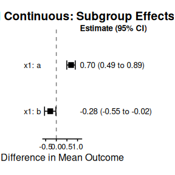
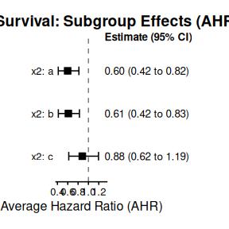

# Advanced Functionalities

This vignette demonstrates advanced functionalities for Bayesian
shrinkage estimation, including specifying an **offset for count data**,
customizing **prior distributions**, and using **stratification** to
handle heterogeneity in nuisance parameters.

## 1 Handling Exposure in Count Outcomes with Offsets

For count data (like disease exacerbations or event rates), the observed
count often depends on the **exposure time** or **follow-up time**.
Using an **offset** variable is the standard statistical method to
properly account for this time variation by modeling the event **rate**
(count per unit time) instead of the raw count.

In `bonsaiforest2`, you can include the offset directly in the
`response_formula` using the standard `brms` syntax:
`count + offset(log_fup_duration) ~ trt`.

### 1.1 Example 1: Count Outcome with Offset (Disease Exacerbations)

This scenario models exacerbation counts using a Negative Binomial
distribution and explicitly accounts for the patient’s follow-up
duration.

*Scenario*: Modeling count outcomes with exposure-time adjustment using
the `shrink_data` dataset. Adjust for `x1` (unshrunk prognostic effect)
and `x2`, `x3` (shrunk prognostic effects). Overall treatment effect on
the rate scale.

``` r
# Load data and prepare offset variable
library(bonsaiforest2)
shrink_data <- bonsaiforest2::shrink_data

# Add log follow-up duration as the offset (accounts for varying exposure time)
shrink_data$log_fup_duration <- log(shrink_data$fup_duration)
count_data <- shrink_data
```

``` r
# Model Fitting with Offset
count_model_fit <- run_brms_analysis(
  data = count_data,
  # Include offset(log_fup_duration) directly in the response formula
  response_formula = count + offset(log_fup_duration) ~ trt,
  response_type = "count",
  unshrunk_terms_formula = ~ x1,
  shrunk_prognostic_formula = ~ 0 + x2 + x3,
  intercept_prior = "normal(0, 5)",
  unshrunk_prior = "normal(0, 2.5)",
  shrunk_prognostic_prior = "horseshoe(scale_global = 1)",
  shrunk_predictive_prior = "horseshoe(scale_global = 1)",
  chains = 2, iter = 1000, warmup = 500, cores = 2, refresh = 0, backend = "cmdstanr"
)
#> Step 1: Preparing formula and data...
#> 
#> Step 2: Fitting the brms model...
#> Fitting brms model...
#> Start sampling
#> Running MCMC with 2 parallel chains...
#> 
#> Chain 1 finished in 2.6 seconds.
#> Chain 2 finished in 2.7 seconds.
#> 
#> Both chains finished successfully.
#> Mean chain execution time: 2.6 seconds.
#> Total execution time: 2.8 seconds.
#> Warning: 6 of 1000 (1.0%) transitions ended with a divergence.
#> See https://mc-stan.org/misc/warnings for details.
#> Loading required namespace: rstan
#> 
#> Analysis complete.
```

## 2 Customizing Prior Distributions

The choice of prior is central to Bayesian shrinkage. `bonsaiforest2`
provides sensible defaults, but it allows for full customization using
dedicated prior arguments: `intercept_prior`, `unshrunk_prior`,
`shrunk_prognostic_prior`, and `shrunk_predictive_prior`.

### 2.1 Prior Specification Mechanics

Priors are specified using separate parameters for each component.

| Prior Component       | Parameter Name            | Default Prior                 | Notes                                                                                                                                                    |
|:----------------------|:--------------------------|:------------------------------|:---------------------------------------------------------------------------------------------------------------------------------------------------------|
| **Intercept**         | `intercept_prior`         | `NULL` (brms default)         | Optional custom prior                                                                                                                                    |
| **Unshrunk Terms**    | `unshrunk_prior`          | `NULL` (brms default)         | Optional custom prior                                                                                                                                    |
| **Shrunk Prognostic** | `shrunk_prognostic_prior` | `horseshoe(scale_global = 1)` | Strong shrinkage for fixed effects (colon syntax); For random effects (pipe-pipe syntax), automatically uses `normal(0, 1)` on SD scale                  |
| **Shrunk Predictive** | `shrunk_predictive_prior` | `horseshoe(scale_global = 1)` | Strong shrinkage for fixed effects (colon syntax); For random effects (pipe-pipe syntax), can be specified via `set_prior("normal(0, 1)", class = "sd")` |

### 2.2 Practical Examples of Prior Setting

The following examples demonstrate how to customize priors using the new
API. We use the `shrink_data` package dataset with a time-to-event
outcome to show different prior specification strategies, from simple
defaults to advanced hierarchical structures.

#### 2.2.1 Dataset Preparation

``` r
# Load library
library(bonsaiforest2)

# 1. Load the shrink_data package dataset
shrink_data <- bonsaiforest2::shrink_data
sim_data <- shrink_data

# Ensure trt is a factor with expected levels
sim_data$trt <- factor(sim_data$trt, levels = c(0, 1))

# 2. Prepare the model formula
prepared_model <- prepare_formula_model(
  data = sim_data,
  response_formula = Surv(tt_event, event_yn) ~ trt,
  shrunk_predictive_formula = ~ 0 + trt:x1,
  unshrunk_terms_formula = ~ x2,
  response_type = "survival"
)
#> Response type is 'survival'. Modeling the baseline hazard explicitly using bhaz().
#> Note: Marginality principle not followed - interaction term 'x1' is used without its main effect. Consider adding 'x1' to prognostic terms for proper model hierarchy.
```

#### 2.2.2 Example 2: Using Default Priors

The simplest approach: use the package defaults that adapt to your
outcome type (horseshoe(1) for shrunk effects, brms defaults for
others).

``` r
fit_ex3 <- fit_brms_model(
  prepared_model = prepared_model,
  intercept_prior = "normal(0, 5)",
  unshrunk_prior = "normal(0, 2.5)",
  shrunk_prognostic_prior = "horseshoe(scale_global = 1)",
  shrunk_predictive_prior = "horseshoe(scale_global = 1)",
  chains = 2, iter = 1000, warmup = 500, cores = 2, refresh = 0, backend = "cmdstanr"
)
#> Fitting brms model...
#> Start sampling
#> Running MCMC with 2 parallel chains...
#> 
#> Chain 1 finished in 3.5 seconds.
#> Chain 2 finished in 4.4 seconds.
#> 
#> Both chains finished successfully.
#> Mean chain execution time: 3.9 seconds.
#> Total execution time: 4.5 seconds.
#> Warning: 1 of 1000 (0.0%) transitions ended with a divergence.
#> See https://mc-stan.org/misc/warnings for details.

# View the priors that were automatically set
cat("\n=== Priors Used ===\n")
#> 
#> === Priors Used ===
print(fit_ex3[["prior"]])
#>                        prior class    coef group resp dpar              nlpar
#>  horseshoe(scale_global = 1)     b                               shpredeffect
#>  horseshoe(scale_global = 1)     b trt:x1a                       shpredeffect
#>  horseshoe(scale_global = 1)     b trt:x1b                       shpredeffect
#>               normal(0, 2.5)     b                         unshrunktermeffect
#>               normal(0, 2.5)     b     trt                 unshrunktermeffect
#>               normal(0, 2.5)     b     x2a                 unshrunktermeffect
#>               normal(0, 2.5)     b     x2b                 unshrunktermeffect
#>               normal(0, 2.5)     b     x2c                 unshrunktermeffect
#>                 dirichlet(1) sbhaz                                           
#>  lb ub tag       source
#>                    user
#>            (vectorized)
#>            (vectorized)
#>                    user
#>            (vectorized)
#>            (vectorized)
#>            (vectorized)
#>            (vectorized)
#>                 default
```

#### 2.2.3 Example 3: Using the R2D2 Shrinkage Prior

The R2D2 prior is useful when you want to control the *global* shrinkage
via the coefficient of determination (\\R^2\\) rather than a scale
parameter. This is often more interpretable for stakeholders.

``` r
# Use a custom R2D2 prior for the shrunk predictive effects (interactions)

fit_ex4 <- fit_brms_model(
  prepared_model = prepared_model,
  intercept_prior = "normal(0, 5)",
  unshrunk_prior = "normal(0, 2.5)",
  shrunk_prognostic_prior = "horseshoe(scale_global = 1)",
  shrunk_predictive_prior = "R2D2(mean_R2 = 0.5, prec_R2 = 1)",
  chains = 2, iter = 1000, warmup = 500, cores = 2, refresh = 0, backend = "cmdstanr"
)
#> Fitting brms model...
#> Start sampling
#> Running MCMC with 2 parallel chains...
#> 
#> Chain 1 finished in 3.1 seconds.
#> Chain 2 finished in 3.2 seconds.
#> 
#> Both chains finished successfully.
#> Mean chain execution time: 3.2 seconds.
#> Total execution time: 3.3 seconds.
#> Warning: 5 of 1000 (0.0%) transitions ended with a divergence.
#> See https://mc-stan.org/misc/warnings for details.

cat("\n=== Priors Used ===\n")
#> 
#> === Priors Used ===
print(fit_ex4[["prior"]])
#>                             prior class    coef group resp dpar
#>  R2D2(mean_R2 = 0.5, prec_R2 = 1)     b                        
#>  R2D2(mean_R2 = 0.5, prec_R2 = 1)     b trt:x1a                
#>  R2D2(mean_R2 = 0.5, prec_R2 = 1)     b trt:x1b                
#>                    normal(0, 2.5)     b                        
#>                    normal(0, 2.5)     b     trt                
#>                    normal(0, 2.5)     b     x2a                
#>                    normal(0, 2.5)     b     x2b                
#>                    normal(0, 2.5)     b     x2c                
#>                      dirichlet(1) sbhaz                        
#>               nlpar lb ub tag       source
#>        shpredeffect                   user
#>        shpredeffect           (vectorized)
#>        shpredeffect           (vectorized)
#>  unshrunktermeffect                   user
#>  unshrunktermeffect           (vectorized)
#>  unshrunktermeffect           (vectorized)
#>  unshrunktermeffect           (vectorized)
#>  unshrunktermeffect           (vectorized)
#>                                    default
```

#### 2.2.4 Example 4: Custom Hierarchical Prior (Advanced)

This example demonstrates injecting raw Stan code using `stanvars`. This
is necessary if you want to implement a hierarchical structure that
`brms` does not support natively, such as estimating a shared variance
parameter across coefficients.

``` r
# 1. Define new hyperparameters in Stan
stanvars_full_hierarchical <- brms::stanvar(
  scode = "  real mu_pred;\n  real<lower=0> sigma_pred;\n",
  block = "parameters"
) +
  # Add priors for these parameters
  brms::stanvar(
    scode = "  // Priors on the hierarchical parameters\n  target += normal_lpdf(mu_pred | 0, 4); \n  target += normal_lpdf(sigma_pred | 0, 1) - normal_lccdf(0 | 0, 1); \n",
    block = "model"
  )

# 2. Create prior that references the Stan variables
prior_full_hierarchical <- brms::set_prior("normal(mu_pred, sigma_pred)")

# 3. Pass both to fit_brms_model
fit_ex5 <- fit_brms_model(
  prepared_model = prepared_model,
  intercept_prior = "normal(0, 5)",
  unshrunk_prior = "normal(0, 2.5)",
  shrunk_prognostic_prior = "horseshoe(scale_global = 1)",
  shrunk_predictive_prior = prior_full_hierarchical,
  stanvars = stanvars_full_hierarchical,
  chains = 2, iter = 1000, warmup = 500, cores = 2, refresh = 0, backend = "cmdstanr"
)
#> Fitting brms model...
#> Start sampling
#> Running MCMC with 2 parallel chains...
#> 
#> Chain 1 finished in 4.8 seconds.
#> Chain 2 finished in 5.2 seconds.
#> 
#> Both chains finished successfully.
#> Mean chain execution time: 5.0 seconds.
#> Total execution time: 5.3 seconds.

# View the used priors
cat("\n=== Priors Used ===\n")
#> 
#> === Priors Used ===
print(fit_ex5[["prior"]])
#>                        prior class    coef group resp dpar              nlpar
#>  normal(mu_pred, sigma_pred)     b                               shpredeffect
#>  normal(mu_pred, sigma_pred)     b trt:x1a                       shpredeffect
#>  normal(mu_pred, sigma_pred)     b trt:x1b                       shpredeffect
#>               normal(0, 2.5)     b                         unshrunktermeffect
#>               normal(0, 2.5)     b     trt                 unshrunktermeffect
#>               normal(0, 2.5)     b     x2a                 unshrunktermeffect
#>               normal(0, 2.5)     b     x2b                 unshrunktermeffect
#>               normal(0, 2.5)     b     x2c                 unshrunktermeffect
#>                 dirichlet(1) sbhaz                                           
#>  lb ub tag       source
#>                    user
#>            (vectorized)
#>            (vectorized)
#>                    user
#>            (vectorized)
#>            (vectorized)
#>            (vectorized)
#>            (vectorized)
#>                 default
print(fit_ex5[["stanvars"]])
#> [[1]]
#> [[1]]$name
#> [1] ""
#> 
#> [[1]]$sdata
#> NULL
#> 
#> [[1]]$scode
#> [1] "  real mu_pred;\n  real<lower=0> sigma_pred;\n"
#> 
#> [[1]]$block
#> [1] "parameters"
#> 
#> [[1]]$position
#> [1] "start"
#> 
#> [[1]]$pll_args
#> character(0)
#> 
#> 
#> [[2]]
#> [[2]]$name
#> [1] ""
#> 
#> [[2]]$sdata
#> NULL
#> 
#> [[2]]$scode
#> [1] "  // Priors on the hierarchical parameters\n  target += normal_lpdf(mu_pred | 0, 4); \n  target += normal_lpdf(sigma_pred | 0, 1) - normal_lccdf(0 | 0, 1); \n"
#> 
#> [[2]]$block
#> [1] "model"
#> 
#> [[2]]$position
#> [1] "start"
#> 
#> [[2]]$pll_args
#> character(0)
#> 
#> 
#> attr(,"class")
#> [1] "stanvars"
```

#### 2.2.5 Example 5: Coefficient-Specific Priors

You can set different priors for specific coefficients by passing a
`brmsprior` object (created with
[`c()`](https://rdrr.io/r/base/c.html)).

*Scenario*: Set a general prior for all unshrunk terms, but use a
tighter prior specifically for treatment-subgroup interactions.

*Key Technique*: Use
[`prepare_formula_model()`](https://openpharma.github.io/bonsaiforest2/reference/prepare_formula_model.md)
to discover the exact coefficient names that will appear in the model.

``` r
# 1. Run prepare_formula_model
prepared_model <- prepare_formula_model(
  data = sim_data,
  response_formula = Surv(tt_event, event_yn) ~ trt,
  shrunk_predictive_formula = ~ 0 + trt:x1,
  unshrunk_terms_formula = ~ x2 + trt*x3,
  response_type = "survival"
)
#> Response type is 'survival'. Modeling the baseline hazard explicitly using bhaz().
#> Note: Marginality principle not followed - interaction term 'x1' is used without its main effect. Consider adding 'x1' to prognostic terms for proper model hierarchy.

# 2. Inspect the Results
# A. The generated brms formula object
print(prepared_model$formula)
#> tt_event | cens(1 - event_yn) + bhaz(Boundary.knots = c(0, 60.500476574435), knots = c(14.0610682872923, 36.1959635027271, 46.047044984117), intercept = FALSE) ~ unshrunktermeffect + shpredeffect 
#> unshrunktermeffect ~ 0 + x2 + trt * x3 + trt
#> shpredeffect ~ 0 + trt:x1

# B. The processed terms
print(prepared_model$stan_variable_names$X_unshrunktermeffect)
#>  [1] "x2a"     "x2b"     "x2c"     "trt"     "x3b"     "x3c"     "x3d"    
#>  [8] "trt:x3b" "trt:x3c" "trt:x3d"

cat("=== Prior Strategy ===\n")
#> === Prior Strategy ===
cat("General unshrunk prior: normal(0, 5)\n")
#> General unshrunk prior: normal(0, 5)
cat("Specific for trt:x3 interactions: normal(0, 1)\n\n")
#> Specific for trt:x3 interactions: normal(0, 1)

# Create combined prior object
# IMPORTANT: Use EXACT coefficient names from the prepared data
unshrunk_priors_combined <- c(
  brms::set_prior("normal(0, 5)", class = "b"),  # General
  brms::set_prior("normal(0, 1)", class = "b", coef = "trt:x3b"),
  brms::set_prior("normal(0, 1)", class = "b", coef = "trt:x3c"),
  brms::set_prior("normal(0, 1)", class = "b", coef = "trt:x3d")
)

# Fit the model
fit_specific <- fit_brms_model(
  prepared_model = prepared_model,
  intercept_prior = "normal(0, 5)",
  unshrunk_prior = unshrunk_priors_combined,  # Pass the combined object
  shrunk_prognostic_prior = "horseshoe(scale_global = 1)",
  shrunk_predictive_prior = "horseshoe(scale_global = 1)",
  chains = 2, iter = 1000, warmup = 500, cores = 2, refresh = 0, backend = "cmdstanr"
)
#> Fitting brms model...
#> Start sampling
#> Running MCMC with 2 parallel chains...
#> 
#> Chain 1 finished in 4.4 seconds.
#> Chain 2 finished in 4.9 seconds.
#> 
#> Both chains finished successfully.
#> Mean chain execution time: 4.7 seconds.
#> Total execution time: 4.9 seconds.
#> Warning: 2 of 1000 (0.0%) transitions ended with a divergence.
#> See https://mc-stan.org/misc/warnings for details.

# View the used priors
cat("\n=== Priors Used ===\n")
#> 
#> === Priors Used ===
print(fit_specific[["prior"]])
#>                        prior class    coef group resp dpar              nlpar
#>  horseshoe(scale_global = 1)     b                               shpredeffect
#>  horseshoe(scale_global = 1)     b trt:x1a                       shpredeffect
#>  horseshoe(scale_global = 1)     b trt:x1b                       shpredeffect
#>                 normal(0, 5)     b                         unshrunktermeffect
#>                 normal(0, 5)     b     trt                 unshrunktermeffect
#>                 normal(0, 1)     b trt:x3b                 unshrunktermeffect
#>                 normal(0, 1)     b trt:x3c                 unshrunktermeffect
#>                 normal(0, 1)     b trt:x3d                 unshrunktermeffect
#>                 normal(0, 5)     b     x2a                 unshrunktermeffect
#>                 normal(0, 5)     b     x2b                 unshrunktermeffect
#>                 normal(0, 5)     b     x2c                 unshrunktermeffect
#>                 normal(0, 5)     b     x3b                 unshrunktermeffect
#>                 normal(0, 5)     b     x3c                 unshrunktermeffect
#>                 normal(0, 5)     b     x3d                 unshrunktermeffect
#>                 dirichlet(1) sbhaz                                           
#>  lb ub tag       source
#>                    user
#>            (vectorized)
#>            (vectorized)
#>                    user
#>            (vectorized)
#>                    user
#>                    user
#>                    user
#>            (vectorized)
#>            (vectorized)
#>            (vectorized)
#>            (vectorized)
#>            (vectorized)
#>            (vectorized)
#>                 default
```

#### 2.2.6 Example 6: Hierarchical Priors with Shared Variance (stanvars)

Create correlated priors by sharing a common variance parameter
estimated from the data.

*Use case*: When you believe treatment effects across subgroups should
be exchangeable, you can pool information by giving them a shared
variance.

``` r
cat("\n=== Hierarchical Prior Structure ===\n")
#> 
#> === Hierarchical Prior Structure ===
cat("Instead of independent priors per coefficient, we pool information through a shared scale:\n")
#> Instead of independent priors per coefficient, we pool information through a shared scale:
cat("  tau ~ half-normal(0, 1)  [shared scale parameter]\n")
#>   tau ~ half-normal(0, 1)  [shared scale parameter]
cat("  beta_i ~ N(0, tau) for each coefficient i\n")
#>   beta_i ~ N(0, tau) for each coefficient i
cat("This creates exchangeability: coefficients are ~similar but with adaptive variation.\n\n")
#> This creates exchangeability: coefficients are ~similar but with adaptive variation.

# Step 1: Declare tau as a parameter to be estimated
tau_parameter <- brms::stanvar(
  scode = "  real<lower=0> biomarker_tau;  // Shared scale parameter\n",
  block = "parameters"
)

# Step 2: Add prior for tau (using normal truncated to positive values with constraint)
tau_prior <- brms::stanvar(
  scode = "  biomarker_tau ~ normal(0, 1);  // Hyperprior on the scale\n",
  block = "model"
)

# Combine stanvars
hierarchical_stanvars <- tau_parameter + tau_prior

# Step 3: Create priors referencing the shared variance parameter
# Note: We identified these coefficient names using prepare_formula_model above
unshrunk_priors_hier <- c(
  brms::set_prior("normal(0, 5)", class = "b"),  # General
  brms::set_prior("normal(0, biomarker_tau)", class = "b", coef = "trt:x3b"),
  brms::set_prior("normal(0, biomarker_tau)", class = "b", coef = "trt:x3c"),
  brms::set_prior("normal(0, biomarker_tau)", class = "b", coef = "trt:x3d")
)
```

``` r
# Step 4: Fit the hierarchical model
fit_hier <- fit_brms_model(
  prepared_model = prepared_model,
  intercept_prior = "normal(0, 5)",
  unshrunk_prior = unshrunk_priors_hier,
  shrunk_prognostic_prior = "horseshoe(scale_global = 1)",
  shrunk_predictive_prior = "horseshoe(scale_global = 1)",
  stanvars = hierarchical_stanvars,
  chains = 2, iter = 1000, warmup = 500, cores = 2, refresh = 0, backend = "cmdstanr"
)

# View the used priors
cat("\n=== Priors Used ===\n")
print(fit_hier[["prior"]])
print(fit_hier[["stanvars"]])
```

## 3 Advanced Model Parameterization

This section demonstrates advanced features for controlling how your
model represents subgroups.

### 3.1 Example 7: Custom Contrast Encoding for Shrunk Terms

By default, `bonsaiforest2` uses one-hot encoding (all factor levels, no
reference category) for shrunk interaction terms specified with
`~ 0 + ...` syntax, enabling full hierarchical shrinkage of all levels.
For unshrunk terms, treatment contrasts (k-1 dummy variables with a
reference level) are used by default. However, you can manually set
custom contrasts in your data using
[`contrasts()`](https://rdrr.io/r/stats/contrasts.html), and the library
will preserve your choice throughout the analysis.

*Scenario*: You want to use custom contrast coding for subgroup
variables, such as Helmert contrasts or sum contrasts, instead of the
default treatment contrasts. This is useful for specific hypothesis
structures or when comparing non-orthogonal effects.

*Key Technique*: Set contrasts using
[`contrasts()`](https://rdrr.io/r/stats/contrasts.html) before calling
[`prepare_formula_model()`](https://openpharma.github.io/bonsaiforest2/reference/prepare_formula_model.md).
The library will preserve your choice.

``` r
# Use the shrink_data dataset
shrink_data <- bonsaiforest2::shrink_data
sample_data_contrast <- shrink_data

# Set Helmert contrasts for the x2 variable (3 levels: a, b, c)
contrasts(sample_data_contrast$x2) <- contr.helmert(3)
cat("Contrast matrix for x2:\n")
#> Contrast matrix for x2:
print(contrasts(sample_data_contrast$x2))
#>   [,1] [,2]
#> a   -1   -1
#> b    1   -1
#> c    0    2

# Prepare model 
prepared_custom_contrast <- prepare_formula_model(
  data = sample_data_contrast,
  response_formula = y ~ trt,
  shrunk_predictive_formula = ~ 0 + trt:x2, 
  response_type = "continuous"
)
#> Note: Marginality principle not followed - interaction term 'x2' is used without its main effect. Consider adding 'x2' to prognostic terms for proper model hierarchy.

# Observe custom contrast in the data
str(prepared_custom_contrast$data)
#> 'data.frame':    500 obs. of  11 variables:
#>  $ id          : int  1 2 3 4 5 6 7 8 9 10 ...
#>  $ trt         : num  0 1 1 0 1 1 0 0 0 1 ...
#>  $ x1          : Factor w/ 2 levels "a","b": 1 2 1 2 1 2 1 1 1 1 ...
#>  $ x2          : Factor w/ 3 levels "a","b","c": 2 3 2 2 2 2 3 3 2 1 ...
#>   ..- attr(*, "contrasts")= num [1:3, 1:2] -1 1 0 -1 -1 2
#>   .. ..- attr(*, "dimnames")=List of 2
#>   .. .. ..$ : chr [1:3] "a" "b" "c"
#>   .. .. ..$ : NULL
#>  $ x3          : Factor w/ 4 levels "a","b","c","d": 2 4 4 4 3 1 4 4 1 4 ...
#>  $ y           : num  5.86 4.46 6.38 5 5.65 ...
#>  $ response    : num  0 0 1 0 0 0 1 0 0 1 ...
#>  $ tt_event    : num  22.9 49.1 59.9 21.3 59.8 ...
#>  $ event_yn    : num  1 0 0 1 0 1 0 1 1 0 ...
#>  $ fup_duration: num  24 24 24 24 24 24 24 24 24 24 ...
#>  $ count       : int  1 0 2 1 1 0 0 0 0 1 ...

# Fit the model
fit_custom_contrast <- fit_brms_model(
  prepared_model = prepared_custom_contrast,
  intercept_prior = "normal(0, 5)",
  unshrunk_prior = "normal(0, 2.5)",
  shrunk_prognostic_prior = "horseshoe(scale_global = 1)",
  shrunk_predictive_prior = "horseshoe(scale_global = 1)",
  chains = 2, iter = 1000, warmup = 500, cores = 2, refresh = 0, backend = "cmdstanr"
)
#> Fitting brms model...
#> Start sampling
#> Running MCMC with 2 parallel chains...
#> 
#> Chain 2 finished in 1.2 seconds.
#> Chain 1 finished in 1.3 seconds.
#> 
#> Both chains finished successfully.
#> Mean chain execution time: 1.2 seconds.
#> Total execution time: 1.4 seconds.
#> Warning: 2 of 1000 (0.0%) transitions ended with a divergence.
#> See https://mc-stan.org/misc/warnings for details.

estimate_custom_contrast <- summary_subgroup_effects(fit_custom_contrast)
#> --- Calculating specific subgroup effects... ---
#> Step 1: Identifying subgroups and creating counterfactuals...
#> ...detected subgroup variable(s): x2
#> Step 2: Generating posterior predictions...
#> Step 3: Calculating marginal effects...
#> Done.

print(estimate_custom_contrast)
#> $estimates
#> # A tibble: 3 × 4
#>   Subgroup Median  CI_Lower CI_Upper
#>   <chr>     <dbl>     <dbl>    <dbl>
#> 1 x2: a     0.378  0.153       0.655
#> 2 x2: b     0.441  0.203       0.731
#> 3 x2: c     0.282 -0.000312    0.550
#> 
#> $response_type
#> [1] "continuous"
#> 
#> $ci_level
#> [1] 0.95
#> 
#> $trt_var
#> [1] "trt"
#> 
#> attr(,"class")
#> [1] "subgroup_summary"
```

### 3.2 Example 8: Prediction on New Data

After fitting a model, you can use `brms::predict()` to generate
predictions for new patients.

*Scenario*: We’ve fitted a treatment effect model and want to predict
outcomes for new patients with different characteristics.

``` r
# Use the fitted model from Example 7
# Generate new data for prediction
set.seed(789)
new_patients <- data.frame(
  id = 1:20,
  trt = rep(0:1, length.out = 20),
  x2 = factor(rep(c("a", "b", "c"), length.out = 20), levels = c("a", "b", "c"))
)

# IMPORTANT: Set the same contrasts as in Example 7
# The prediction data must use the same encoding as the training data
contrasts(new_patients$x2) <- contr.helmert(3)

# Prepare new data
prepared_custom_contrast <- prepare_formula_model(
  data = new_patients,
  response_formula = y ~ trt,
  shrunk_predictive_formula = ~ 0 + trt:x2, 
  response_type = "continuous"
)
#> Note: Marginality principle not followed - interaction term 'x2' is used without its main effect. Consider adding 'x2' to prognostic terms for proper model hierarchy.
#> Warning: Could not extract Stan variable names. Error: The following variables can neither be found in 'data' nor in 'data2':
#> 'y'

# Generate predictions using brms::predict
# This returns posterior predictive samples
predictions <- predict(fit_custom_contrast, newdata = prepared_custom_contrast$data, summary = TRUE)

head(predictions)
#>      Estimate Est.Error     Q2.5    Q97.5
#> [1,] 5.419561  1.125105 3.165091 7.515665
#> [2,] 5.862782  1.084850 3.807817 8.040690
#> [3,] 5.414205  1.087779 3.365337 7.651618
#> [4,] 5.841834  1.154566 3.590417 8.100206
#> [5,] 5.487413  1.111793 3.242018 7.568826
#> [6,] 5.731516  1.115848 3.411121 7.919469
```

## 4 Stratification for Nuisance Parameters

In many trials, parameters like the observation error variance
(\\\sigma^2\\ for continuous outcomes) or the baseline hazard function
(\\h_0(t)\\ for survival outcomes) are known to vary by site, country,
or other factors. Stratification models this known heterogeneity by
fitting these nuisance parameters separately for each level of a
grouping variable.

Use the `stratification_formula` argument to define the grouping
factor(s).

### 4.1 Example 9: Stratified Continuous Model

*Scenario*: We model outcomes where the observation error **standard
deviation** \\\sigma\\ differs by site. Stratification uses `brms`
distributional formulas to estimate separate residual variance
parameters for each site, allowing for heterogeneity in measurement
noise or outcome variability across sites.

``` r
shrink_data <- bonsaiforest2::shrink_data
set.seed(42)
# Add a site variable based on x3 subgroup levels
sample_data_strat_cont <- shrink_data
sample_data_strat_cont$site <- factor(
  ifelse(shrink_data$x3 %in% c("a", "b"), "A",
    ifelse(shrink_data$x3 == "c", "B", "C"))
)
```

``` r
# Model Fitting with Stratified Model

fit_continuous_stratified <- run_brms_analysis(
  data = sample_data_strat_cont,
  response_formula = y ~ trt,
  response_type = "continuous",
  shrunk_predictive_formula = ~ 0 + trt:x1,
  stratification_formula = ~ site,
  intercept_prior = "normal(0, 5)",
  shrunk_prognostic_prior = "horseshoe(scale_global = 1)",
  shrunk_predictive_prior = "horseshoe(scale_global = 1)",
  chains = 2, iter = 1000, warmup = 500, cores = 2, refresh = 0, backend = "cmdstanr"
)
#> Step 1: Preparing formula and data...
#> Applying stratification: estimating sigma by 'site'.
#> Note: Marginality principle not followed - interaction term 'x1' is used without its main effect. Consider adding 'x1' to prognostic terms for proper model hierarchy.
#> 
#> Step 2: Fitting the brms model...
#> Using default priors for unspecified effects:
#>   - unshrunk terms: brms default
#> Fitting brms model...
#> Start sampling
#> Running MCMC with 2 parallel chains...
#> 
#> Chain 2 finished in 4.1 seconds.
#> Chain 1 finished in 4.4 seconds.
#> 
#> Both chains finished successfully.
#> Mean chain execution time: 4.3 seconds.
#> Total execution time: 4.5 seconds.
#> Warning: 5 of 1000 (0.0%) transitions ended with a divergence.
#> See https://mc-stan.org/misc/warnings for details.
#> 
#> Analysis complete.
```

``` r
strat_continuous_summary <- summary_subgroup_effects(
  brms_fit = fit_continuous_stratified
  # All parameters automatically extracted!
)
#> --- Calculating specific subgroup effects... ---
#> Step 1: Identifying subgroups and creating counterfactuals...
#> ...detected subgroup variable(s): x1
#> Step 2: Generating posterior predictions...
#> Step 3: Calculating marginal effects...
#> Done.

print(strat_continuous_summary$estimates)
#> # A tibble: 2 × 4
#>   Subgroup Median CI_Lower CI_Upper
#>   <chr>     <dbl>    <dbl>    <dbl>
#> 1 x1: a     0.697    0.495   0.894 
#> 2 x1: b    -0.284   -0.555  -0.0206
plot(strat_continuous_summary, title = "Stratified Continuous: Subgroup Effects")
#> Preparing data for plotting...
#> Generating plot...
#> Done.
```



### 4.2 Example 10: Stratified Survival Model

*Scenario*: We model a time-to-event outcome with stratified baseline
hazard by country using a piecewise exponential model. Stratification
via `stratification_formula = ~ country` allows the baseline hazard to
differ by country, accommodating regional differences in baseline risk
or standard of care.

``` r
shrink_data <- bonsaiforest2::shrink_data
set.seed(123)
# Add a country variable derived from x1 levels
surv_data_strat <- shrink_data
surv_data_strat$country <- factor(ifelse(shrink_data$x1 == "a", "A", "B"))
surv_data_strat$trt <- factor(surv_data_strat$trt, levels = c(0, 1))
```

``` r
# Model Fitting with Stratified Baseline Hazard
fit_surv_stratified <- run_brms_analysis(
  data = surv_data_strat,
  response_formula = Surv(tt_event, event_yn) ~ trt,
  response_type = "survival",
  shrunk_predictive_formula = ~ 0 + trt:x2,
  stratification_formula = ~ country,
  intercept_prior = "normal(0, 5)",
  shrunk_prognostic_prior = "horseshoe(scale_global = 1)",
  shrunk_predictive_prior = "horseshoe(scale_global = 1)",
  chains = 2, iter = 1000, warmup = 500, cores = 2, refresh = 0, backend = "cmdstanr"
)
#> Step 1: Preparing formula and data...
#> Response type is 'survival'. Modeling the baseline hazard explicitly using bhaz().
#> Applying stratification: estimating separate baseline hazards by 'country'.
#> Note: Marginality principle not followed - interaction term 'x2' is used without its main effect. Consider adding 'x2' to prognostic terms for proper model hierarchy.
#> 
#> Step 2: Fitting the brms model...
#> Using default priors for unspecified effects:
#>   - unshrunk terms: brms default
#> Fitting brms model...
#> Start sampling
#> Running MCMC with 2 parallel chains...
#> 
#> Chain 2 finished in 4.0 seconds.
#> Chain 1 finished in 4.7 seconds.
#> 
#> Both chains finished successfully.
#> Mean chain execution time: 4.4 seconds.
#> Total execution time: 4.8 seconds.
#> 
#> Analysis complete.
```

``` r
strat_surv_summary <- summary_subgroup_effects(
  brms_fit = fit_surv_stratified
  # All parameters automatically extracted!
)
#> --- Calculating specific subgroup effects... ---
#> Step 1: Identifying subgroups and creating counterfactuals...
#> ...detected subgroup variable(s): x2
#> Step 2: Generating posterior predictions...
#> Warning: Dropping 'draws_df' class as required metadata was removed.
#> Warning: Dropping 'draws_df' class as required metadata was removed.
#> Step 3: Calculating marginal effects...
#> Done.

print(strat_surv_summary$estimates)
#> # A tibble: 3 × 4
#>   Subgroup Median CI_Lower CI_Upper
#>   <chr>     <dbl>    <dbl>    <dbl>
#> 1 x2: a     0.598    0.416    0.815
#> 2 x2: b     0.611    0.418    0.826
#> 3 x2: c     0.881    0.619    1.19
plot(strat_surv_summary, title = "Stratified Survival: Subgroup Effects (AHR)")
#> Preparing data for plotting...
#> Generating plot...
#> Done.
```



## 5 Summary

This vignette demonstrated advanced functionalities in `bonsaiforest2`:

1.  **Offset variables** for count outcomes with varying exposure times
2.  **Custom prior specification** with flexible prior constraints
3.  **One-hot encoding** for full factor representation in interactions
4.  **Coefficient-specific priors** for fine-grained control
5.  **Hierarchical priors** with shared variance using `stanvars`
6.  **Stratification** for nuisance parameters that vary by groups

These features provide researchers with powerful tools for complex trial
analyses while maintaining the principled Bayesian shrinkage framework.
