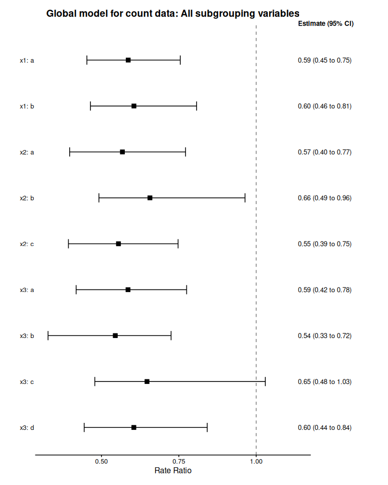
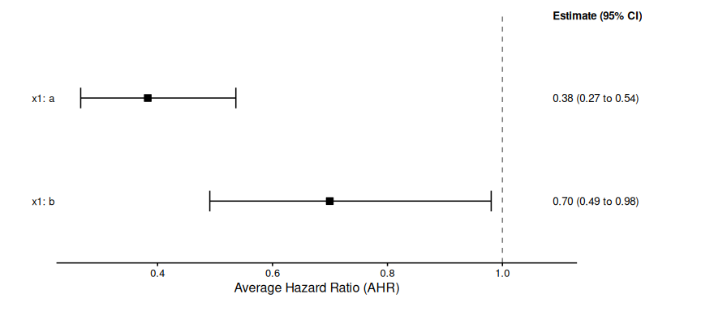

# Advanced Functionalities

This vignette demonstrates advanced functionalities supported by
`bonsaiforest2` and the underlying `brms` package, including adding an
**offset to negative binomial regression models** for counts,
**customizing prior distributions**, and **applying stratification** to
nuisance parameters.

## 1 Handling Exposure in Count Outcomes with Offsets

For count data, the observed value often depends on the **exposure
time** or **follow-up time**. Using an **offset** variable is the
standard statistical method to properly account for this time variation
by modeling the event **rate** (count per unit time) instead of the raw
count.

In `bonsaiforest2`, you can include the offset directly in the
`response_formula` using the syntax:
`count ~ trt + offset(log_fup_duration)`.

#### Example 1: Count outcome with offset

The example uses the `shrink_data` dataset to illustrate a negative
binomial model for variable `count` accounting for treatment `trt` and
the subgrouping variables `x1`, `x2`, and `x3`. Each subject’s follow-up
time is provided in variable `fup_duration` whose log-transformed value
is included as an offset.

``` r
# Load packages and data
library(bonsaiforest2)
library(brms)
#> Loading required package: Rcpp
#> Loading 'brms' package (version 2.23.0). Useful instructions
#> can be found by typing help('brms'). A more detailed introduction
#> to the package is available through vignette('brms_overview').
#> 
#> Attaching package: 'brms'
#> The following object is masked from 'package:stats':
#> 
#>     ar

shrink_data <- bonsaiforest2::shrink_data

# prepare offset variable
shrink_data$log_fup_duration <- log(shrink_data$fup_duration)
```

``` r
count_model_fit <- run_brms_analysis(
  data = shrink_data,
  response_type = "count",
  response_formula = count ~ trt + offset(log_fup_duration),
  unshrunk_terms_formula  = ~ 1 + x1 + x2 + x3,
  shrunk_predictive_formula = ~ 0 + trt:x1 + trt:x2 + trt:x3,
  shrunk_predictive_prior = "horseshoe(scale_global = 1)",
  chains = 2, iter = 1000, warmup = 500, cores = 2, refresh = 0, backend = "cmdstanr"
)
#> Step 1: Preparing formula and data...
#> 
#> Step 2: Fitting the brms model...
#> Using default priors for unspecified effects:
#>   - intercept: brms default
#>   - unshrunk terms: brms default
#> Fitting brms model...
#> Start sampling
#> Running MCMC with 2 parallel chains...
#> 
#> Chain 1 finished in 3.5 seconds.
#> Chain 2 finished in 3.4 seconds.
#> 
#> Both chains finished successfully.
#> Mean chain execution time: 3.4 seconds.
#> Total execution time: 3.6 seconds.
#> Warning: 5 of 1000 (0.0%) transitions ended with a divergence.
#> See https://mc-stan.org/misc/warnings for details.
#> Loading required namespace: rstan
#> 
#> Analysis complete.

count_model_summary <- summary_subgroup_effects(brms_fit = count_model_fit)
#> --- Calculating specific subgroup effects... ---
#> Step 1: Identifying subgroups and creating counterfactuals...
#> ...detected subgroup variable(s): x1_onehot, x2_onehot, x3_onehot
#> Step 2: Generating posterior predictions...
#> Step 3: Calculating marginal effects...
#> Done.

plot(count_model_summary, title = "Global model for count data: All subgrouping variables")
#> Preparing data for plotting...
#> Generating plot...
#> Done.
```



## 2 Customizing Prior Distributions

In Bayesian analysis, the choice of priors is important and can
materially affect the results. For most settings, the `brms` default of
flat priors for the intercept (`intercept_prior`) and unshrunk terms
(`unshrunk_prior`, includes the prior for the main treatment effect) are
sensible and do not need fine-tuning. However, **we recommend that the
user carefully considers the prior for shrunken terms**, in particular
those for covariate-by-treatment interactions
(**`shrunk_predictive_prior`**).

`bonsaiforest2` gives the user full flexibility to specify priors as
described via examples below.

The **default priors** used by `bonsaiforest2` are as follows:

| Prior Component       | Parameter Name            | Default Prior                                                                                                                                                                                                      |     |
|:----------------------|:--------------------------|:-------------------------------------------------------------------------------------------------------------------------------------------------------------------------------------------------------------------|:----|
| **Intercept**         | `intercept_prior`         | `NULL` (i.e. `brms` default)                                                                                                                                                                                       |     |
| **Unshrunk Terms**    | `unshrunk_prior`          | `NULL` (i.e. `brms` default)                                                                                                                                                                                       |     |
| **Shrunk Prognostic** | `shrunk_prognostic_prior` | `horseshoe(scale_global = 1)`; in case the formula specifies random effects (pipe-pipe syntax), automatically uses a normal prior with a half-normal hyperprior with \\\phi=1\\ for the standard deviation instead |     |
| **Shrunk Predictive** | `shrunk_predictive_prior` | `horseshoe(scale_global = 1)`; in case the formula specifies random effects (pipe-pipe syntax), automatically uses a normal prior with a half-normal hyperprior with \\\phi=1\\ for the standard deviation instead |     |

The following examples demonstrate how to customize priors in
`bonsaiforest2`. We use the `shrink_data` package dataset with a
time-to-event outcome to show different prior specification strategies,
from simple defaults to advanced hierarchical structures.

#### 2.0.1 Model Preparation

``` r
# Prepare basic model formulas
prepared_model <- prepare_formula_model(
  data = shrink_data,
  response_type = "survival",
  response_formula = Surv(tt_event, event_yn) ~ trt,
  unshrunk_terms_formula = ~ x1 + x2,
  shrunk_predictive_formula = ~ 0 + trt:x1
)
#> Response type is 'survival'. Modeling the baseline hazard explicitly using bhaz().
```

#### Example 2: Using priors directly supported by `brms`

The simplest approach: use the priors directly supported by `brms` to
adjust priors of different terms. Below, we assume that the trial
targeted a hazard ratio of 0.7, i.e. \\\delta\_{plan}=\|log(0.7)\\, and
set `scale_global` of the regularized horseshoe prior to this value.

``` r
fit_ex2 <- fit_brms_model(
  prepared_model = prepared_model,
  intercept_prior = "normal(0, 5)",
  unshrunk_prior = "normal(0, 2.5)",
  shrunk_predictive_prior = "horseshoe(scale_global = abs(log(0.7)), scale_slab = 2, df_slab = 4)",
  chains = 2, iter = 1000, warmup = 500, cores = 2, refresh = 0, backend = "cmdstanr"
)
#> Fitting brms model...
#> Start sampling
#> Running MCMC with 2 parallel chains...
#> 
#> Chain 2 finished in 3.1 seconds.
#> Chain 1 finished in 3.4 seconds.
#> 
#> Both chains finished successfully.
#> Mean chain execution time: 3.2 seconds.
#> Total execution time: 3.5 seconds.
#> Warning: 1 of 1000 (0.0%) transitions ended with a divergence.
#> See https://mc-stan.org/misc/warnings for details.

# View the priors that were automatically set
cat("\n=== Priors Used ===\n")
#> 
#> === Priors Used ===
print(fit_ex2[["prior"]])
#>                                                                 prior class
#>  horseshoe(scale_global = abs(log(0.7)), scale_slab = 2, df_slab = 4)     b
#>  horseshoe(scale_global = abs(log(0.7)), scale_slab = 2, df_slab = 4)     b
#>  horseshoe(scale_global = abs(log(0.7)), scale_slab = 2, df_slab = 4)     b
#>                                                        normal(0, 2.5)     b
#>                                                        normal(0, 2.5)     b
#>                                                        normal(0, 2.5)     b
#>                                                        normal(0, 2.5)     b
#>                                                        normal(0, 2.5)     b
#>                                                        normal(0, 2.5)     b
#>                                                          dirichlet(1) sbhaz
#>            coef group resp dpar              nlpar lb ub tag       source
#>                                       shpredeffect                   user
#>  trt:x1_onehota                       shpredeffect           (vectorized)
#>  trt:x1_onehotb                       shpredeffect           (vectorized)
#>                                 unshrunktermeffect                   user
#>             trt                 unshrunktermeffect           (vectorized)
#>             x1a                 unshrunktermeffect           (vectorized)
#>             x1b                 unshrunktermeffect           (vectorized)
#>             x2b                 unshrunktermeffect           (vectorized)
#>             x2c                 unshrunktermeffect           (vectorized)
#>                                                                   default
```

#### Example 3: Using the R2-D2 shrinkage prior

An alternative global-local shrinkage prior to the regularized horseshoe
prior is the R2-D2 prior. In the linear regression setting, it can be
motivated as specifying a prior on the model’s coefficient of
determination (\\R^2\\) first, and then distributing the prior through
to the coefficients. The R2-D2 prior is also directly supported by
`brms` as illustrated below.

``` r
fit_ex3 <- fit_brms_model(
  prepared_model = prepared_model,
  shrunk_predictive_prior = "R2D2(mean_R2 = 0.5, prec_R2 = 1)",
  chains = 2, iter = 1000, warmup = 500, cores = 2, refresh = 0, backend = "cmdstanr"
)
#> Using default priors for unspecified effects:
#>   - unshrunk terms: brms default
#> Fitting brms model...
#> Start sampling
#> Running MCMC with 2 parallel chains...
#> 
#> Chain 1 finished in 2.4 seconds.
#> Chain 2 finished in 2.4 seconds.
#> 
#> Both chains finished successfully.
#> Mean chain execution time: 2.4 seconds.
#> Total execution time: 2.5 seconds.
#> Warning: 14 of 1000 (1.0%) transitions ended with a divergence.
#> See https://mc-stan.org/misc/warnings for details.

cat("\n=== Priors Used ===\n")
#> 
#> === Priors Used ===
print(fit_ex3[["prior"]])
#>                             prior class           coef group resp dpar
#>  R2D2(mean_R2 = 0.5, prec_R2 = 1)     b                               
#>  R2D2(mean_R2 = 0.5, prec_R2 = 1)     b trt:x1_onehota                
#>  R2D2(mean_R2 = 0.5, prec_R2 = 1)     b trt:x1_onehotb                
#>                            (flat)     b                               
#>                            (flat)     b            trt                
#>                            (flat)     b            x1a                
#>                            (flat)     b            x1b                
#>                            (flat)     b            x2b                
#>                            (flat)     b            x2c                
#>                      dirichlet(1) sbhaz                               
#>               nlpar lb ub tag       source
#>        shpredeffect                   user
#>        shpredeffect           (vectorized)
#>        shpredeffect           (vectorized)
#>  unshrunktermeffect                default
#>  unshrunktermeffect           (vectorized)
#>  unshrunktermeffect           (vectorized)
#>  unshrunktermeffect           (vectorized)
#>  unshrunktermeffect           (vectorized)
#>  unshrunktermeffect           (vectorized)
#>                                    default
```

#### Example 4: Custom hierarchical prior (advanced)

This example demonstrates injecting raw Stan code using `stanvars`. This
is necessary if you want to implement a hierarchical structure that
`brms` does not support natively, such as estimating a shared variance
parameter across coefficients.

``` r
# 1. Define new hyperparameters in Stan
stanvars_full_hierarchical <- brms::stanvar(
  scode = "  real mu_pred;\n  real<lower=0> sigma_pred;\n",
  block = "parameters"
) +
  # Add priors for these parameters
  brms::stanvar(
    scode = "  // Priors on the hierarchical parameters\n  target += normal_lpdf(mu_pred | 0, 4); \n  target += normal_lpdf(sigma_pred | 0, 1) - normal_lccdf(0 | 0, 1); \n",
    block = "model"
  )

# 2. Create prior that references the Stan variables
prior_full_hierarchical <- brms::set_prior("normal(mu_pred, sigma_pred)")

# 3. Pass both to fit_brms_model
fit_ex4 <- fit_brms_model(
  prepared_model = prepared_model,
  intercept_prior = "normal(0, 5)",
  unshrunk_prior = "normal(0, 2.5)",
  shrunk_prognostic_prior = "horseshoe(scale_global = 1)",
  shrunk_predictive_prior = prior_full_hierarchical,
  stanvars = stanvars_full_hierarchical,
  chains = 2, iter = 1000, warmup = 500, cores = 2, refresh = 0, backend = "cmdstanr"
)
#> Fitting brms model...
#> Start sampling
#> Running MCMC with 2 parallel chains...
#> 
#> Chain 1 finished in 5.3 seconds.
#> Chain 2 finished in 5.5 seconds.
#> 
#> Both chains finished successfully.
#> Mean chain execution time: 5.4 seconds.
#> Total execution time: 5.6 seconds.

# View the used priors
cat("\n=== Priors Used ===\n")
#> 
#> === Priors Used ===
print(fit_ex4[["prior"]])
#>                        prior class           coef group resp dpar
#>  normal(mu_pred, sigma_pred)     b                               
#>  normal(mu_pred, sigma_pred)     b trt:x1_onehota                
#>  normal(mu_pred, sigma_pred)     b trt:x1_onehotb                
#>               normal(0, 2.5)     b                               
#>               normal(0, 2.5)     b            trt                
#>               normal(0, 2.5)     b            x1a                
#>               normal(0, 2.5)     b            x1b                
#>               normal(0, 2.5)     b            x2b                
#>               normal(0, 2.5)     b            x2c                
#>                 dirichlet(1) sbhaz                               
#>               nlpar lb ub tag       source
#>        shpredeffect                   user
#>        shpredeffect           (vectorized)
#>        shpredeffect           (vectorized)
#>  unshrunktermeffect                   user
#>  unshrunktermeffect           (vectorized)
#>  unshrunktermeffect           (vectorized)
#>  unshrunktermeffect           (vectorized)
#>  unshrunktermeffect           (vectorized)
#>  unshrunktermeffect           (vectorized)
#>                                    default
print(fit_ex4[["stanvars"]])
#> [[1]]
#> [[1]]$name
#> [1] ""
#> 
#> [[1]]$sdata
#> NULL
#> 
#> [[1]]$scode
#> [1] "  real mu_pred;\n  real<lower=0> sigma_pred;\n"
#> 
#> [[1]]$block
#> [1] "parameters"
#> 
#> [[1]]$position
#> [1] "start"
#> 
#> [[1]]$pll_args
#> character(0)
#> 
#> 
#> [[2]]
#> [[2]]$name
#> [1] ""
#> 
#> [[2]]$sdata
#> NULL
#> 
#> [[2]]$scode
#> [1] "  // Priors on the hierarchical parameters\n  target += normal_lpdf(mu_pred | 0, 4); \n  target += normal_lpdf(sigma_pred | 0, 1) - normal_lccdf(0 | 0, 1); \n"
#> 
#> [[2]]$block
#> [1] "model"
#> 
#> [[2]]$position
#> [1] "start"
#> 
#> [[2]]$pll_args
#> character(0)
#> 
#> 
#> attr(,"class")
#> [1] "stanvars"
```

#### Example 5: Coefficient-specific priors

By default, `bonsaiforest2` uses the same prior for all coefficients
assigned to the group of “unshrunken terms”, “shrunken prognostic
terms”, or “shrunken predictive terms”, respectively. However, it is
possible to fine-tune this by assigning a different prior to one or
several coefficients within a group.

The example below illustrates this. It includes the interaction `trt*x3`
as an “unshrunken term” and assigns a tighter prior to the regression
coefficients for `trt:x3b`, `trt:x3c`, and `trt:x3d`, respectively,
compared to other coefficients in the same group.

To implement this, we first call
[`prepare_formula_model()`](https://openpharma.github.io/bonsaiforest2/reference/prepare_formula_model.md)
to extract the exact coefficient names that will be included in the
model. Then, we define coefficient-specific priors for these by
combining
[`brms::set_prior`](https://paulbuerkner.com/brms/reference/set_prior.html)
calls.

``` r
# 1. Run prepare_formula_model
prepared_model_ex5 <- prepare_formula_model(
  data = shrink_data,
  response_type = "survival",
  response_formula = Surv(tt_event, event_yn) ~ trt,
  unshrunk_terms_formula = ~ x1 + trt*x3,
  shrunk_predictive_formula = ~ 0 + trt:x1,
)
#> Response type is 'survival'. Modeling the baseline hazard explicitly using bhaz().

# 2. Inspect the Results
# A. The generated brms formula object
print(prepared_model_ex5$formula)
#> tt_event | cens(1 - event_yn) + bhaz(Boundary.knots = c(0, 60.500476574435), knots = c(14.0610682872923, 36.1959635027271, 46.047044984117), intercept = FALSE) ~ unshrunktermeffect + shpredeffect 
#> unshrunktermeffect ~ 0 + x1 + trt * x3 + trt
#> shpredeffect ~ 0 + trt:x1_onehot

# B. The processed terms
print(prepared_model_ex5$stan_variable_names$X_unshrunktermeffect)
#> [1] "x1a"     "x1b"     "trt"     "x3b"     "x3c"     "x3d"     "trt:x3b"
#> [8] "trt:x3c" "trt:x3d"

cat("=== Prior Strategy ===\n")
#> === Prior Strategy ===
cat("General unshrunk prior: normal(0, 5)\n")
#> General unshrunk prior: normal(0, 5)
cat("Specific for trt:x3 interactions: normal(0, 1)\n\n")
#> Specific for trt:x3 interactions: normal(0, 1)

# Create combined prior object
# IMPORTANT: Use EXACT coefficient names from the prepared data
unshrunk_priors_combined <- c(
  brms::set_prior("normal(0, 5)", class = "b"),  # General
  brms::set_prior("normal(0, 1)", class = "b", coef = "trt:x3b"),
  brms::set_prior("normal(0, 1)", class = "b", coef = "trt:x3c"),
  brms::set_prior("normal(0, 1)", class = "b", coef = "trt:x3d")
)

# Fit the model
fit_ex5 <- fit_brms_model(
  prepared_model = prepared_model_ex5,
  intercept_prior = "normal(0, 5)",
  unshrunk_prior = unshrunk_priors_combined,  # Pass the combined object
  shrunk_predictive_prior = "horseshoe(scale_global = 1)",
  chains = 2, iter = 1000, warmup = 500, cores = 2, refresh = 0, backend = "cmdstanr"
)
#> Fitting brms model...
#> Start sampling
#> Running MCMC with 2 parallel chains...
#> 
#> Chain 2 finished in 3.5 seconds.
#> Chain 1 finished in 4.0 seconds.
#> 
#> Both chains finished successfully.
#> Mean chain execution time: 3.7 seconds.
#> Total execution time: 4.1 seconds.
#> Warning: 2 of 1000 (0.0%) transitions ended with a divergence.
#> See https://mc-stan.org/misc/warnings for details.

# View the used priors
cat("\n=== Priors Used ===\n")
#> 
#> === Priors Used ===
print(fit_ex5[["prior"]])
#>                        prior class           coef group resp dpar
#>  horseshoe(scale_global = 1)     b                               
#>  horseshoe(scale_global = 1)     b trt:x1_onehota                
#>  horseshoe(scale_global = 1)     b trt:x1_onehotb                
#>                 normal(0, 5)     b                               
#>                 normal(0, 5)     b            trt                
#>                 normal(0, 1)     b        trt:x3b                
#>                 normal(0, 1)     b        trt:x3c                
#>                 normal(0, 1)     b        trt:x3d                
#>                 normal(0, 5)     b            x1a                
#>                 normal(0, 5)     b            x1b                
#>                 normal(0, 5)     b            x3b                
#>                 normal(0, 5)     b            x3c                
#>                 normal(0, 5)     b            x3d                
#>                 dirichlet(1) sbhaz                               
#>               nlpar lb ub tag       source
#>        shpredeffect                   user
#>        shpredeffect           (vectorized)
#>        shpredeffect           (vectorized)
#>  unshrunktermeffect                   user
#>  unshrunktermeffect           (vectorized)
#>  unshrunktermeffect                   user
#>  unshrunktermeffect                   user
#>  unshrunktermeffect                   user
#>  unshrunktermeffect           (vectorized)
#>  unshrunktermeffect           (vectorized)
#>  unshrunktermeffect           (vectorized)
#>  unshrunktermeffect           (vectorized)
#>  unshrunktermeffect           (vectorized)
#>                                    default
```

#### Example 6: Hierarchical priors with shared variance (stanvars)

Create correlated priors by sharing a common variance parameter
estimated from the data. This is sensible when you believe treatment
effects across subgroups are exchangeable and want to borrow information
across them.

``` r
cat("\n=== Hierarchical Prior Structure ===\n")
#> 
#> === Hierarchical Prior Structure ===
cat("Instead of independent priors per coefficient, we pool information through a shared scale:\n")
#> Instead of independent priors per coefficient, we pool information through a shared scale:
cat("  tau ~ half-normal(0, 1)  [shared scale parameter]\n")
#>   tau ~ half-normal(0, 1)  [shared scale parameter]
cat("  beta_i ~ N(0, tau) for each coefficient i\n")
#>   beta_i ~ N(0, tau) for each coefficient i
cat("This creates exchangeability: we assume coefficients are similar but with adaptive variation.\n\n")
#> This creates exchangeability: we assume coefficients are similar but with adaptive variation.

# Step 1: Declare tau as a parameter to be estimated
tau_parameter <- brms::stanvar(
  scode = "  real<lower=0> biomarker_tau;  // Shared scale parameter\n",
  block = "parameters"
)

# Step 2: Add prior for tau (using normal truncated to positive values with constraint)
tau_prior <- brms::stanvar(
  scode = "  biomarker_tau ~ normal(0, 1);  // Hyperprior on the scale\n",
  block = "model"
)

# Combine stanvars
hierarchical_stanvars <- tau_parameter + tau_prior

# Step 3: Create priors referencing the shared variance parameter
# Note: We identified these coefficient names using prepare_formula_model above
unshrunk_priors_hier <- c(
  brms::set_prior("normal(0, 5)", class = "b"),  # General
  brms::set_prior("normal(0, biomarker_tau)", class = "b", coef = "trt:x3b"),
  brms::set_prior("normal(0, biomarker_tau)", class = "b", coef = "trt:x3c"),
  brms::set_prior("normal(0, biomarker_tau)", class = "b", coef = "trt:x3d")
)
```

``` r
# Step 4: Fit the hierarchical model
fit_ex6 <- fit_brms_model(
  prepared_model = prepared_model_ex5,
  intercept_prior = "normal(0, 5)",
  unshrunk_prior = unshrunk_priors_hier,
  shrunk_predictive_prior = "horseshoe(scale_global = 1)",
  stanvars = hierarchical_stanvars,
  chains = 2, iter = 1000, warmup = 500, cores = 2, refresh = 0, backend = "cmdstanr"
)

# View the used priors
cat("\n=== Priors Used ===\n")
print(fit_ex6[["prior"]])
print(fit_ex6[["stanvars"]])
```

## 3 Stratification for nuisance parameters

Stratified models which assume different residual variances (continuous
endpoints), overdispersion parameters (count endpoints), or baseline
hazards (time-to-event endpoints) across strata are also supported in
`bonsaiforest2` (via `brms`). The argument `stratification_formula`
defines the grouping factor(s).

#### Example 7: Fully stratified continuous one-way shrinkage model

We fit a one-way model for the continuous outcome `y` in `shrink_data`
with subgroups defined by the binary covariate `x1` with adjustment for
`x2` and `x3` as prognostic factors.

In the model specification below, we assume separate regression
coefficients for `x2` and `x3`, respectively, across strata defined by
`x1` (specified via interaction terms `x1*x2` and `x1*x3`) as well as
different residual variances across strata (specified via argument
`stratification_formula`). The only parameter that is shared across
strata is the shrinkage parameter for treatment effect heterogeneity.

``` r
# model with x1*x2 and x1*x3 (separate regression coef per level of x1 for x2 and x3), and separate variance per x1 strata
oneway_x1_flex_strat <- run_brms_analysis(
  data = shrink_data,
  response_type = "continuous",
  response_formula = y ~ trt,
  stratification_formula = ~ x1,
  unshrunk_terms_formula = ~ x1 + x1*x2 + x1*x3, 
  shrunk_predictive_formula = ~ (0 + trt || x1),
  shrunk_predictive_prior = set_prior("normal(0, 0.3)", class = "sd"),
  chains = 2, iter = 2000, warmup = 1000, cores = 2,
  refresh = 0, backend = "cmdstanr"
)
#> Step 1: Preparing formula and data...
#> Applying stratification: estimating sigma by 'x1'.
#> 
#> Step 2: Fitting the brms model...
#> Using default priors for unspecified effects:
#>   - intercept: brms default
#>   - unshrunk terms: brms default
#> Fitting brms model...
#> Start sampling
#> Running MCMC with 2 parallel chains...
#> 
#> Chain 2 finished in 4.0 seconds.
#> Chain 1 finished in 4.2 seconds.
#> 
#> Both chains finished successfully.
#> Mean chain execution time: 4.1 seconds.
#> Total execution time: 4.3 seconds.
#> 
#> Analysis complete.
```

``` r
summary_oneway_x1_flex_strat <- summary_subgroup_effects(
  brms_fit = oneway_x1_flex_strat
)
#> --- Calculating specific subgroup effects... ---
#> Step 1: Identifying subgroups and creating counterfactuals...
#> ...detected subgroup variable(s): x1
#> Step 2: Generating posterior predictions...
#> Step 3: Calculating marginal effects...
#> Done.

print(summary_oneway_x1_flex_strat$estimates)
#> # A tibble: 2 × 4
#>   Subgroup Median CI_Lower CI_Upper
#>   <chr>     <dbl>    <dbl>    <dbl>
#> 1 x1: a     0.496    0.260    0.726
#> 2 x1: b     0.126   -0.199    0.429
```

#### Example 8: Stratified one-way survival model

Assume that the primary analysis of the trial was stratified by variable
`x2`. A corresponding one-way model for `x1` which uses a Cox model
stratified by `x2` is fitted below.

``` r
# Model fitting with stratified baseline hazard
fit_surv_oneway_x1_strat <- run_brms_analysis(
  data = shrink_data,
  response_type = "survival",
  response_formula = Surv(tt_event, event_yn) ~ trt,
  stratification_formula = ~ x2,
  unshrunk_terms_formula = ~ x1 + x3, 
  shrunk_predictive_formula = ~ (0 + trt || x1),
  shrunk_predictive_prior = set_prior("normal(0, abs(log(0.7)))", class = "sd"),
  chains = 2, iter = 1000, warmup = 500, cores = 2, refresh = 0, backend = "cmdstanr"
)
#> Step 1: Preparing formula and data...
#> Response type is 'survival'. Modeling the baseline hazard explicitly using bhaz().
#> Applying stratification: estimating separate baseline hazards by 'x2'.
#> 
#> Step 2: Fitting the brms model...
#> Using default priors for unspecified effects:
#>   - unshrunk terms: brms default
#> Fitting brms model...
#> Start sampling
#> Running MCMC with 2 parallel chains...
#> 
#> Chain 2 finished in 3.7 seconds.
#> Chain 1 finished in 3.9 seconds.
#> 
#> Both chains finished successfully.
#> Mean chain execution time: 3.8 seconds.
#> Total execution time: 4.0 seconds.
#> 
#> Analysis complete.

summary_surv_oneway_x1_strat <- summary_subgroup_effects(fit_surv_oneway_x1_strat)
#> --- Calculating specific subgroup effects... ---
#> Step 1: Identifying subgroups and creating counterfactuals...
#> ...detected subgroup variable(s): x1
#> Step 2: Generating posterior predictions...
#> Warning: Dropping 'draws_df' class as required metadata was removed.
#> Warning: Dropping 'draws_df' class as required metadata was removed.
#> Warning: Dropping 'draws_df' class as required metadata was removed.
#> Step 3: Calculating marginal effects...
#> Done.

print(summary_surv_oneway_x1_strat$estimates)
#> # A tibble: 2 × 4
#>   Subgroup Median CI_Lower CI_Upper
#>   <chr>     <dbl>    <dbl>    <dbl>
#> 1 x1: a     0.383    0.266    0.536
#> 2 x1: b     0.700    0.491    0.980

plot(summary_surv_oneway_x1_strat)
#> Preparing data for plotting...
#> Generating plot...
#> Done.
```



## 4 Summary

This vignette demonstrated several advanced functionalities supported by
`bonsaiforest2`:

1.  **Offset variables** for count outcomes with varying exposure times
2.  **Custom prior specification** with flexible prior constraints
3.  **Stratification** for nuisance parameters that vary across groups

These features provide researchers with powerful tools for complex trial
analyses while maintaining the principled Bayesian shrinkage framework.
