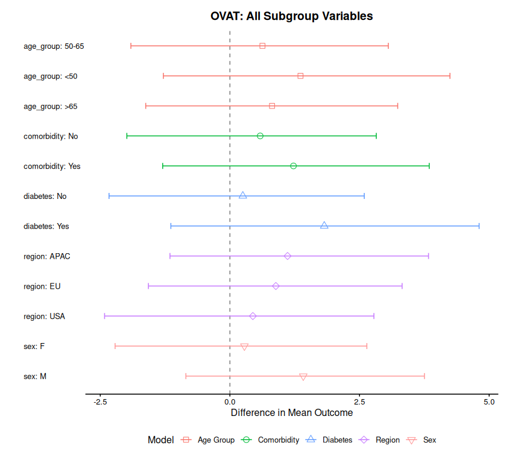

# Quickstart

## 1 Introduction

The `bonsaiforest2` package consists of 3 core functions which are
typically called in sequence:

1.  [`run_brms_analysis()`](https://openpharma.github.io/bonsaiforest2/reference/run_brms_analysis.md) -
    Prepares the model formula and fits the Bayesian model using `brms`.
2.  [`summary_subgroup_effects()`](https://openpharma.github.io/bonsaiforest2/reference/summary_subgroup_effects.md) -
    Calculates the marginal subgroup treatment effects.
3.  [`plot()`](https://rdrr.io/r/graphics/plot.default.html) - Creates a
    forest plot from the summary object.

The package enables the implementation of both a **global modeling
approach** ([Wolbers et al. 2025](#ref-wolbers2025using)), that
estimates all prognostic and predictive effects in a single model, and a
**One-Variable-At-a-Time (OVAT)** approach ([Wang et al.
2024](#ref-wang2024bayesian)), that estimates the predictive effects
using a different model for each subgrouping variable.

This vignette demonstrates how to use the package to fit and compare
these different modeling formulas. You’ll learn how to:

- Fit OVAT models (one model per subgroup variable)
- Fit a global model (all subgroup variables in one model)
- Generate summaries of subgroup treatment effects
- Visualize and compare results from different model specifications

This example makes use of Bayesian modeling, which requires the
installation of the [`brms`](https://paulbuerkner.com/brms/) package and
a working Stan installation (e.g., via
[`cmdstanr`](https://mc-stan.org/cmdstanr/)).

## 2 The Data

We will use a simulated example dataset representing a clinical trial
for blood pressure. The relevant endpoint is the change in Systolic
Blood Pressure (SBP) from baseline (`sbp_change`).

We consider a model where we want to find the treatment effect (`trt`)
on `sbp_change`. The model will adjust for `baseline_sbp` as a
**prognostic** variable (predictor of the outcome) and explore
**multiple subgroup variables** as **predictive** variables (potential
treatment effect modifiers):

- `region`: Geographic region (USA, EU, APAC)
- `comorbidity`: Presence of comorbidities (Yes, No)
- `age_group`: Age category (\< 50, 50-65, \> 65)
- `sex`: Biological sex (M, F)
- `diabetes`: Diabetes status (Yes, No)

First, let’s load the libraries and create the data.

``` r
# Load the main package
library(bonsaiforest2)
```

``` r
# Create the example data with multiple subgroup variables
set.seed(123)
n_patients <- 300

continuous_data <- data.frame(
  id = 1:n_patients,
  sbp_change = rnorm(n_patients, mean = -5, sd = 10),
  trt = sample(0:1, n_patients, replace = TRUE),
  baseline_sbp = rnorm(n_patients, mean = 140, sd = 15),
  region = factor(sample(c("USA", "EU", "APAC"), n_patients, replace = TRUE)),
  comorbidity = factor(sample(c("Yes", "No"), n_patients, replace = TRUE, prob = c(0.4, 0.6))),
  age_group = factor(sample(c("<50", "50-65", ">65"), n_patients, replace = TRUE, prob = c(0.3, 0.4, 0.3))),
  sex = factor(sample(c("M", "F"), n_patients, replace = TRUE)),
  diabetes = factor(sample(c("Yes", "No"), n_patients, replace = TRUE, prob = c(0.3, 0.7)))
)

continuous_data$trt <- factor(continuous_data$trt, levels = c(0, 1))

print(head(continuous_data))
#>   id sbp_change trt baseline_sbp region comorbidity age_group sex diabetes
#> 1  1 -10.604756   1     161.4560   APAC          No     50-65   M      Yes
#> 2  2  -7.301775   1     155.6994     EU          No       <50   F       No
#> 3  3  10.587083   1     146.5293     EU          No       <50   F       No
#> 4  4  -4.294916   0     150.7277     EU          No       <50   F       No
#> 5  5  -3.707123   0     153.7576   APAC         Yes     50-65   M       No
#> 6  6  12.150650   0     100.0862     EU          No     50-65   F      Yes
```

## 3 OVAT: One Variable At a Time

This section demonstrates how to fit separate models, each examining one
subgroup variable at a time. We’ll fit a model for each of our 5
subgroup variables.

### 3.1 OVAT: Region Only

``` r
# Write the sigma specified in the trial protocol
sigma_ref <- 2

# Fit model with only region as subgroup variable
ovat_region <- run_brms_analysis(
  data = continuous_data,
  response_formula = sbp_change ~ trt,
  response_type = "continuous",
  unshrunk_terms_formula = ~ baseline_sbp,
  shrunk_predictive_formula = ~ 0+ (0+trt||region),
  shrunk_predictive_prior = "normal(0, 2 * sigma_ref)",
  sigma_ref = sigma_ref,
  chains = 1, iter = 2000, warmup = 1000, cores = 1,
  refresh = 0, backend = "cmdstanr"
)
#> sbp_change ~ unshrunktermeffect + shpredeffect 
#> unshrunktermeffect ~ baseline_sbp + trt
#> shpredeffect ~ 0 + (0 + trt || region)
#> Running MCMC with 1 chain...
#> 
#> Chain 1 finished in 3.1 seconds.

summary_ovat_region <- summary_subgroup_effects(brms_fit = ovat_region)
```

### 3.2 OVAT: Comorbidity Only

``` r
ovat_comorbidity <- run_brms_analysis(
  data = continuous_data,
  response_formula = sbp_change ~ trt,
  response_type = "continuous",
  unshrunk_terms_formula = ~ baseline_sbp,
  shrunk_predictive_formula = ~ 0 + (0+trt||comorbidity),
  shrunk_predictive_prior = "normal(0, 2 * sigma_ref)",
  sigma_ref = sigma_ref,
  chains = 1, iter = 2000, warmup = 1000, cores = 1,
  refresh = 0, backend = "cmdstanr"
)
#> sbp_change ~ unshrunktermeffect + shpredeffect 
#> unshrunktermeffect ~ baseline_sbp + trt
#> shpredeffect ~ 0 + (0 + trt || comorbidity)
#> Running MCMC with 1 chain...
#> 
#> Chain 1 finished in 3.1 seconds.

summary_ovat_comorbidity <- summary_subgroup_effects(brms_fit = ovat_comorbidity)
```

### 3.3 OVAT: Age Group Only

``` r
ovat_age <- run_brms_analysis(
  data = continuous_data,
  response_formula = sbp_change ~ trt,
  response_type = "continuous",
  unshrunk_terms_formula = ~ baseline_sbp,
  shrunk_predictive_formula = ~ 0 + (0+trt||age_group),
  shrunk_predictive_prior = "normal(0, 2 * sigma_ref)",
  sigma_ref = sigma_ref,
  chains = 1, iter = 2000, warmup = 1000, cores = 1,
  refresh = 0, backend = "cmdstanr"
)
#> sbp_change ~ unshrunktermeffect + shpredeffect 
#> unshrunktermeffect ~ baseline_sbp + trt
#> shpredeffect ~ 0 + (0 + trt || age_group)
#> Running MCMC with 1 chain...
#> 
#> Chain 1 finished in 3.0 seconds.

summary_ovat_age <- summary_subgroup_effects(brms_fit = ovat_age, subgroup_vars = "age_group")
```

### 3.4 OVAT: Sex Only

``` r
ovat_sex <- run_brms_analysis(
  data = continuous_data,
  response_formula = sbp_change ~ trt,
  response_type = "continuous",
  unshrunk_terms_formula = ~ baseline_sbp,
  shrunk_predictive_formula = ~ 0 + (0+trt||sex),
  shrunk_predictive_prior = "normal(0, 2 * sigma_ref)",
  sigma_ref = sigma_ref,
  chains = 1, iter = 2000, warmup = 1000, cores = 1,
  refresh = 0, backend = "cmdstanr"
)
#> sbp_change ~ unshrunktermeffect + shpredeffect 
#> unshrunktermeffect ~ baseline_sbp + trt
#> shpredeffect ~ 0 + (0 + trt || sex)
#> Running MCMC with 1 chain...
#> 
#> Chain 1 finished in 3.2 seconds.

summary_ovat_sex <- summary_subgroup_effects(brms_fit = ovat_sex)
```

### 3.5 OVAT: Diabetes Only

``` r
ovat_diabetes <- run_brms_analysis(
  data = continuous_data,
  response_formula = sbp_change ~ trt,
  response_type = "continuous",
  unshrunk_terms_formula = ~ baseline_sbp,
  shrunk_predictive_formula = ~ 0 + (0+trt||diabetes),
  shrunk_predictive_prior = "normal(0, 2 * sigma_ref)",
  sigma_ref = sigma_ref,
  chains = 1, iter = 2000, warmup = 1000, cores = 1,
  refresh = 0, backend = "cmdstanr"
)
#> sbp_change ~ unshrunktermeffect + shpredeffect 
#> unshrunktermeffect ~ baseline_sbp + trt
#> shpredeffect ~ 0 + (0 + trt || diabetes)
#> Running MCMC with 1 chain...
#> 
#> Chain 1 finished in 3.2 seconds.

summary_ovat_diabetes <- summary_subgroup_effects(brms_fit = ovat_diabetes)
```

### 3.6 OVAT: Visualizing All Models

You can combine and visualize results from multiple models using
[`combine_summaries()`](https://openpharma.github.io/bonsaiforest2/reference/combine_summaries.md):

``` r
# Combine all OVAT models
combined_ovat <- combine_summaries(list(
  "Region" = summary_ovat_region,
  "Comorbidity" = summary_ovat_comorbidity,
  "Age Group" = summary_ovat_age,
  "Sex" = summary_ovat_sex,
  "Diabetes" = summary_ovat_diabetes
))

plot(combined_ovat, title = "OVAT: All Subgroup Variables")
#> Preparing data for plotting...
#> Generating plot...
#> Done.
```



## 4 Global Modeling Approach

This section demonstrates how to fit a single model that includes all
subgroup variables simultaneously.

### 4.1 Global Model: All Subgroups

``` r
# Fit a single model with ALL subgroup variables
global_model <- run_brms_analysis(
  data = continuous_data,
  response_formula = sbp_change ~ trt,
  response_type = "continuous",
  unshrunk_terms_formula = ~ baseline_sbp + region + comorbidity + age_group + sex + diabetes,
  shrunk_predictive_formula = ~ 0 + trt:region+trt:comorbidity + trt:age_group + trt:sex + trt:diabetes,
  shrunk_predictive_prior = "horseshoe(1)",
  sigma_ref = sigma_ref,
  chains = 1, iter = 2000, warmup = 1000, cores = 1,
  refresh = 0, backend = "cmdstanr"
)
#> sbp_change ~ unshrunktermeffect + shpredeffect 
#> unshrunktermeffect ~ baseline_sbp + region + comorbidity + age_group + sex + diabetes + trt
#> shpredeffect ~ 0 + trt:region + trt:comorbidity + trt:age_group + trt:sex + trt:diabetes
#> Running MCMC with 1 chain...
#> 
#> Chain 1 finished in 3.2 seconds.
```

### 4.2 Global Model: Summary of Subgroup Effects

Use
[`summary_subgroup_effects()`](https://openpharma.github.io/bonsaiforest2/reference/summary_subgroup_effects.md)
to generate marginal treatment effects for each subgroup. The function
automatically extracts all necessary parameters from the fitted model:

``` r
global_summary <- summary_subgroup_effects(
  brms_fit = global_model
)
#> Using trt_var from model attributes: trt
#> Using response_type from model attributes: continuous
#> --- Calculating specific subgroup effects... ---
#> Using data from model attributes
#> Step 1: Identifying subgroups and creating counterfactuals...
#> `subgroup_vars` set to 'auto'. Detecting from model...
#> Model data has 300 rows and 9 columns
#> Column names: id, sbp_change, trt, baseline_sbp, region, comorbidity, age_group, sex, diabetes
#> Treatment variable: 'trt'
#> All coefficient names:
#> unshrunktermeffect_Intercept
#> unshrunktermeffect_baseline_sbp
#> unshrunktermeffect_regionEU
#> unshrunktermeffect_regionUSA
#> unshrunktermeffect_comorbidityYes
#> unshrunktermeffect_age_group>65
#> unshrunktermeffect_age_group50M65
#> unshrunktermeffect_sexM
#> unshrunktermeffect_diabetesYes
#> unshrunktermeffect_trt
#> shpredeffect_trt:regionAPAC
#> shpredeffect_trt:regionEU
#> shpredeffect_trt:regionUSA
#> shpredeffect_trt:comorbidityYes
#> shpredeffect_trt:age_group>65
#> shpredeffect_trt:age_group50M65
#> shpredeffect_trt:sexM
#> shpredeffect_trt:diabetesYes
#> Looking for treatment interactions with pattern: 'trt:'
#> Found 8 treatment interaction coefficients
#> Treatment interaction coefficients found:
#> shpredeffect_trt:regionAPAC
#> shpredeffect_trt:regionEU
#> shpredeffect_trt:regionUSA
#> shpredeffect_trt:comorbidityYes
#> shpredeffect_trt:age_group>65
#> shpredeffect_trt:age_group50M65
#> shpredeffect_trt:sexM
#> shpredeffect_trt:diabetesYes
#> Detected subgroup variable 'region' from coefficient 'shpredeffect_trt:regionAPAC'
#> Detected subgroup variable 'region' from coefficient 'shpredeffect_trt:regionEU'
#> Detected subgroup variable 'region' from coefficient 'shpredeffect_trt:regionUSA'
#> Detected subgroup variable 'comorbidity' from coefficient 'shpredeffect_trt:comorbidityYes'
#> Detected subgroup variable 'age_group' from coefficient 'shpredeffect_trt:age_group>65'
#> Detected subgroup variable 'age_group' from coefficient 'shpredeffect_trt:age_group50M65'
#> Detected subgroup variable 'sex' from coefficient 'shpredeffect_trt:sexM'
#> Detected subgroup variable 'diabetes' from coefficient 'shpredeffect_trt:diabetesYes'
#> Checking for random effects parameters...
#> Retrieved 31 total parameters from model
#> Using regex pattern: '^r_(.+)__[^\[]+\[[^,]+,trt\]'
#> Found 0 matching random effect parameters
#> No random effect parameters matching the pattern were found
#> ...detected subgroup variable(s): region, comorbidity, age_group, sex, diabetes
#> Step 2: Generating posterior predictions...
#> ... detected Fixed Effects (Colon model). Predicting with re_formula = NA.
#> ... (predicting expected outcomes)...
#> Step 3: Calculating marginal effects...
#> ... processing region
#> ... processing comorbidity
#> ... processing age_group
#> ... processing sex
#> ... processing diabetes
#> Done.

print(global_summary)
#> $estimates
#> # A tibble: 12 × 4
#>    Subgroup         Median CI_Lower CI_Upper
#>    <chr>             <dbl>    <dbl>    <dbl>
#>  1 region: APAC      1.67    -1.29      4.92
#>  2 region: EU        0.879   -2.00      3.85
#>  3 region: USA       0.472   -2.40      3.17
#>  4 comorbidity: No   0.826   -1.48      3.01
#>  5 comorbidity: Yes  1.27    -1.31      3.90
#>  6 age_group: <50    1.22    -1.26      3.83
#>  7 age_group: >65    1.08    -1.93      4.11
#>  8 age_group: 50-65  0.841   -1.87      3.13
#>  9 sex: F            0.384   -2.26      2.87
#> 10 sex: M            1.61    -0.924     3.96
#> 11 diabetes: No      0.660   -1.69      2.75
#> 12 diabetes: Yes     1.74    -0.977     4.54
#> 
#> $response_type
#> [1] "continuous"
#> 
#> $ci_level
#> [1] 0.95
#> 
#> $trt_var
#> [1] "trt"
#> 
#> attr(,"class")
#> [1] "subgroup_summary"
```

### 4.3 Global Model: Visualization

Use the [`plot()`](https://rdrr.io/r/graphics/plot.default.html)
function to create a forest plot from the summary object:

``` r
plot(global_summary, title = "Global Model: All Subgroup Variables")
#> Preparing data for plotting...
#> Generating plot...
#> Done.
```


## 5 Comparing Multiple Models in One Plot

The [`plot()`](https://rdrr.io/r/graphics/plot.default.html) function
supports comparing multiple models side-by-side. Pass a named list of
`subgroup_summary` objects to create a comparative forest plot.

### 5.1 Example: Comparing OVAT vs Global Model

``` r
# Combine summaries for comparison
combined <- combine_summaries(list(
  "OVAT" = combined_ovat,
  "Global Model" = global_summary
))

# Plot the comparison
plot(combined, title = "Comparing OVAT vs Global Model")
#> Preparing data for plotting...
#> Generating plot...
#> Done.
```


Wang, Yun, Wenda Tu, William Koh, James Travis, Robert Abugov, Kiya
Hamilton, Mengjie Zheng, Roberto Crackel, Pablo Bonangelino, and Mark
Rothmann. 2024. “Bayesian hierarchical models for subgroup analysis.”
*Pharmaceutical Statistics* 23: 1065–83.

Wolbers, Marcel, Mar Vázquez Rabuñal, Ke Li, Kaspar Rufibach, and Daniel
Sabanés Bové. 2025. “Using shrinkage methods to estimate treatment
effects in overlapping subgroups in randomized clinical trials with a
time-to-event endpoint.” *Statistical Methods in Medical Research*,
1–12.
