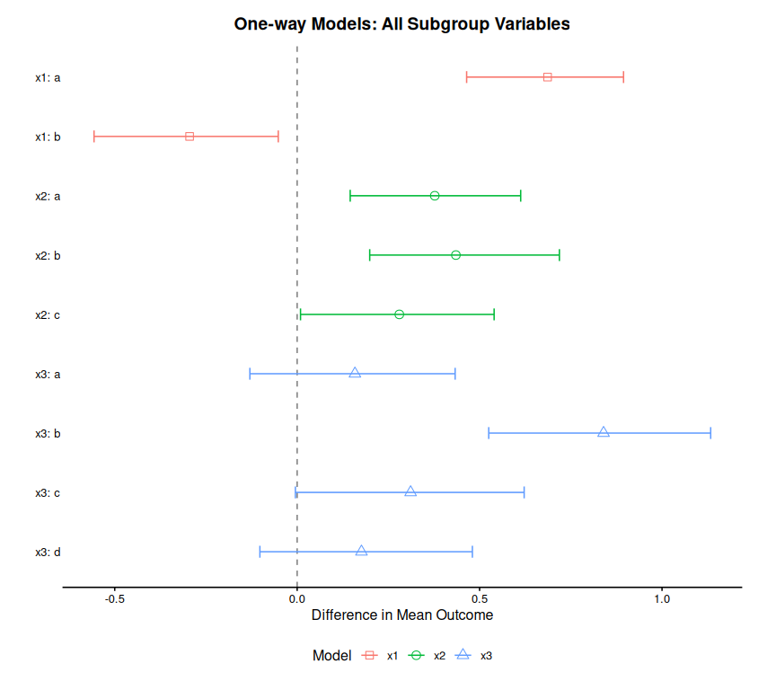
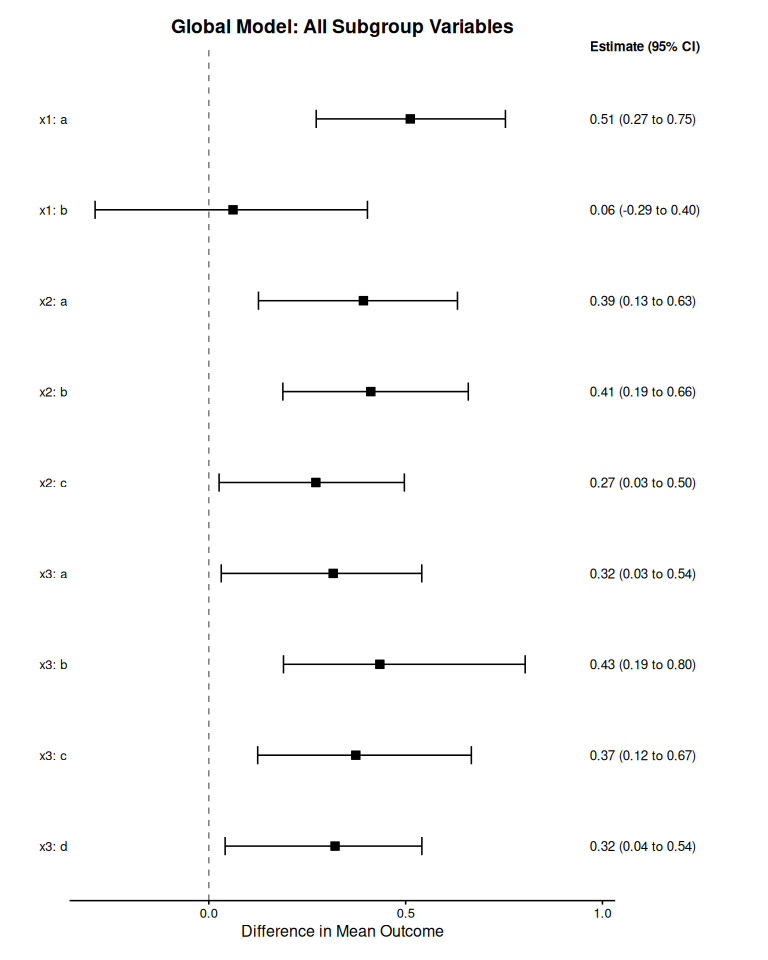
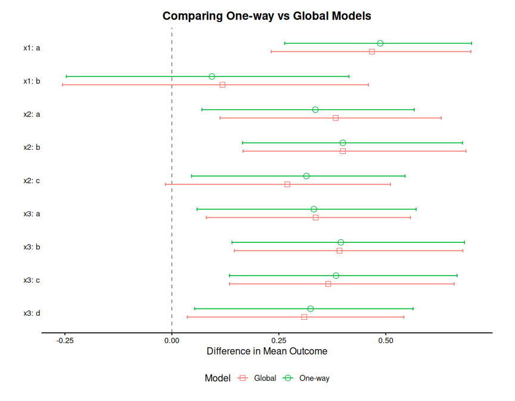

# Quickstart

## 1 Introduction

The `bonsaiforest2` package consists of 3 core functions which are
typically called in sequence:

1.  [`run_brms_analysis()`](https://openpharma.github.io/bonsaiforest2/reference/run_brms_analysis.md) -
    Prepares the model formula and fits the Bayesian model using `brms`.
2.  [`summary_subgroup_effects()`](https://openpharma.github.io/bonsaiforest2/reference/summary_subgroup_effects.md) -
    Calculates the marginal subgroup treatment effects.
3.  [`plot()`](https://rdrr.io/r/graphics/plot.default.html) - Creates a
    forest plot from the summary object.

The package enables the implementation of both **global models**
([Wolbers et al. 2025](#ref-wolbers2025using)), that estimate all
prognostic and predictive effects in a single unified model, and
**one-way models** ([Wang et al. 2024](#ref-wang2024bayesian)), that
estimate treatment fitting a different model for each subgrouping
variable.

This vignette demonstrates how to use the package to fit and compare
these different modeling formulas. You’ll learn how to:

- Fit one-way models (random effects with treatment slopes varying by
  subgroup)
- Fit global models (all subgroup variables in one unified model)
- Generate summaries of subgroup treatment effects
- Visualize and compare results from different model specifications

This example makes use of Bayesian modeling, which requires the
installation of the [`brms`](https://paulbuerkner.com/brms/) package and
a working Stan installation (e.g., via
[`cmdstanr`](https://mc-stan.org/cmdstanr/)).

## 2 The Data

We will use the `shrink_data` package dataset with a continuous response
variable. The relevant outcome is `y`.

We consider a model where we want to find the treatment effect (`trt`)
on `y`. We explore **three subgroup variables** as **predictive**
variables (potential treatment effect modifiers):

- `x1`: Subgroup 1 (categories: a, b)
- `x2`: Subgroup 2 (categories: a, b, c)
- `x3`: Subgroup 3 (categories: a, b, c, d)

First, let’s load the libraries and the data.

``` r
# Load the main package
library(bonsaiforest2)
library(brms)
```

``` r
# Load the shrink_data package dataset
shrink_data <- bonsaiforest2::shrink_data

print(head(shrink_data))
#>   id trt x1 x2 x3        y response tt_event event_yn fup_duration count
#> 1  1   0  a  b  b 5.864030        0 22.94233        1           24     1
#> 2  2   1  b  c  d 4.464349        0 49.13731        0           24     0
#> 3  3   1  a  b  d 6.379085        1 59.90381        0           24     2
#> 4  4   0  b  b  d 5.002507        0 21.25450        1           24     1
#> 5  5   1  a  b  c 5.652024        0 59.80762        0           24     1
#> 6  6   1  b  b  a 5.427096        0 22.81750        1           24     0
```

## 3 One-way Models

This section demonstrates how to fit separate models, each examining one
subgroup variable at a time. In one-way models, we specify treatment
effects as random slopes using pipe-pipe notation (e.g.,
`~ (0 + trt || subgroup)`), which allows treatment effects to vary by
subgroup with automatic hierarchical regularization via random effects.
Note that for each model we also include always the subgrouping variable
we want to test the treatment effects for also as prognostic.

### 3.1 One-way Model: x1 Only

``` r
# Fit model with only x1 as subgroup variable using one-way approach
# Random effects notation (0 + trt || x1) estimates varying treatment slopes by x1
oneway_x1 <- run_brms_analysis(
  data = shrink_data,
  response_type = "continuous",
  response_formula = y ~ trt,
  unshrunk_terms_formula = ~ x1,
  shrunk_prognostic_formula = NULL,
  shrunk_predictive_formula = ~ (0 + trt || x1),
  intercept_prior = "normal(0, 10)",
  shrunk_predictive_prior = set_prior("normal(0, 1)", class = "sd"),
  chains = 2, iter = 2000, warmup = 1000, cores = 2,
  refresh = 0, backend = "cmdstanr"
)
#> Running MCMC with 2 parallel chains...
#> 
#> Chain 1 finished in 2.4 seconds.
#> Chain 2 finished in 2.9 seconds.
#> 
#> Both chains finished successfully.
#> Mean chain execution time: 2.6 seconds.
#> Total execution time: 3.1 seconds.

summary_oneway_x1 <- summary_subgroup_effects(brms_fit = oneway_x1)
print(summary_oneway_x1)
#> $estimates
#> # A tibble: 2 × 4
#>   Subgroup Median CI_Lower CI_Upper
#>   <chr>     <dbl>    <dbl>    <dbl>
#> 1 x1: a    0.527     0.300    0.744
#> 2 x1: b    0.0168   -0.289    0.344
#> 
#> $response_type
#> [1] "continuous"
#> 
#> $ci_level
#> [1] 0.95
#> 
#> $trt_var
#> [1] "trt"
#> 
#> attr(,"class")
#> [1] "subgroup_summary"
```

### 3.2 One-way Model: x2 Only

``` r
oneway_x2 <- run_brms_analysis(
  data = shrink_data,
  response_type = "continuous",
  response_formula = y ~ trt,
  shrunk_prognostic_formula = NULL,
    unshrunk_terms_formula = ~ x2,
  shrunk_predictive_formula = ~ (0 + trt || x2),
  intercept_prior = "normal(0, 10)",
  shrunk_predictive_prior = set_prior("normal(0, 1)", class = "sd"),
  chains = 2, iter = 2000, warmup = 1000, cores = 2,
  refresh = 0, backend = "cmdstanr"
)
#> Running MCMC with 2 parallel chains...
#> 
#> Chain 1 finished in 1.7 seconds.
#> Chain 2 finished in 1.8 seconds.
#> 
#> Both chains finished successfully.
#> Mean chain execution time: 1.7 seconds.
#> Total execution time: 1.9 seconds.

summary_oneway_x2 <- summary_subgroup_effects(brms_fit = oneway_x2)
```

### 3.3 One-way Model: x3 Only

``` r
oneway_x3 <- run_brms_analysis(
  data = shrink_data,
  response_type = "continuous",
  response_formula = y ~ trt,
  unshrunk_terms_formula = ~ x3,
  shrunk_prognostic_formula = NULL,
  shrunk_predictive_formula = ~ (0 + trt || x3),
  intercept_prior = "normal(0, 10)",
  shrunk_predictive_prior = set_prior("normal(0, 1)", class = "sd"),
  chains = 2, iter = 2000, warmup = 1000, cores = 2,
  refresh = 0, backend = "cmdstanr"
)
#> Running MCMC with 2 parallel chains...
#> 
#> Chain 1 finished in 1.5 seconds.
#> Chain 2 finished in 1.6 seconds.
#> 
#> Both chains finished successfully.
#> Mean chain execution time: 1.5 seconds.
#> Total execution time: 1.7 seconds.

summary_oneway_x3 <- summary_subgroup_effects(brms_fit = oneway_x3)
```

### 3.4 One-way Models: Visualizing All Models

You can combine and visualize results from multiple models using
[`combine_summaries()`](https://openpharma.github.io/bonsaiforest2/reference/combine_summaries.md):

``` r
# Combine all one-way models
combined_oneway <- combine_summaries(list(
  "x1" = summary_oneway_x1,
  "x2" = summary_oneway_x2,
  "x3" = summary_oneway_x3
))

plot(combined_oneway, title = "One-way Models: All Subgroup Variables")
#> Preparing data for plotting...
#> Generating plot...
#> Done.
```



## 4 Global Model

This section demonstrates how to fit a single model that includes all
subgroup variables simultaneously using the global approach. All
treatment-by-subgroup interactions are estimated in one unified model
with colon notation (e.g., `~ 0 + trt:subgroup`) and strong
regularization (Horseshoe prior) applied to the interaction terms.

### 4.1 Global Model: All Subgroups

``` r
# Fit a single unified model with ALL subgroup variables simultaneously using global approach
# - Unshrunk prognostic effects: subgroup main effects without shrinkage
# - Shrunk predictive effects: treatment interactions with strong regularization using one-hot encoding
global_shrinkage_model <- run_brms_analysis(
  data = shrink_data,
  response_type = "continuous",
  response_formula = y ~ trt,
  unshrunk_terms_formula  = ~ 0 + x1 + x2 + x3,
  shrunk_predictive_formula = ~ 0 + trt:x1 + trt:x2 + trt:x3,
  intercept_prior = "normal(0, 10)",
  shrunk_predictive_prior = "horseshoe(scale_global = 0.5)",
  chains = 2, iter = 2000, warmup = 1000, cores = 2,
  refresh = 0, backend = "cmdstanr"
)
#> Running MCMC with 2 parallel chains...
#> 
#> Chain 1 finished in 3.4 seconds.
#> Chain 2 finished in 3.7 seconds.
#> 
#> Both chains finished successfully.
#> Mean chain execution time: 3.5 seconds.
#> Total execution time: 3.8 seconds.
```

### 4.2 Global Model: Summary of Subgroup Effects

Use
[`summary_subgroup_effects()`](https://openpharma.github.io/bonsaiforest2/reference/summary_subgroup_effects.md)
to generate marginal treatment effects for each subgroup. The function
automatically extracts all treatment interactions from the fitted model:

``` r
global_summary <- summary_subgroup_effects(brms_fit = global_shrinkage_model)
#> --- Calculating specific subgroup effects... ---
#> Step 1: Identifying subgroups and creating counterfactuals...
#> ...detected subgroup variable(s): x1_onehot, x2_onehot, x3_onehot
#> Step 2: Generating posterior predictions...
#> Step 3: Calculating marginal effects...
#> Done.

# Print the summary of subgroup-specific treatment effects
print(global_summary)
#> $estimates
#> # A tibble: 9 × 4
#>   Subgroup Median CI_Lower CI_Upper
#>   <chr>     <dbl>    <dbl>    <dbl>
#> 1 x1: a     0.469  0.247      0.724
#> 2 x1: b     0.127 -0.248      0.449
#> 3 x2: a     0.380  0.116      0.627
#> 4 x2: b     0.410  0.167      0.696
#> 5 x2: c     0.279 -0.00298    0.514
#> 6 x3: a     0.335  0.0534     0.576
#> 7 x3: b     0.405  0.160      0.690
#> 8 x3: c     0.376  0.129      0.710
#> 9 x3: d     0.314  0.0310     0.558
#> 
#> $response_type
#> [1] "continuous"
#> 
#> $ci_level
#> [1] 0.95
#> 
#> $trt_var
#> [1] "trt"
#> 
#> attr(,"class")
#> [1] "subgroup_summary"
```

### 4.3 Global Model: Visualization

Use the [`plot()`](https://rdrr.io/r/graphics/plot.default.html)
function to create a forest plot from the summary object:

``` r
plot(global_summary, title = "Global Model: All Subgroup Variables")
#> Preparing data for plotting...
#> Generating plot...
#> Done.
```



## 5 Comparing Multiple Models in One Plot

The [`plot()`](https://rdrr.io/r/graphics/plot.default.html) function
supports comparing multiple models side-by-side. Pass a named list of
`subgroup_summary` objects to create a comparative forest plot.

### 5.1 Example: Comparing One-way vs Global Models

``` r
# Combine summaries for comparison
combined <- combine_summaries(list(
  "One-way" = combined_oneway,
  "Global" = global_summary
))

# Plot the comparison
plot(combined, title = "Comparing One-way vs Global Models")
#> Preparing data for plotting...
#> Generating plot...
#> Done.
```



Wang, Yun, Wenda Tu, William Koh, James Travis, Robert Abugov, Kiya
Hamilton, Mengjie Zheng, Roberto Crackel, Pablo Bonangelino, and Mark
Rothmann. 2024. “Bayesian hierarchical models for subgroup analysis.”
*Pharmaceutical Statistics* 23: 1065–83.

Wolbers, Marcel, Mar Vázquez Rabuñal, Ke Li, Kaspar Rufibach, and Daniel
Sabanés Bové. 2025. “Using shrinkage methods to estimate treatment
effects in overlapping subgroups in randomized clinical trials with a
time-to-event endpoint.” *Statistical Methods in Medical Research*,
1–12.
