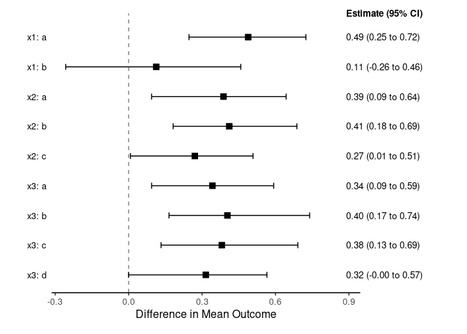

# bonsaiforest2

## Overview

The `bonsaiforest2` package has been developed to facilitate Bayesian
shrinkage estimation of treatment effects in subgroups of randomized
clinical trials. It supports both **one-way models**, which fit a
separate Bayesian shrinkage model for each subgrouping variable, and
**global models**, which fit a single model including all subgroup
variables at once. For both types of models, treatment effect estimates
in subgroups are derived via standardization (G-computation). The
package supports continuous, binary, time-to-event (Cox), and count
outcomes. It leverages `brms` and `Stan` for model fitting, allowing for
a flexible choice of priors, including normal, regularized horseshoe,
and R2-D2.

A comprehensive description of the methodology implemented in this R
package can be found in Wolbers et al. (2026).

## Installation

The latest stable release of `bonsaiforest2` can be installed from the
`main` branch on [GitHub](https://github.com/openpharma/bonsaiforest2):

``` r
remotes::install_github("openpharma/bonsaiforest2")
```

`bonsaiforest2` depends on the [`brms`](https://paulbuerkner.com/brms/)
package and a R interface to Stan (e.g.,
[`cmdstanr`](https://mc-stan.org/cmdstanr/))

## Quick Start Example

This example demonstrates Bayesian shrinkage estimation of treatment
effects across subgroups using a **global model** with a regularized
horseshoe prior (with default hyperprior parameters from `brms`),
applied to the `shrink_data` dataset with three subgrouping variables.

``` r
library(bonsaiforest2)

# 1. Load the shrink_data package dataset
shrink_data <- bonsaiforest2::shrink_data

# 2. Fit global shrinkage model
fit_fixed <- run_brms_analysis(
  data = shrink_data,
  response_type = "continuous",
  response_formula = y ~ trt,
  unshrunk_terms_formula = ~ x1 + x2 + x3,
  shrunk_predictive_formula = ~ 0 + trt:x1 + trt:x2 + trt:x3,
  shrunk_predictive_prior = "horseshoe(1)",
  chains = 2, iter = 1000, warmup = 500,
  backend = "cmdstanr", refresh = 0
)
```

``` r
# 3. Extract and visualize standardized treatment effects in subgroups
subgroup_effects <- summary_subgroup_effects(fit_fixed)
print(subgroup_effects$estimates)
#> # A tibble: 9 × 4
#>   Subgroup Median CI_Lower CI_Upper
#>   <chr>     <dbl>    <dbl>    <dbl>
#> 1 x1: a     0.486  0.249      0.719
#> 2 x1: b     0.105 -0.243      0.436
#> 3 x2: a     0.388  0.114      0.629
#> 4 x2: b     0.421  0.155      0.713
#> 5 x2: c     0.267 -0.00707    0.508
#> 6 x3: a     0.329  0.0389     0.545
#> 7 x3: b     0.407  0.157      0.722
#> 8 x3: c     0.384  0.110      0.727
#> 9 x3: d     0.313  0.0216     0.544
plot(subgroup_effects)
```



## References

Wolbers, Marcel, Miriam Pedrera Gómez, Alex Ocampo, and Isaac
Gravestock. 2026. “Unified Implementation and Comparison of Bayesian
Shrinkage Methods for Treatment Effect Estimation in Subgroups.” *arXiv
Preprint arXiv:2603.21967*. <https://arxiv.org/abs/2603.21967>.
